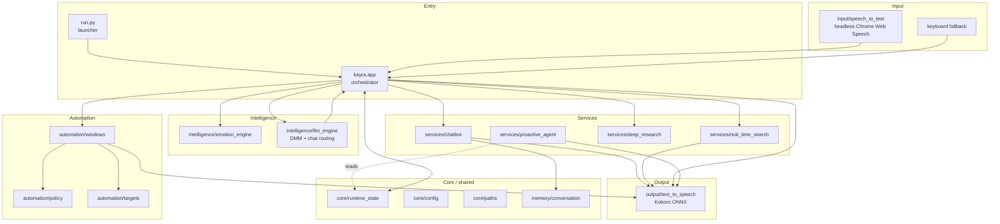
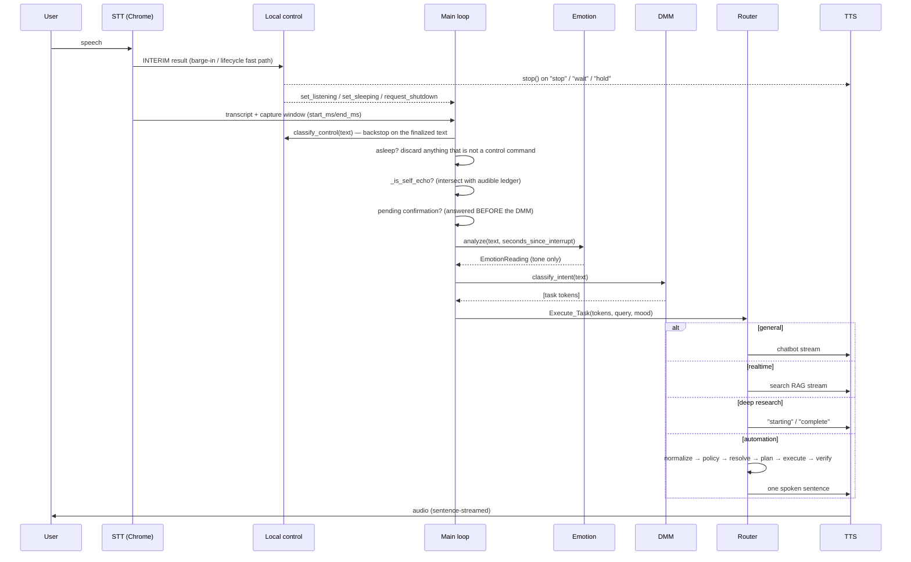
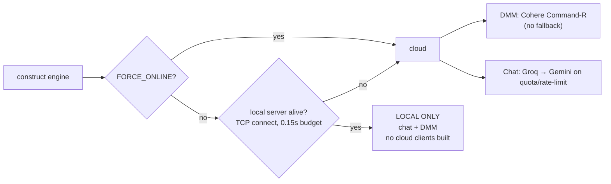
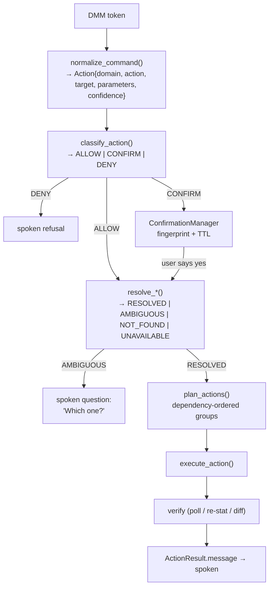
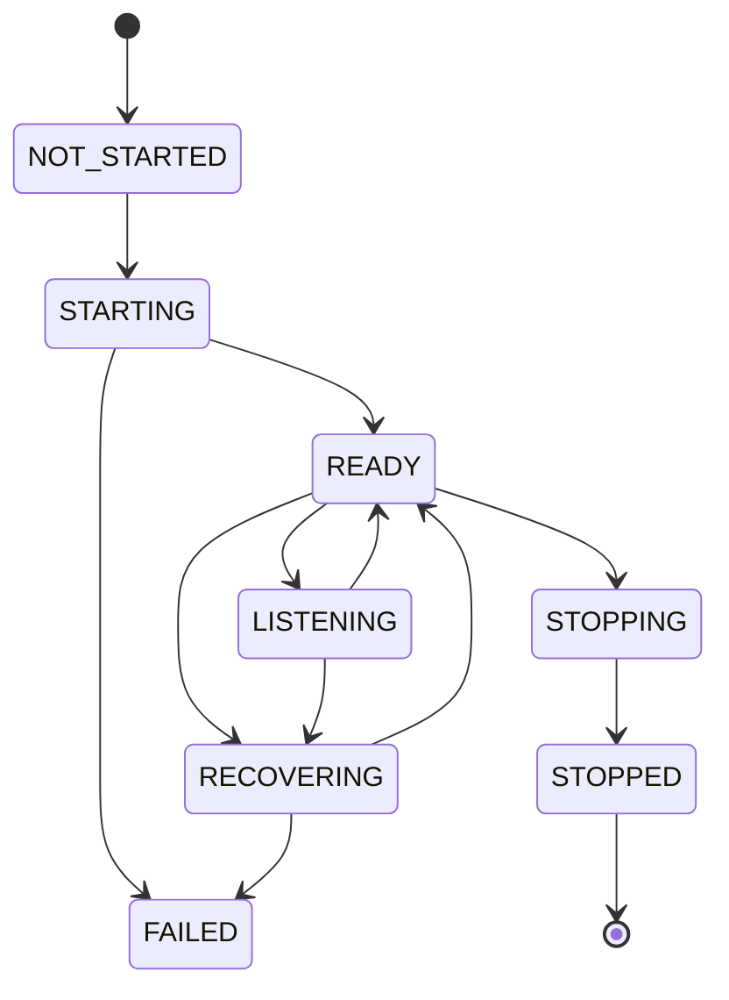
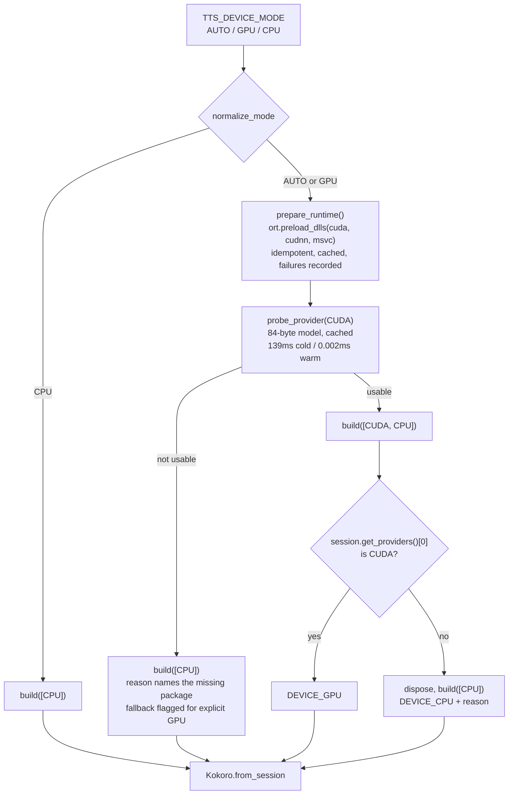
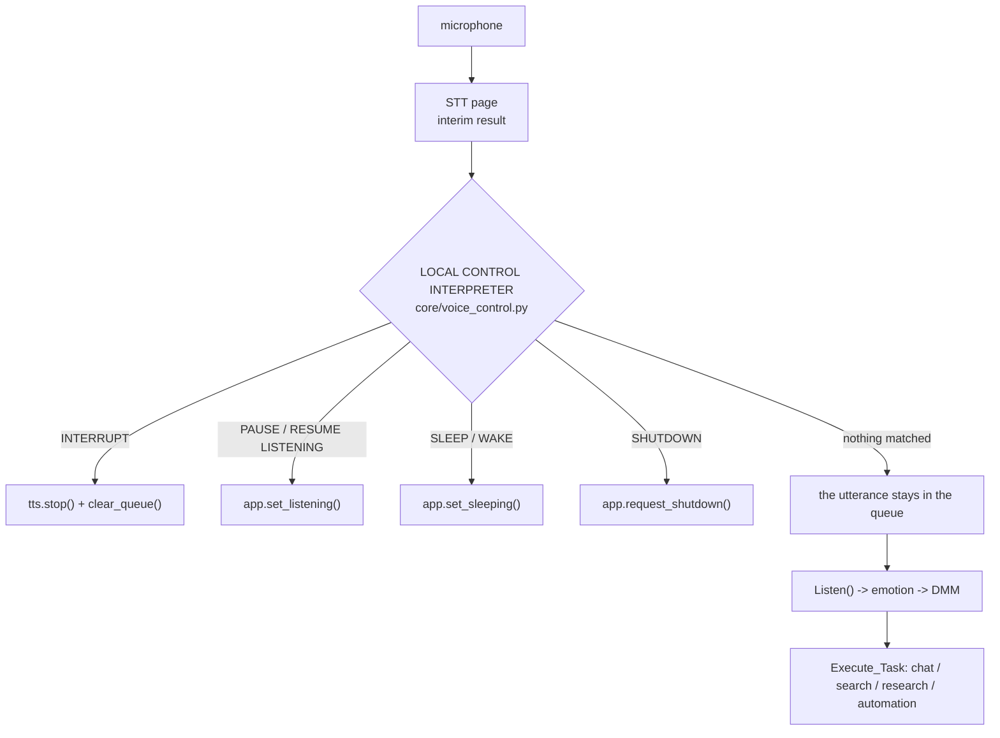
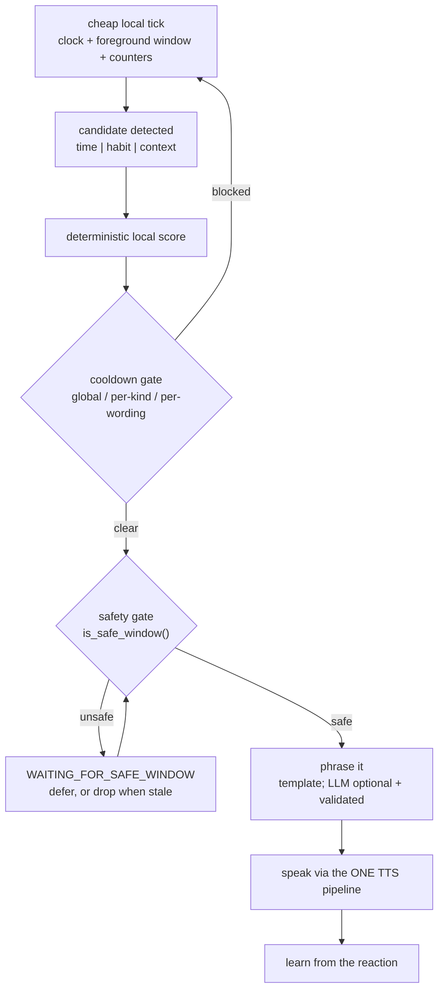
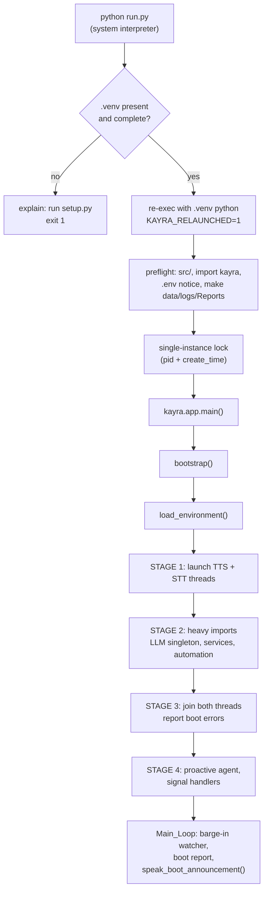
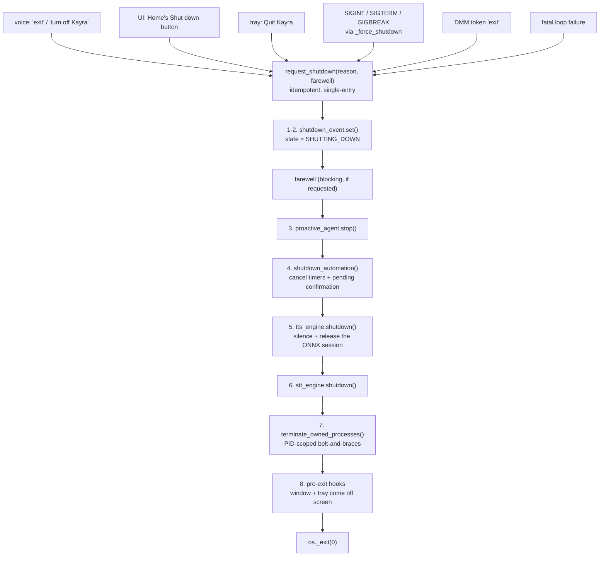

# Kayra System Architecture

> **Scope.** This document describes the Kayra implementation as it exists in this repository,
> not an aspiration and not a historical design. Every claim about behaviour was read out of
> the source; every number labelled *measured* was produced by running the code on the
> development host and is marked with what produced it. Numbers that are targets, estimates or
> inherited from earlier measurement rounds are labelled as such.
>
> **Audience.** Engineers (human or AI) making changes to Kayra. It explains not only *what*
> each subsystem is, but *how* it works, *why* it is built that way, *what else was possible*,
> and *why the alternative lost*.
>
> **Last verified against the tree:** 2026-09-07.

---

## Table of contents

1. [Project overview](#1-project-overview)
2. [Design goals](#2-design-goals)
3. [Architectural principles](#3-architectural-principles)
4. [High-level architecture](#4-high-level-architecture)
5. [Complete data flow](#5-complete-data-flow)
6. [Input architecture](#6-input-architecture)
6b. [The utterance boundary — one commit point](#6b-the-utterance-boundary--one-commit-point)
7. [Emotion engine](#7-emotion-engine)
8. [Decision-Making Model](#8-decision-making-model-dmm)
8b. [Model provider routing and failover](#8b-model-provider-routing-and-failover)
8c. [The DMM empty-response retry bound](#8c-the-dmm-empty-response-retry-bound)
9. [Context system](#9-context-system)
10. [Chatbot](#10-chatbot)
11. [Real-time search](#11-real-time-search)
12. [Deep research](#12-deep-research)
13. [Automation architecture](#13-automation-architecture)
14. [Automation safety](#14-automation-safety)
14b. [The power-target boundary](#14b-the-power-target-boundary--kayra-is-not-the-computer)
17c. [Confirmation ownership and short answers](#17c-confirmation-ownership-and-short-answers)
22b. [Turn ownership and stale work](#22b-turn-ownership-and-stale-work)
15. [Browser / STT Chrome lifecycle](#15-browser--stt-chrome-lifecycle)
15b. [Live speech-backend switching](#15b-live-speech-backend-switching)
16. [TTS architecture](#16-tts-architecture)
16b. [TTS device selection (AUTO / GPU / CPU)](#16b-tts-device-selection)
17. [Barge-in and the local control layer](#17-barge-in-and-the-local-control-layer)
17b. [Dangerous voice control is confirmation-gated](#17b-dangerous-voice-control-is-confirmation-gated)
18. [Self-echo protection](#18-self-echo-protection)
19. [Proactive agent](#19-proactive-agent)
20. [Memory](#20-memory)
20b. [Memory management](#20b-memory-management)
21. [Runtime state](#21-runtime-state)
21b. [Voice state and the assistant visual](#21b-voice-state-and-the-assistant-visual)
21c. [Machine identity: OS, processor and graphics](#21c-machine-identity-os-processor-and-graphics)
22. [Logging](#22-logging)
23. [Configuration](#23-configuration)
23b. [Hardware-conditional provisioning](#23b-hardware-conditional-provisioning)
24. [Startup](#24-startup)
25. [Shutdown](#25-shutdown)
26. [Performance](#26-performance)
27. [Security](#27-security)
28. [Alternatives considered](#28-alternatives-considered)
29. [Why the current choices were selected](#29-why-the-current-choices-were-selected)
30. [Current features](#30-current-features)
31. [Current limitations](#31-current-limitations)
32. [Future extensions](#32-future-extensions)
33. [Final folder structure](#33-final-folder-structure)
34. [Development workflow](#34-development-workflow)
35. [Testing strategy](#35-testing-strategy)

---

## 1. Project overview

Kayra is a voice-driven desktop assistant for Windows. It listens continuously, classifies what
the user asked for, and routes that to one of four capabilities: conversation, live web search,
autonomous deep research, or direct control of the machine. It answers out loud through an
offline neural voice, and it can be interrupted mid-sentence.

The defining constraint is that Kayra **acts on a real computer that belongs to someone**. That
single fact shapes most of the architecture: the safety policy, the PID-scoped process
ownership, the confirmation system, the verification step after every action, and the refusal
to let a language model reach the operating system directly.

The second defining constraint is **latency**. A voice assistant that takes six seconds to
start talking feels broken regardless of how good the answer is. Much of the design — the
overlapped boot, the sentence-streaming TTS, the zero-LLM execution path, the microsecond
normalizer — exists to protect the time between a user finishing a sentence and hearing the
first word back.

| Property | Value |
|---|---|
| Package | `kayra` (under `src/`), version 2.0.0 |
| Platform | Windows 11 (Win32 automation, Windows-only signal handling) |
| Python | 3.10 floor, 3.11 recommended and verified, 3.12 allowed but unverified |
| Entry points | `python run.py` (preferred), `python main.py` (shim), `python -m kayra` |
| Setup | `python setup.py` (once) |
| Offline-capable | Yes, with a local LLM server and the Kokoro voice model |

---

## 2. Design goals

1. **Answer fast.** Time-to-first-spoken-word is the headline metric, not total response time.
2. **Never damage the user's machine or data.** Ambiguity is resolved by asking, not guessing.
3. **Never take resources the user owns.** Kayra's browser is Kayra's; the user's browser is
   untouchable.
4. **Be interruptible.** The user can always take the floor back mid-sentence.
5. **Work offline where it can.** A local LLM and an offline voice mean the core loop does not
   require the network.
6. **Be deterministic where determinism is possible.** A model decides *what was meant*; plain
   Python decides *what may run* and *what happens*.
7. **Stay bounded.** Every queue, cache, history and log has an explicit cap.
8. **Be honest about failure.** Report what broke; never silently degrade in a way that looks
   like success.

---

## 3. Architectural principles

These are load-bearing rules, not style preferences. Each one exists because violating it
caused a real, diagnosed bug.

| # | Principle | The failure it prevents |
|---|---|---|
| 1 | One authoritative state system (`core/runtime_state.py`) | Two copies gave two different answers to "is the assistant speaking?", so the proactive agent read the one nobody wrote |
| 2 | One shared LLM engine (singleton) | The engine was constructed up to 5× per boot, each re-probing the local server and rebuilding API clients |
| 3 | One STT lifecycle manager | A second engine meant a second headless Chrome competing for the microphone |
| 4 | One shared TTS pipeline | A private sentence queue in a service survived `stop()`, so the assistant kept talking after being interrupted |
| 5 | One proactive service | — |
| 6 | One automation policy layer | A missed check in one of thirty handlers is a formatted disk |
| 7 | One target-resolution strategy | Substring sweeps closed every window whose title contained a word |
| 8 | Deterministic execution for known actions | — |
| 9 | LLM for semantic reasoning, never for keystrokes | An LLM round-trip per Ctrl+W is cost with no benefit |
| 10 | Bounded queues, caches, history | Unbounded growth in a process meant to run all day |
| 11 | Explicit resource ownership (by PID, never by name) | A name-based sweep would close the user's entire browsing session |
| 12 | Deterministic shutdown | Orphaned Chrome processes and timers firing after exit |
| 13 | No unrestricted shell execution | — |
| 14 | No process-name-based destructive cleanup | See 11 |
| 15 | No unnecessary startup work | Four spoken boot lines cost ~19s before the assistant was usable |
| 16 | No module import-time side effects | Importing a module started a browser |
| 17 | No hidden global state where a service boundary belongs | See 1 |
| 18 | No silent fallback that hides failure | — |
| 19 | Measured performance wherever practical | — |
| 20 | Extensible without being over-engineered | — |

---

## 4. High-level architecture



**Layer rules.**

- `core` imports nothing from the rest of the package. `core/paths.py` imports only the stdlib.
- `utils` may import `core`, never `services`, `automation`, `input` or `output`.
- `automation` never imports `input` (see [§15](#15-browser--stt-chrome-lifecycle) — importing
  `speech_to_text` would boot a browser as a side effect of asking to close a window).
- `services/proactive_agent` imports neither the TTS engine nor an LLM client; it receives
  callables. This is what makes it structurally unable to touch the cancellation epoch.
- `app.py` is the only module that knows about all of the above.

---

## 5. Complete data flow



The ordering here contains four deliberate, non-obvious decisions.

**Local control comes before everything, including the echo gate.** Barge-in, listening pause,
standby and shutdown are matched by `core.voice_control` with no model and no network. They run
ahead of the echo gate on purpose: "stop" and "exit" spoken OVER a running answer are the cases
that matter most, and the echo gate would discard them. See
[§17](#17-barge-in-and-the-local-control-layer).

**Echo rejection happens next.** An utterance captured while the assistant was
audible is its own voice and is dropped, except for interrupt words. See
[§18](#18-self-echo-protection).

**A pending confirmation is answered before the classifier.** A bare "yes" sent to the DMM
comes back as `general yes` and gets answered by the chatbot, so the confirmation would never
resolve. It would also make the answer to "should I restart your computer?" depend on a cloud
round-trip. `resolve_confirmation` returns `handled=False` for anything that is not actually an
answer, so an unrelated command spoken while a confirmation is pending still runs normally.

**Emotion is computed before routing but handed only to the response generators.** It never
reaches the DMM. How the user sounds must not be able to change what they asked for.

---

## 6. Input architecture

### 6.1 Speech (primary)

`input/speech_to_text.py`. The recognizer is the HTML5 Web Speech API running inside a
headless, Selenium-controlled Chromium browser — **not necessarily Chrome**; see
[§6.4](#64-browser-choice-and-the-speech-backend-problem). Python never sees audio — it receives
finalized transcripts over the WebDriver wire, each carrying the wall-clock window it was
captured in.

Two page-side properties exist specifically to make the voice loop work:

1. **Capture timestamps** (`start`/`end` from `Date.now()`) on every utterance. An utterance is
   only finalized ~800ms after the speaker stops, so "was the assistant talking when this was
   *captured*?" is the only answerable form of the echo question.
2. **Interim-result interrupt detection**, published on `window.kayraInterrupt`. This bypasses
   both the VAD silence timer and the translation round-trip, taking "stop" from ~1.2s to
   ~200ms.

The page is served from `http://127.0.0.1:<ephemeral>` by a small loopback server, **not** a
`data:` URL. A `data:` URL has an opaque origin and is not a secure context, so
`navigator.mediaDevices` is `undefined` there and the page's echo-cancellation request was
silently dead code. Verified after the change: `isSecureContext` is true and
`echoCancellation: true` appears in the live track settings.

### 6.2 Keyboard (fallback)

When the STT engine fails to boot, `Listen()` falls back to typed input and the assistant runs
identically otherwise. This is what makes the whole system testable without a microphone.

### 6.4 Browser choice and the speech-backend problem

Kayra does not require Chrome specifically. `input/browsers.py` discovers the installed
browsers, reads the user's Windows default, and picks one that can actually transcribe.

**Why capability must be verified rather than assumed.** `webkitSpeechRecognition` needs a
speech BACKEND, which is a property of the build, not of the API. Chrome carries Google's key;
Edge uses Microsoft's; Brave ships neither, as a deliberate privacy decision. A backendless
browser exposes the whole API surface, `start()` succeeds and `onstart` fires — then recognition
dies with `onerror{error:'network'}` and never produces a transcript. Checking for the API's
existence proves nothing.

Measured on the development host (headless, against the real recognition page):

| Browser | Version | Behaviour | Verdict |
|---|---|---|---|
| Chrome | 152 | session started, no error | USABLE |
| Edge | 152 | session started, no error, produced a result | USABLE (Microsoft backend) |
| Brave | 152 | started, then `network`, session ended | UNUSABLE |

**Edge is the reason "no Chrome installed" is survivable** — it ships on every Windows 11
machine. Measured: a full STT session on Edge starts in **1.3s with 8 owned processes**, versus
Chrome's 1.4s / 9 processes.

**Selection order.** Explicit `STT_BROWSER` → previously verified → the user's default (unless
known backendless) → other browsers with a real backend → unknowns → known-backendless last, so
a machine with only such a browser gets a specific error rather than "no browser found".

**The infinite-loop bug this exposed.** The page's `onerror` treated `network` as transient and
restarted unconditionally. In a backendless browser that is an endless restart loop: the
assistant looks alive, consumes CPU and never hears anything. Restart is now bounded (3
consecutive network errors while nothing has ever been recognised), a successful result clears
the counter, and `onend` refuses to resurrect a backend already declared dead.

**Verification must not cost cold start.** A blanket probe on every session start measured
+2.8s on boot and pushed crash recovery from 2.5s to 6.5s. So browsers with a first-party
backend, and any browser cached as previously working, are TRUSTED at start; unknown and
known-backendless browsers are probed for up to 4s (a backendless build declares itself dead in
1.55–1.78s, measured over three trials). Trusted browsers are verified later at zero cost:
`capture()` already reads the page status on every 50ms poll in the same round-trip it uses to
pop the speech queue, so a dead backend is detected at the first listen and `_switch_browser()`
rebuilds the session on the next candidate. After this change: Chrome 1.4s, Edge 1.3s, recovery
back to 2.5s.

**Cache asymmetry.** Only success is persisted (`data/browser_support.json`). A `network` error
is structural for Brave but temporary for Chrome on an offline machine; persisting the negative
would let a single offline boot permanently demote a good browser. Rejections are session-scoped.

**The user's own browser is never touched.** Kayra reads the registry UserChoice to learn the
preference and runs its own headless session; it does not launch, modify or close the browser
the user actually browses with. When the default cannot be used, it says so — the user chose
that default deliberately, and silently substituting another looks like a bug later.

Firefox is deliberately unsupported: recognition is disabled by default and there is no bundled
backend, so listing it would only be a slower path to the same failure.

### 6.3 Hand gesture control

`input/gesture/`. Camera in, mouse pointer out — a full second input modality alongside speech,
wired into the orchestrator, the desktop UI and the local voice-control vocabulary. It replaced
a standalone 551-line `input/gesture.py` that was never part of the loop and was unreliable in
five separate ways; the replacement is a package of eight modules with one clear owner each.

```
camera ──▶ preprocess ──▶ detect ──▶ features ──▶ stabilise ──▶ FSM ──▶ arbitrate ──▶ pointer
             │
             └──▶ preview (the same frame, throttled, PULLED by the UI)
```

| Module | Owns |
|---|---|
| `camera.py` | THE capture. One `VideoCapture`, one thread, a single-frame mailbox, bounded recovery |
| `detector.py` | The MediaPipe graph, one hand, deterministic primary selection, the accelerator decision |
| `features.py` | Scale-invariant geometry, and the stability score that gates actions |
| `filters.py` | One Euro, dead-zone, outlier gate, speed ceiling, the `Hysteresis` gate, rate limiters |
| `state_machine.py` | The temporal FSM and one-action-per-frame arbitration |
| `pointer.py` | The only code that touches the desktop (`user32`) |
| `controller.py` | Lifecycle, the two switches, the thread, the preview, telemetry, events |
| `config.py` | Every threshold, read once from `.env`, clamped and invariant-checked |

**The gesture map is unchanged from v1 and every gesture is preserved:** index finger moves the
cursor, index+thumb is a left click, middle+thumb a right click, index+middle+thumb a double
click, two fingers swept vertically scrolls, and a closed fist pauses. What changed is that each
one now goes through a two-threshold gate with a dwell time, fires on a rising edge only, and is
arbitrated against the others by a fixed priority.

#### 6.3.1 Why it lives in `input/` and injects through `user32`

The camera is a capture device and this package's job is to work out what the user MEANT, which
is exactly what the speech package does. It reaches the desktop through `pointer.py` — twenty-five
lines of `user32`, no shell, no subprocess, no target resolution — rather than through
`automation.windows`, for two independent reasons.

`automation` must never import `input` ([§4.2](#42-import-rules)), and putting a camera owner
inside `automation` would invert that rule. And the automation pipeline's cost is the right cost
for a sentence and the wrong cost for a 30Hz pointer update: `normalize_command` is 1.4us and
`classify_action` 4.3us, which is ~0.2ms per frame of overhead for a decision the state machine
has already made. `pyautogui.moveTo` is worse still — measured at 1.9ms against
`user32.SetCursorPos`'s 0.012ms, a 160x difference on the call made most often in the system.

A SPOKEN "click" still goes through `automation.windows.MouseControl`, unchanged.

#### 6.3.2 The capture mailbox, and the freeze it removed

v1 read the camera synchronously inside the same loop that ran inference and injected mouse
events. `cap.read()` blocks, and frames the driver queued while inference was busy had to be
dequeued one at a time before a fresh one could be reached. A 200ms hiccup therefore left the
loop processing the past while six more frames accumulated, and it never caught up — latency
grew without bound, which is what "delayed response", "occasional freezes" and "gestures
sometimes stop working" all were.

`CAP_PROP_BUFFERSIZE = 1` was already set in v1 and does not fix it: the Windows MSMF and DSHOW
backends treat it as a hint. The capture is now its own thread writing into a **single-slot
mailbox** that the processor reads; a frame nobody read is overwritten and counted as dropped.
Measured with a consumer four times slower than the camera, staleness never exceeds one frame.

This is a mailbox, not a queue, and that is the point: `queue.Queue(maxsize=N)` reintroduces
staleness for small N and unbounded growth for large N.

#### 6.3.3 Normalized thresholds

Every geometric threshold is a ratio of `hand_scale` (wrist → middle MCP, the palm's rigid long
axis), in width-normalized units so a vertical and a horizontal span of equal pixel length
measure equal. v1's pixel thresholds (`pinch < 30px`, `release > 40px`, `SCROLL_DEADBAND = 20`)
changed meaning with distance: at arm's length 30px is a third of the whole hand, and leaning in,
a real pinch never gets under it. Both symptoms were reported and they are the same bug seen
from two distances.

#### 6.3.4 The GPU decision

**CPU, and no GPU context is created.** `mediapipe 0.10.14`'s pip wheel builds `solutions.hands`
CPU-only on Windows, and the Tasks API exposes a GPU delegate enum on every platform including
ones with no GPU calculators compiled in — so testing for the enum proves nothing, the same trap
[§9](#9-speech-output) documents for ONNX Runtime's `get_available_providers()`.

It would be the wrong trade regardless, and this was measured rather than assumed. Inference at
`model_complexity=0` is 10.5-13.5ms, which is three frames of headroom at 30 FPS, so the detector
is not the bottleneck. Gesture control uses **0 MiB of VRAM** and holds no CUDA context, so there
is no contention with the Kokoro ONNX session to have; running both, TTS synthesis went from
13.01s to 13.30s per sentence (**+2.2%**) while gesture control held 19.8 FPS with 0 dropped
frames. `GESTURE_GPU=ON` forces a delegate attempt for a platform where one exists and reports
loudly when it fails.

The change that actually mattered was `model_complexity`, not the device: v1 used complexity 1 at
26-31ms, which on a 33ms budget leaves nothing, and a loop with no slack is a loop that falls
behind on the first hiccup.

#### 6.3.5 Two switches, and the state that cannot exist

The camera and gesture control are separate axes, for the same reason listening and standby are
([§5.4](#54-the-four-stop-shaped-concepts)): seeing the preview and having something move your
pointer are different requests. `camera OFF, gesture ON` is prevented rather than repaired —
enabling gesture control starts the camera first, and turning the camera off stops gesture
control first. Both switches are transactional through `core.settings_log`, so a camera that
fails to open leaves the switch OFF and reports the camera's own message.

#### 6.3.6 It never touches voice state

No call in the package reaches `set_listening`, `set_sleeping`, the STT engine, the TTS engine or
the voice state machine, and `tests/test_gesture_control.py` asserts that by walking the parsed
source. Camera activity must never be able to pause the microphone or repaint the orb. The two
systems share only the runtime event bus, in one direction: the controller emits `gesture_state`
and writes nothing.

#### 6.3.7 Running it

```bash
python -m kayra.input.gesture            # gesture control alone, no UI
python -m kayra.input.gesture --doctor   # camera, detector and accelerator report only
```

Both drive the same `GestureController` the UI and the voice commands drive. There is no second
implementation — that duplication is exactly what the single-ownership rule exists to prevent,
and the v1 standalone module was an instance of it.

---

## 6b. The utterance boundary — one commit point

`src/kayra/core/endpointing.py`. The ONE authority for "has the user finished speaking?".

### The failure it was written for

A user said, in Hindi and English together, *"यार मेरी girlfriend मुझसे नाराज़ है, बताओ मैं क्या
करूँ?"* — and Kayra shut down mid-sentence.

The cause was not the recognizer and not a mis-heard word. It was **a second commit point**. The
recognition page published lifecycle commands out of `recognition.onresult`, from a probe built
from the INTERIM transcript, and `_local_control_watcher` dispatched that flag at ~17 Hz. A
transient interim reading of "exit" therefore reached `request_shutdown()` **without ever
passing through the endpointer**. The VAD was working correctly and was simply not consulted,
because that path did not go through it.

The fix is architectural. There is no word list, no "distrust the word exit", and no
replacement dictionary — this codebase already refuses those elsewhere, and they would
eventually mis-fire on a legitimate command. What changed is that only a COMMITTED utterance can
reach a control.

### The pipeline, and where it narrows

```
microphone -> AEC/NS -> VAD -> recognizer -> utterance accumulator
   -> ENDPOINT DECISION       <-- core/endpointing.py
   -> transcript repair -> conversation context -> control -> DMM
```

Above the arrow nothing may act on words; below it everything does. **Barge-in is the single
documented exception**: interim text may still be inspected to SILENCE PLAYBACK. Silencing is
not an action on the world — it hands the floor back — and its whole value is that it happens
before the endpoint. It cannot start a turn, run automation, end the process or reach the DMM.

* `looksLikeControl()` is **deleted** from the page, not guarded. `kayraControlPhrases` is
  hard-coded `[]`; nothing assigns `window.kayraControl`.
* `flushUtterance` has exactly one call site and it is the endpoint decision's.
* `Listen()` logs `[VOICE] Transcribed: "…"` at the boundary — the ONE transcript line
  per turn. The endpoint's own reasoning and the recognizer's drafts stay at DEBUG.

### Two signals, and neither is sufficient

| Signal | Why it is not enough alone |
|---|---|
| a FINAL recognition result | means "this SEGMENT is final". Several arrive per sentence, while the speaker keeps going |
| a silence timer | results LAG the sound, so "no results for N ms" fires mid-sentence whenever the backend is slow. A clipped word is worse than a mis-heard one — there is nothing left to repair |

Both were already required. What this milestone added is **continuation evidence** — three
reasons to keep listening, all about acoustics and timing, none about which words were heard:

1. **The user is audibly speaking right now.** `voice_active` blocks the commit outright. This
   check alone would have prevented the reported failure.
2. **The turn is younger than `min_utterance_ms`** (350 ms).
3. **The transcript is implausibly short for the speech duration.** Past
   `continuation_speech_ms` (1500 ms), a one- or two-word transcript means the recognizer is
   behind. Such a turn never takes the fast path and waits out a doubled room hangover.

**Rule 3 delays a commit; it never blocks one.** It knows nothing about which word it is and
cannot reject one — asserted by a check that a lone word does still commit once the room stays
quiet.

### Adaptive, so short commands stayed fast

| Condition | Required recognizer silence |
|---|---|
| interim words pending | `max(silence, interim_grace)` — uncommitted words are worth waiting for |
| looks truncated | `silence` — never the fast path |
| short and committed | `fast_endpoint` (420 ms) |
| anything else | `silence` (800 ms) |

Measured: a short control command endpoints **~500 ms** after the speaker stops (unchanged);
`decide()` costs **1.68 µs** and is evaluated at 60 ms intervals.

### One rule, two implementations

The Python module is the specification and holds every threshold; the page mirrors the
predicate because the decision must run at 60 ms resolution next to the audio, where a Selenium
round-trip per tick is not available. `_capture_tuning()` composes `tuning_payload()` and adds
only the microphone's acoustic settings, so the two cannot disagree about when a turn ends.

**Verified live against the real headless Chrome: 10/10 scenarios agree**, including the
reported-failure case.

### VAD hysteresis

Speech is not a plateau — every stop consonant dips below any single threshold, so a bare
`rms > t` comparator toggled `voice` several times a second inside one sentence. That produced
the `LISTENING -> USER_SPEAKING -> LISTENING` churn in the logs and an orb that flickered per
syllable. Leaving the speaking state now requires falling to `vadReleaseRatio` (0.6×) of the
enter threshold **and** staying there for `vadReleaseMs` (220 ms). Both halves are needed —
hysteresis alone still flickers on a deep dip, a hold alone still chatters. Measured live:
enter 0.01673, exit 0.01004.

---

## 17b. Dangerous voice control is confirmation-gated

A single recognition must never end the process. The input is a probabilistic transcript of a
room and the cost of being wrong once is the whole session.

```
"Okay Kayra, shut down the engine."
  [VOICE] Control candidate: CONTROL_SHUTDOWN (explicit)
  [VOICE] Confirmation required
  "Just to confirm — should I shut down the Kayra engine?"
"Yes."
  [VOICE] Confirmation: YES
  [SHUTDOWN] Executing confirmed Kayra shutdown
```

### What is gated, and what deliberately is not

`DANGEROUS_KINDS = {SHUTDOWN, SLEEP}`.

* **`PAUSE_LISTENING` is not gated.** It closes the microphone, is one button/hotkey/tray click
  to undo, and a user who says "stop listening" wants it now. Asking first would be the wrong
  trade.
* **`INTERRUPT` is not gated.** Silencing is how the user takes the floor back; gating it would
  defeat barge-in entirely.

### Only one path executes

`_dispatch_control` **cannot** run a dangerous kind — it asks. The only path is
`_execute_confirmed`, reached solely from `resolve_lifecycle_confirmation` on an affirmative
answer; the suite walks the AST for callers and asserts the list. The UI's Shut down button,
the tray's Quit and the signal handler still call `request_shutdown` directly, and should: a
button press is already unambiguous confirmed intent, and a transcript is not.

The confirmation is answered **before** the classifier, for the reason the automation
confirmation is answered before the DMM: a bare "yes" sent to a classifier comes back as
conversation and the question would never resolve.

### Three-way replies

| Reply | Example | Outcome |
|---|---|---|
| `YES` | "yes", "yeah, go ahead", "yes please", "do it" | execute |
| `NO` | "no", "cancel", "never mind", "not now" | cancel |
| `UNCLEAR` | "yes, but first tell me my options" | re-ask once (`MAX_ASKS` 2 — a third is a loop) |
| `None` | "what time is it" | not an answer: clear the request, process normally |

Collapsing `UNCLEAR` into either neighbour is how a dangerous action gets executed off a
sentence that was really a question. Matching is on the WHOLE normalized utterance, never a
substring.

Bounded window (`KAYRA_CONFIRMATION_TTL_SECONDS`, 20 s, evaluated on read): a late "yes" does
nothing. One pending request at a time — a new one replaces the old, because two outstanding
questions is a state nobody can answer unambiguously.

### The echo interaction

Kayra asks out loud, so the user's "Yes." lands within a second or two of her own voice and
often overlaps it. If the confirmation resolved AFTER the echo gate, the reply that matters most
would be the one most reliably discarded — and a broad post-speech mute window would do the
same, which is why there is not one.

So the confirmation resolves **before** the gate, and echo-flagged audio clears a HIGHER bar
rather than being trusted or discarded: only a clean whole-utterance YES or NO is honoured from
it. This is necessary because Kayra's own question opens with a word in the affirmative
vocabulary — without the rule she re-asks herself in a loop, and with a naive "not an answer
clears it" she cancels the confirmation she just asked. `"none-echo"` therefore leaves the
request pending, which is a different outcome from `"none"` and deliberately so.

### False-positive protection is structural, not a word list

"Why did the program exit?", "The application exists.", "That is great.", "Why do people sleep
so much?" — all reach the DMM untouched, because matching is exact on the whole normalized
utterance. Verified live against the real assistant.

Two supporting rules:

* **Apostrophes are deleted in normalization, not turned into spaces.** The punctuation sweep
  split "don't" into `["don", "t"]`, so every phrase containing one was unmatchable — silently,
  because a phrase that cannot match looks exactly like a phrase that was not said.
* **`transcript_repair._is_irreversible` widened from SHUTDOWN to every `DANGEROUS_KIND`.** A
  stage that may not invent "exit" must not be able to invent "sleep" either, and one set
  governs both.

`"stop Kayra"` stays a **barge-in**, not a shutdown: the name is a filler for the interrupt
vocabulary, so it and "Kayra, stop" are the same utterance. It was briefly added to the shutdown
table during this work and the suite caught it immediately.

---

## 8c. The DMM empty-response retry bound

`MAX_DMM_EMPTY_RETRIES = 5` (raised from 3), plus `DMM_RETRY_BUDGET_SECONDS = 15.0`.

This governs **one** failure class — the provider answered and the answer parsed to zero usable
tokens — and nothing else. Transport failures, rate limits, timeouts and auth errors belong to
the provider router (§8b) and never reach it, so a rate-limited cloud key still costs exactly
one call per provider per request.

* **Five rather than three because the local path is where empty completions happen.** A small
  local model that samples only stop-tokens, or one still warming, produces them regularly, and
  each attempt is an in-process round-trip rather than a metered call.
* **The wall-clock budget is the other half.** Measured against LM Studio on the reference host
  an empty completion costs ~2.0 s, so five retries is ~10 s of silence for a request that ends
  in "treat as conversation". The budget stops a slower backend turning that into half a
  minute; whichever limit is reached first wins and the log says which.
* **No sleep anywhere in the retry path**, and there must not be one. This is a deadline, not a
  backoff: the model is up and merely produced nothing.
* **No traceback for an expected empty response** — one WARNING line, once.

Measured live, local model, cloud keys rate-limited throughout:

```
[DMM] Empty response. Retry 1/5
...
[DMM] Empty response. Retry 5/5
[DMM] Model exhausted 5 retries. Treating this as conversation.
```

and `"what is the capital of France"` succeeded on attempt 2 — the retry earns its keep.

---

## 7. Emotion engine

`intelligence/emotion_engine.py`.

### 7.1 What it is for

One sentence of tone guidance appended to the chat system prompt. That is the entire consumer.
Understanding this is essential to judging the design: the value ceiling on this subsystem is
low, so its cost budget is also low.

### 7.2 Why there is no acoustic analysis

The obvious upgrade is prosody — pitch, energy, speaking rate. It is deliberately absent, and
the reason is architectural rather than effort.

**Kayra's STT is the Web Speech API inside headless Chrome. Chrome owns the microphone and
hands Python a transcript. The raw audio never enters this process at all.** Adding acoustic
emotion would require one of:

| Option | Cost | Verdict |
|---|---|---|
| Open a second microphone stream in Python | Two capture paths on one device, contending with Chrome; a second copy of every buffer | Violates the single-capture rule outright |
| Record in-page with `MediaRecorder`, base64 back through Selenium | Hundreds of KB of JSON per utterance on the same WebDriver connection the barge-in watcher polls every 60ms | Endangers the one resource that must stay responsive |
| Add librosa/scipy feature extraction | Tens of MB RSS, hundreds of ms per utterance, on the hot path of every turn | Cost exceeds the value of one tone hint |

The engine therefore uses the signals that are genuinely free and says so, rather than shipping
a placeholder that pretends to hear tone of voice. `_TAB_ENUMERATION_NOTE`-style honesty is the
house pattern here. **If the STT layer is ever replaced by an in-process recognizer that already
holds PCM, this decision should be revisited** — the blocker is the audio boundary, not the idea.

### 7.3 The three signals

| Signal | Weight | What it reads |
|---|---|---|
| Lexical | `W_LEXICAL = 0.62` | Weighted n-gram lexicon with negation, amplifiers and dampeners |
| Structural | `W_STRUCTURAL = 0.20` | Punctuation, capitalisation, elongation, length |
| Contextual | `W_CONTEXT = 0.18` | Recent utterances, local hour, seconds since the user interrupted |

Structural is weighted low on purpose: `"!!!"` is intensity without content, and can only ever
tip a near-tie.

### 7.4 Fusion

Each signal is normalised by **its own evidence mass** before weighting (`scale = weight /
evidence`), so a signal that fired weakly cannot contribute a large raw number merely because
its scale differs. This is the mechanism that satisfies the "one weak signal must not override
a strong one" requirement.

Confidence is then computed from two independent quantities:

```
margin     = (top - runner_up) / top        # how clearly the winner won
mass       = min(1.0, total_evidence / 1.5) # how much evidence existed at all
confidence = (0.45 + 0.55 * margin) * mass
```

Both are needed. Margin alone would make a single 0.3-weight token look as certain as a
paragraph; mass alone would ignore whether the reading was ambiguous.

A **smoothing** bonus of +0.12 applies when at least two of the last three readings agreed with
this one at confidence ≥ 0.4. It only ever *adds* confidence to agreement — it can never invent
an emotion the current utterance had no evidence for.

Below `DEFAULT_THRESHOLD = 0.35`, the reading is reported as `neutral` with its confidence
preserved.

### 7.5 False-positive control

This is the requirement that actually matters, because emotional vocabulary appears constantly
in ordinary questions. Damping is applied to the lexical signal based on **whether the sentence
is even about the speaker**:

| Condition | Damping | Example |
|---|---|---|
| Definitional and no first person | 0.10 | "Why do people get stressed before exams?" |
| Question and no first person | 0.20 | "what does burnout mean" |
| Third person and no first person | 0.30 | "he was furious about the delay" |
| Question with first person | 0.75 | "Why am I so tired today?" |

Negation inside the three tokens before a match cancels it entirely; amplifiers and dampeners
in the two tokens before scale it.

Measured on fresh engines at `hour=14`:

| Utterance | Result |
|---|---|
| "Why do people get stressed before exams?" | `neutral` (0.07) |
| "what does burnout mean" | `neutral` (0.07) |
| "tell me about depression" | `neutral` (0.00) |
| "he was furious about the delay" | `neutral` (0.20) |
| "I am not angry at all" | `neutral` (0.00) |
| "I'm so tired of this" | `tired` (0.87) |
| "THIS IS AMAZING!!!" | `excited` (0.90) |
| "I am really excited about the launch" | `excited` (0.93) |
| "open chrome" | `neutral` (0.00) |

### 7.6 Vocabulary and output

Eight states: `neutral`, `happy`, `excited`, `stressed`, `sad`, `tired`, `frustrated`, `calm`.

`EmotionReading` subclasses `str`, so it is the emotion label wherever a string is expected —
which is what keeps `Chatbot(query, tts, mood)` and `RealTimeSearchEngine(query, mood, tts)`
working unchanged — while also carrying `.confidence`, `.signals`, `.scores`, `.tone` and
`.to_dict()`.

```python
{"emotion": "stressed", "confidence": 0.81, "signals": ["text", "structure"]}
```

### 7.7 Influence, not control

Emotion modifies **tone only**, via `TONE_GUIDANCE`. It is passed to the chatbot and the search
engine and to nothing else. It is never passed to the DMM, so it cannot alter intent: "open
Chrome" spoken angrily is still `open chrome`.

### 7.8 Memory and threading

Bounded and in-RAM: a short deque of recent readings and recent utterance tokens. **Nothing is
persisted** — there is no emotion file, by design. `analyze()` takes a lock only to snapshot
history, and the engine starts no threads and opens no audio stream (both asserted by the test
suite). It runs synchronously on the main loop because at 14.3µs it is far cheaper than the
thread hand-off would be.

Failure is contained: `app.py` wraps the call in `try/except` and continues with `mood=None`.
A malformed or non-string input returns a neutral reading rather than raising.

### 7.9 Measured cost

Measured on the development host with the project `.venv` (Python 3.11.9):

| Metric | Value |
|---|---|
| `analyze()` | **14.3 µs** per call (~69,800 calls/sec) |
| Construction | **2.4 µs** |
| RSS growth over 50,000 analyses | **11.7 KB** |
| Threads started | 0 |
| Audio streams opened | 0 |
| Heavy imports | none (`collections`, `datetime`, `re`, `threading`, `time`) |

At 14.3µs against a DMM round-trip measured in seconds, emotion analysis is not a measurable
part of response latency.

---

## 8. Decision-Making Model (DMM)

`intelligence/llm_engine.py :: CentralizedLLMEngine.classify_intent()`.

### 8.1 How it works

The raw user query plus a large few-shot preamble (`dmm_preamble` + `dmm_chat_history`) goes to
Cohere Command-R (cloud) or the local model. The model must reply with a comma-separated list
of task tokens, each beginning with one of the strings in `self.funcs`. That list is the
acceptance gate.

### 8.2 The contract, and the traps in it

- **`self.funcs` is the acceptance gate, so a token in it that no executor handles is worse
  than useless.** It passes the filter and is then silently dropped, and the user gets nothing.
  `generate image` was exactly that and was removed.
- **Duplicate matching.** Several entries are prefixes of others (`close` / `close window` /
  `close tab`, `save` / `save file`, `minimize` / `minimize all`, `copy` / `copy text`). Each
  raw task must be matched against the header set **once**, not once per matching prefix — a
  naive per-func loop-append double-executes (`minimize all` would fire Win+D twice, undoing
  itself). Keep the single-match + `seen_tasks` dedup.
- **Few-shot ordering is a design decision, not a list.** Recency weight with Cohere is strong
  enough that adding `proactive on`/`proactive off` — which pushed a media example into the
  final position — reproducibly dragged "Undo that." from `undo` to `resume`, taking the matrix
  from 53/53 to 52/53. Moving an undo/redo contrastive pair to the very end restored it. Never
  slice or truncate this list, and re-run the matrix after any append.
- **Placeholders must never reach the output.** The preamble writes `'general ...'`, not
  `'general (query)'`, because the model copied the literal word "query" as the payload. A
  parser guard substitutes the user's real words if a placeholder appears — this matters
  because `deep research` slices its topic out of the token.
- The rate-limit path recurses with `retries + 1` and gives up after 3 attempts. It previously
  recursed with the same counter, making a sustained rate limit an unbounded recursion.

### 8.3 Model routing



`_check_local_server()` does a **TCP connect with a short per-address budget** before any HTTP
call. The old bare `requests.get(..., timeout=1.5)` measured **3.0s** on a host with no local
server: Windows Firewall *drops* rather than refuses connections to closed loopback ports, and
`localhost` resolves to two address families, so the timeout was paid twice.

If the Cohere key is missing while online, `classify_intent` degrades every query to
`general <query>` — the assistant still converses but cannot automate.

### 8.4 Singleton

`CentralizedLLMEngine.__new__` returns one shared instance per process. Five modules construct
it at import time; without the singleton that meant five local-server probes and five sets of
API clients per boot.

`run_boot_sequence()` is **purely cosmetic narration**. `classify_intent()` and
`generate_chat_stream()` work on a freshly constructed engine whether or not it is ever called.
`app.py` calls it without a TTS engine on purpose.

---

## 8b. Model provider routing and failover

`src/kayra/intelligence/provider_router.py` is the ONE authority for which provider serves a
request and what happens when it does not.

### Two hierarchies, deliberately different

```
DECISION (the DMM)   Cohere  ->  Groq  ->  Gemini
CHAT                 Groq    ->  Gemini
```

Cohere leads DECISION because the DMM's few-shot token contract was written and measured
against Command-R. It is not a conversational model for this assistant and appears nowhere in
the CHAT chain. Groq leads CHAT because it produces the fastest first token here; it is the
DMM's first FALLBACK rather than its primary because the intent-boundary matrix was tuned
against Cohere. Both orders live in one constant (`ROUTE_CHAINS`) rather than being implied by
the ordering of `if` statements in two functions.

Local-first is unchanged and absolute: with an LM Studio / Ollama server up, all traffic goes
there and the router is not consulted.

### What it replaced, and why it is one module

Fallback used to be invented independently in two places inside `llm_engine.py`:

* `classify_intent` had ONE provider and no fallback at all. A rate limit was answered with
  `sleep(5)`, `sleep(10)`, `sleep(15)` and then a degrade to conversation — thirty seconds of
  blocked user, ending in the assistant not doing what was asked, on a machine where two other
  configured providers sat idle.
* `generate_chat_stream` had a two-provider chain with its own private string-matching notion
  of a quota error and no memory: the NEXT request hit the rate-limited provider again, and the
  one after that, forever.

**When two layers each retry, one user request becomes four provider calls** — which on a
rate-limited key is precisely the wrong response to a rate limit. That is a correctness
property, not tidiness, and it is why there is exactly one authority.

### Classification

| Kind | Falls through? | Default cooldown | Why |
|---|---|---|---|
| `RATE_LIMITED` | yes | 60s | temporary; the provider is otherwise healthy |
| `AUTH_FAILURE` | yes | 900s | another key may be fine, but nothing fixes a wrong one soon |
| `NETWORK_FAILURE` | yes | 30s | transient |
| `TIMEOUT` | yes | 30s | bounded, then somebody else gets a turn |
| `SERVER_ERROR` | yes | 60s | their problem, not ours |
| `MODEL_UNAVAILABLE` | yes | 300s | a decommissioned model id will not come back |
| `INVALID_REQUEST` | **no** | 0s | the request was wrong, the provider was not |
| `UNKNOWN` | yes | 20s | short: standing a provider down over a mystery is worse |

A provider-supplied `Retry-After` always wins over the configured default. Verified live: Groq
returned `Retry-After: 6` under load and was skipped for 6s rather than 60s.

### Execution

Sequential, never concurrent, and **at most one call per provider per request** — the property
that makes "no duplicate calls" true rather than hoped for. Racing providers would spend three
quotas to answer one question and would make a rate limit worse.

Streaming may only fall back BEFORE the first chunk. Once a token has reached the user,
switching providers would splice two answers into one sentence; a mid-stream failure is
terminal for that request, and the provider is still stood down so the NEXT request routes
elsewhere.

### `max_retries=0`

The OpenAI SDK retries twice by default with its own backoff — a SECOND retry authority
underneath the router. Measured live before the change: a single Groq DMM call took **9.9s**
and then **24.0s**. After setting `max_retries=0` and a bounded `PROVIDER_TIMEOUT_SECONDS`,
every call in the same test completed in 1.7-2.0s and the full Cohere -> Groq -> Gemini chain
in 2.03s.

### Measured, live, against the developer's real (rate-limited) Cohere key

```
[DMM] Provider: Cohere (command-r-plus-08-2024)
[DMM] Result: RATE_LIMITED from Cohere, cooling down 60s
[DMM] Fallback: Groq (openai/gpt-oss-120b)
[DMM] Result: SUCCESS via Groq (openai/gpt-oss-120b)
   -> ['open youtube']   (708ms)
```

Twenty consecutive requests against a rate-limited provider produce **one** call to it, not
twenty. The DMM's cooldown does not affect the CHAT chain, and vice versa.

---

## 9. Context system

Two distinct things carry context, and they are deliberately separate.

**`AutomationContext`** (`automation/policy.py`) — six fixed slots (last app, window, site,
file, …) with a 300s referent TTL, so "close it" resolves to something real instead of a
hallucinated referent. Bounded by construction; it is not a growing history.

**`RuntimeState`** (`core/runtime_state.py`) — what the assistant is doing and how recently the
user was involved. See [§21](#21-runtime-state).

Conversational context is the chatbot's own short-term window ([§20](#20-memory)).

---

## 10. Chatbot

`services/chatbot.py`. Memory-augmented conversation.

- Builds the prompt from the identity/system prompt, the short-term session window, relevant
  long-term memory, and the mood tone hint.
- Streams tokens from the shared LLM engine through `utils.SentenceStreamer` into
  `tts_engine.speak`.
- **It must not spawn its own speech worker thread.** A private queue holds a backlog that
  survives `stop()`, which is exactly how the old implementation kept talking after being
  interrupted. The TTS engine owns the only sentence queue.
- Cancellation is epoch-scoped: it captures `tts.turn_token()` once and asks
  `tts.is_cancelled(token)`. It must **not** read a global `interrupted` flag — that flag is
  process-wide and `begin_turn()` clears it, so a proactive suggestion firing in the window
  between a barge-in and the chatbot noticing would un-cancel the interrupted response.

---

## 11. Real-time search

`services/real_time_search.py`. Live retrieval-augmented generation.

DuckDuckGo (`ddgs`, with `duckduckgo_search` as an import fallback) retrieves snippets, which
are injected into the system prompt as live context, and the answer is streamed and spoken
sentence-by-sentence like the chatbot path. It shares the same memory helpers and the same
`SentenceStreamer` discipline.

---

## 12. Deep research

`services/deep_research.py`. A six-stage autonomous research agent that writes a Markdown
report into `Reports/`.

1. **Plan** — the LLM decomposes the topic into angles, sub-topics and search queries.
2. **Broad scrape** — DuckDuckGo for high-level context.
3. **Deep extraction** — full page fetch + BeautifulSoup article extraction for the best hits.
4. **Follow-up generation** — the LLM identifies gaps and writes targeted queries.
5. **Gap-filling scrape** — executes those and deep-scrapes again.
6. **Synthesis** — one long-form cited Markdown document.

Bounded by `MAX_SUB_QUESTIONS`, `MAX_FOLLOWUP_QUERIES`, `MAX_DEEP_PAGES` and
`SEARCH_RESULTS_PER_QUERY`. It is the one path that takes minutes, so the assistant says so
before starting and confirms when the report is saved.

---

## 13. Automation architecture

`automation/windows.py` (the hands), `automation/policy.py` (may it run?),
`automation/targets.py` (what exactly does it mean?).

### 13.1 The pipeline



The sentence is parsed **once**, into a structured `Action`. No later layer re-reads the user's
raw English. That is what makes each stage independently testable: the policy without a
desktop, the resolver without an executor, the executor with a target it did not have to guess.

### 13.2 Prefix collisions are structural, not positional

The old implementation was one ordered `if/elif` chain on `cmd_lower.startswith(...)`, so
`close window` and `close tab` had to be tested before the generic `close ` prefix or they were
routed to `CloseApp("window")`. That ordering constraint is gone: `_EXACT_TOKENS` is a dict
consulted before `_PREFIX_TOKENS`, and the prefix list is sorted longest-first at import. **A
dict cannot be reordered by accident and a longest-first list cannot be shadowed**, so the bug
class is eliminated rather than documented.

When adding a literal token, add it to `_EXACT_TOKENS` and cover it in the normalizer table.
Every token in `llm_engine.funcs` must normalize to something — the suite asserts zero dead
tokens.

### 13.3 Planner

`plan_actions` groups actions for execution. Only `_CONCURRENT_SAFE` domains (`info` — pure
reads) share a group; **everything else is sequential**. This is a correctness fix, not tuning.
The old router built every command as an `asyncio.to_thread` task and fired the lot through one
`asyncio.gather`, so "open chrome and maximize the window" raced the maximize against the
launch, and two keystroke sequences went to whatever had focus at that instant.

### 13.4 Verification

Actions verify rather than assume:

- `_open_app_verified` focuses an already-running app instead of launching a second copy, then
  waits for a window.
- `close` polls until the handle is gone.
- screenshot diffs the folder.
- filesystem operations re-`stat` the result.

Nothing says "Done." because a keystroke was sent.

### 13.5 The stuck-modifier bug (do not reintroduce)

Bringing a window forward needs a synthetic ALT tap to defeat Windows' `ForegroundLockTimeout`.
If ALT is still logically held when the next accelerator arrives, **Ctrl+T is delivered as
Ctrl+Alt+T and Windows opens the task switcher** — the browser never sees it. Observed end to
end: the new tab silently failed, and the following "close this tab" then landed on a
single-tab window and closed the whole window.

Two things prevent it, both load-bearing:

- `focus_window` tries `SetForegroundWindow` **first** and only taps ALT as a fallback, then
  releases ALT/CTRL/SHIFT and settles for `FOCUS_SETTLE_SECONDS` — **including on the fast path
  where the window is already in front**, which is where the bug actually lived.
- `send_keys()` normalises modifier state immediately before **every** injected keystroke.
  Every injection site goes through it, so no future call site can forget.

**Never call `keyboard.press_and_release()` directly in the automation layer.**

### 13.6 Destructive tab actions never hunt for a browser

`close_tab` requires a browser to already be in front. If the user says "close this tab" while
looking at their editor, the honest answer is "no browser is in front". An earlier version fell
back to "find any browser and close a tab in it", and during testing that closed a tab in a
window full of the user's own work. Non-destructive actions (new tab, refresh, back) may still
focus the one unambiguous browser.

### 13.7 Backward compatibility

Every handler that existed before the rewire is still exported with its original name and
signature: `OpenApp`, `CloseApp`, `WindowManage`, `MediaControl`, `HotkeyShortcut`,
`SystemInfo`, `SetTimer`, `TakeScreenshot`, `Clipboard*`, `ExecuteCommand`, `ToggleWifi`,
`WebSearch`, `Content`, `YoutubeSearch`, `PlayYoutube`, `global_desktop_type`,
`translate_and_execute`, `Automation`. The test suite asserts the list.

`Automation()` now **returns the spoken sentence** instead of `True`; a non-empty string is
still truthy, so truthiness checks are unaffected. Before this, automation was silent to a
voice user — a failed or ambiguous action was indistinguishable from a successful one.

---

## 14. Automation safety

`automation/policy.py` is the single boundary. `classify_action` for structured actions,
`classify_shell` for terminal commands; both return ALLOW / CONFIRM / DENY plus a reason that
becomes the spoken refusal.

### 14.1 Shell classification parses, it does not string-match

A blocklist of literal strings is trivially defeated by whitespace, quoting or an equivalent
flag spelling. So:

1. Shell metacharacters (chaining, piping, redirection, substitution) are **refused outright**,
   because every later check reasons about *one* command.
2. The executable **stem** is identified, path- and extension-insensitively, so
   `C:\Windows\System32\format.exe` is `format`.
3. Destructive verbs are judged by **scope** against `_is_protected_path`.
4. Nested interpreters (`powershell`, `cmd`, `wscript`) are **denied as shell targets**, because
   a nested shell defeats every check above it.
5. Unrecognised executables are **CONFIRM, not ALLOW**.

`_is_protected_path` distinguishes `_PROTECTED_TREES` (the Windows directory and everything
under it) from `_PROTECTED_EXACT` (a drive root, the Users folder — protected as a *target*
only). Conflating them is not a safe default in the direction it looks: an earlier version
protected everything on `C:`, which blocked every legitimate file operation the user has. Caught
by the test suite, not by reading it.

**Kayra's own first-party PowerShell calls are not governed by this policy** — they are fixed
argument vectors with no user text in them (`_powershell`, the brightness WMI calls, the timer
toast). The policy governs commands that *originate from something the user said*.

### 14.2 Three dangers that were removed

| Removed | Why it was dangerous |
|---|---|
| `taskkill /f /im <name>.exe` fallback in `CloseApp` | For "close chrome" that is the user's entire browsing session **and** Kayra's own STT Chrome, taking the microphone down with it. There is now **no path** in the stack that terminates a process by name — the test suite walks the AST to prove it. Closing is `WM_CLOSE` to a resolved window: what clicking the X does. |
| The substring sweep | `CloseApp` posted `WM_CLOSE` to *every* visible window whose title contained the string. Matches are now scored (`_score_window`) and ranked; a near-tie returns AMBIGUOUS so the assistant asks. |
| Instant shutdown/restart | `ExecuteCommand` ran `os.system("shutdown /s /t 0")` the moment a substring matched — a misheard word could power the machine off mid-sentence. Both are CONFIRM actions now, and `ExecuteCommand`'s branch is deliberately inert so the gate cannot be routed around. |

`force_close_app()` exists for the genuine force case: PID-scoped, protected-process filtered,
CONFIRM-gated.

### 14.3 Confirmations

`ConfirmationManager` holds **at most one** pending action, bound to `Action.fingerprint()`
(domain, action, target, parameters) and expiring after `AUTOMATION_CONFIRM_TTL_SECONDS`. A
"yes" resolves *that* fingerprint and can never execute something else.

`read_confirmation_reply` matches the **whole cleaned utterance exactly** — "yes and open
chrome" is a new instruction, not an authorisation — and returns `None` for anything that is not
an answer.

### 14.4 Target resolution

`resolve_open_target`, `resolve_window`, `resolve_application`, `resolve_site`,
`resolve_browser`, `resolve_path`, plus `pick_single`. Every one returns a `Resolution`, never
an action. A `Resolution` carries a **status** (RESOLVED / AMBIGUOUS / NOT_FOUND / UNAVAILABLE
/ UNSAFE) *and* a **kind** — a `TargetType` (APPLICATION, WEBSITE, URL, WINDOW, TAB, FILE,
FOLDER, PROCESS, UNKNOWN). Knowing *what* was resolved is not a nicety: the bug this fixed was
a type confusion, where "YouTube" travelled as an untyped string into an application launcher.

- **Kayra-owned PID exclusion is the critical safety property.** `kayra_owned_pids()` reads the
  live STT engine's `owned_pids` out of `sys.modules` — it must **never** import or construct
  `speech_to_text`, because that would boot a headless Chrome as a side effect of the user
  asking to close a window. Every enumerated window is flagged once, in `list_windows`, so no
  caller can forget to check.
- **"Close YouTube" is a site, not a process.** `looks_like_site` + `resolve_site` match the
  site's title fragments against browser window titles.
- **Stated limitation:** Win32 exposes one handle per browser window and its title reflects only
  the *active* tab. A site in a background tab is invisible here. `resolve_site` returns
  NOT_FOUND with that reason rather than closing something else. Real tab enumeration needs UI
  Automation or a debugging port; neither is installed and neither earns its cost yet.
  `_TAB_ENUMERATION_NOTE` marks the extension point.
- `list_windows()` caches for 250ms — a multi-step command asks three or four times, and a
  quarter-second is far shorter than any user-visible window change. Call `invalidate_cache()`
  after anything that changes the window set.

### 14.4a Opening: application vs website is a first-class distinction

**The bug.** "Open YouTube" opened File Explorer. "Open GitHub" launched Git GUI.

`OpenApp` sent every non-URL target to `AppOpener.open(..., match_closest=True)`, whose
launcher is `os.system("explorer shell:appsFolder\\<id>")` over a **cached** Start-Menu index,
with a `difflib` fuzzy fallback at cutoff 0.6. Both failures were reproduced on the dev
machine:

| Symptom | Mechanism |
|---|---|
| File Explorer opens | the cached index held `youtube -> Brave._crx_agimnkij...`, a PWA AppsFolder id that no longer exists. `explorer shell:appsFolder\<dead id>` does not fail — **it opens a plain File Explorer window** |
| Git GUI opens | `github` was absent from the index, so `difflib` matched `git gui` at ≥0.6 and launched it |

Neither raised, so the assistant reported success. When AppOpener *did* raise, the fallback was
a DuckDuckGo `!ducky` redirect — routing a plain "open YouTube" through a search engine.

**The fix.** `targets.resolve_open_target()` decides the target's *type* first, and each type
has exactly one execution path:

```
"open X"
  ├─ explicit URL / domain?          → URL        → default browser
  ├─ installed application?          → APPLICATION → focus if running, else launch + verify
  ├─ canonical website?              → WEBSITE    → registry URL in the default browser
  ├─ curated app, install unconfirmed→ APPLICATION → launch attempt, verified
  ├─ exact Start-Menu entry?         → APPLICATION → launch + verify
  ├─ named user folder / real path?  → FOLDER|FILE → default handler
  └─ NOT_FOUND                       → "I couldn't find X."
```

There is deliberately **no step that searches the machine for something whose name resembles X
and runs it**. A miss is reported. `match_closest=True` no longer appears at any call site
(AST-asserted), and the `!ducky` fallback is gone.

- **`WEBSITE_REGISTRY`** (`targets.py`) maps ~23 canonical services to their URLs, with aliases
  and the title fragments used for closing. Adding one is a single line. Lookup is one hash
  probe — **1.7µs measured** — so nothing consults an LLM or the network to learn that YouTube
  is a website.
- **`application_available()`** answers "is X really installed?" from metadata that already
  exists: a running window (free), the Windows *App Paths* registry key (what the Run box
  uses), then the Start-Menu index **on exact names only**. Cached for 300s: **0.12ms cold,
  1.2µs warm**. It never walks the disk.
- **Application beats website** for a curated app name, so "open Chrome" is never a web page.
  A curated app that fails to launch but has a web version (Spotify, WhatsApp) falls back to
  the web player — and says so.
- **"Open YouTube" ≠ "search the web for YouTube".** The first is `browser.open_url`, the
  second `realtime`, and `google search X` / `youtube search X` remain their own tokens.

### 14.4b Closing: one intent, one target

**The bug.** "Close X" could close several windows. `resolve_application` returns *every*
window of an application and the executor looped `WM_CLOSE` over all of them. A missed site
lookup also fell through into a **loose** application lookup that matched the name anywhere in
a window title, so "close YouTube" could reach a VS Code window editing `youtube-dl` notes.

**The fix** is structural, not per-call-site care:

- **`targets.pick_single()`** narrows a multi-candidate resolution to exactly one target. The
  tie-break is the foreground window, and only when it is genuinely one of the candidates.
  Otherwise: AMBIGUOUS, and the assistant asks. Nothing on the close path iterates a match set.
- **Strictness scales with risk.** `resolve_application(name, strict=True)` is used for every
  close: for a name Kayra does not curate, only exact process identity counts — never a title
  substring. The loose reading is still used for *focus*, where a near-miss costs a window
  coming forward.
- **A pure site name that is not on screen is a miss**, not an invitation to hunt for a process
  of that name. Only a name that is *also* a real application falls through to the app branch.
- **Breadth is explicit, never inferred.** `close all <app>` (`app.close_all`) and
  `close everything` / `close all windows` (`window.close_all`) are their own DMM tokens. A
  plain "close chrome" can never widen into them. `window.close_all` is CONFIRM-gated — it is
  the one close whose blast radius is the whole desktop.
- **The semantics stay distinct:**

  | Said | Action | Target |
  |---|---|---|
  | "close this" / "close this window" | `window.close` | the exact foreground HWND |
  | "close this tab" | `browser.close_tab` | Ctrl+W to the focused browser (a browser must already be in front) |
  | "close YouTube" | site → tab | the one browser window showing it |
  | "close Chrome" | `app.close` | one window — foreground-preferred, else ask |
  | "close that" | context referent | the last thing established, or the foreground window |
  | "close all Chrome windows" | `app.close_all` | every Chrome window, explicitly |
  | "close everything" | `window.close_all` | every window, CONFIRM-gated |

- **Window close is still `WM_CLOSE` to a resolved HWND**, verified by polling until the handle
  is gone. Nothing terminates by process name; nothing clicks a screen-coordinate X button; the
  target is chosen by system identity, never by position. PID-scoped termination stays behind
  `force_close_app` and its CONFIRM gate.
- **Last-tab behaviour is the browser's, not a second close.** Ctrl+W on a single-tab window
  makes the *browser* close that window. Kayra sent one keystroke to one window; that is the
  guarantee, and `tests/test_target_resolution.py` pins it.
- **Kayra's own STT Chrome remains invisible** to every one of these paths — `pick_single`
  filters owned windows again, so a match set that somehow contained one still cannot be acted
  on.

### 14.5 Audit

Every automation decision is written to a bounded 200-entry ring and to `logs/automation.log`.
Spoken output stays one short sentence; paths, status codes and detail go to `detail` and the
audit log.

---

## 14b. The power-target boundary — Kayra is not the computer

**Observed live.** The recognizer produced `"Shutdown the engine car."` — a malformed transcript
of a request about KAYRA's engine — and Kayra offered to shut down Windows.

The root cause was a **substring test with no target requirement**:

```python
for needle, verb in _SYSTEM_VERBS:
    if needle in lowered_payload:            # "shutdown" in "shutdown the engine car"
        return Action("system", verb, ...)   # -> system.shutdown -> CONFIRM -> "your computer"
```

`policy.resolve_power_target()` now resolves the target on **whole words** before the action is
built, and **defaults to AMBIGUOUS** — nothing infers a computer shutdown.

| | |
|---|---|
| `COMPUTER_TARGET_WORDS` | computer, pc, laptop, desktop, machine, windows, notebook, workstation, device |
| `KAYRA_TARGET_WORDS` | kayra, engine, assistant, yourself, you, program, app, application (+ the configured alias) |
| `POWER_VERBS` | shutdown, restart, sign_out, sleep. **Not** lock — a one-keystroke undo is not a session-wide blast radius. |

`"system"` is deliberately absent from the computer set: it is the DMM's own token prefix, so it
appears in every payload and would match all of them.

Two DENIED actions carry the outcome: `system.power_ambiguous` (asks which, naming both) and
`system.power_kayra` (says what it understood and how to phrase it). `classify_action`
re-checks the target from the action itself — a verdict that depends on one function having been
called correctly is not a policy. The genuine computer prompt now says "your COMPUTER, not
Kayra". `"turn off screen"` became `system.screen_off` (it was mapped to `sleep`, which
suspended the whole machine).

---

## 17c. Confirmation ownership, and short answers

Three live defects, all about the turn AFTER a confirmation.

**"Yes yes go to sleep" reached the DMM and was answered "Sleep well".** Five words, so the
length rule sent it to UNCLEAR. `_restates()` now allows an utterance past that limit when every
word beyond the polarity belongs to the pending kind's own phrases — narrow and checkable, so
"yes, open chrome" is still not an answer to a sleep question.

**Repeated "exit" asked the question over and over.** Each one was not an answer, so it cleared
the request and then raised a fresh one. `answer()` checks for a restatement of the same kind
BEFORE reading the reply and returns `"restated"`: the question stays, the reply is "Please say
yes or no."

**"Turn off listening" disabled proactive suggestions.** The phrase was not in the local
vocabulary so it reached the DMM, which guessed `proactive off`. Added, with its mirrors.
PAUSED and STANDBY stay distinct: `set_listening` touches nothing but the microphone.

### "yes" recognised as "S"

The recognizer catches only the sibilant of a short, quiet reply. The forbidden fix is
`if transcript == "s": transcript = "yes"` — a global substitution corrupts ordinary
conversation and is the replacement dictionary this codebase refuses everywhere else.

`resolve_short_answer()` runs ONLY inside an active confirmation, and uses evidence a general
corrector never has:

1. **The recognizer's own N-best.** Preferring a reading it PROPOSED is re-ranking; producing
   one it never proposed is invention. No length or confidence guard needed.
2. **A strict affix** (prefix or suffix — not an edit distance, not a phonetic key, both of
   which recover "yes" from "yet" and "guess") of a reply word, with: one token, ≤3 characters,
   confidence low or unknown, and no candidate of the opposite polarity.

The uniqueness that matters is **polarity, not the word**: "s" is the tail of "yes" and the head
of "sure", both affirmative. A token that could be either polarity ("o" → "no"/"okay") is
refused. Echo-flagged audio is never recovered. The raw transcript is always logged with the
evidence.

---

## 22b. Turn ownership and stale work

**Turn numbers were resetting to 1.** `end_turn()` set the only counter to 0, so every turn was
"Turn #1" and nothing could tell whether one turn was newer than another. Two counters now:
`_turn_seq` monotonic, `_turn` the open one. `latest_turn()` is what background work compares
against — `current_turn()` is 0 between turns, exactly when a stale retry is most likely running.

**The turn is opened at the COMMIT**, inside `Listen()`, because that is where a complete
utterance exists and also where it may be consumed by a confirmation or a control without
reaching the loop. Every consuming path closes it.

**Stale DMM work stops.** `classify_intent` carries its turn and checks `_turn_superseded()` at
entry and before every retry. Verified live against the real local model: undisturbed 4.5 s to
exhaustion; interrupted at 1.2 s it stopped at **3.0 s and returned `[]`**.
`_cancel_active_work()` runs first in the shutdown sequence.

**Retry classification.** `TERMINAL_DMM_FAILURES` (invalid request, auth, model unavailable) are
not retried — the next four attempts fail identically. Bounded LINEAR backoff, zero on the first
retry. A health cooldown stands the local model down for 20 s after three consecutive empty
REQUESTS. Retry progress is INFO; the WARNING is kept for the exhaustion.

**Barge-in needs a sustained voice.** Over playback the VAD must hold its verdict for 320 ms
before the visual accepts it; residual echo crosses the threshold in bursts and any crossing
used to repaint the state. A real "stop" is unaffected — it arrives as INTERRUPTING through the
page's interim flag, a different and immediate branch.

---

## 15. Browser / STT Chrome lifecycle

`SpeechToTextEngine` owns exactly **one** ChromeDriver and **one** Chrome session for the life
of the process. `get_shared_engine()` is the only sanctioned entry point; constructing a second
engine while one is live logs a warning, because that means a second browser.

### 15.1 Lifecycle



`_start_session`, `recover` and `shutdown` are the only writers, and each holds
`_lifecycle_lock` across the whole transition.

### 15.2 The rules that make it fast and safe

- **Never create a session before the old one is gone.** `recover()` tears down, waits for the
  owned PIDs to actually disappear, and only then builds the replacement.
- **Detect death by PROCESS, not by WebDriver.** `_service_alive()` is a `psutil` check on the
  ChromeDriver PID and costs microseconds. Discovering the same thing through Selenium costs
  ~16s of urllib3 connect retries *while holding the driver lock*, which freezes the barge-in
  watcher too. Measured end-to-end recovery: **45s before, 2.5s after**.
- **Never speak WebDriver to a corpse.** `_teardown_session(session_dead=True)` skips
  `execute_script` and `quit()` (~16s each against a dead driver) and uses `service.stop()`
  (0.00s) plus PID termination (0.04s).
- **Process ownership is PID-based, never name-based.** `owned_pids` records the ChromeDriver
  PID and every Chrome PID beneath it.

### 15.3 Why the browser cannot be killed by process name

This is the single most important ownership rule in the codebase, and it is not stylistic.

`automation/windows.py` opens applications through AppOpener, which uses `subprocess.Popen`.
**A Chrome window Kayra opened *for the user* is therefore a child of the Kayra process.** The
old `children(recursive=True) + name matches "chrome"` sweep in `_force_shutdown` would have
closed the user's browsing session on exit.

This was demonstrated live while verifying this document. A Kayra run left an orphaned STT
browser; walking the PID tree from the ChromeDriver identified **8 owned processes**, while
**6 other `chrome.exe` processes on the same machine belonged to the user**. A name-based
sweep would have killed all 14. The PID-descent cleanup killed the 8 and left the user's 6
running.

Do not reintroduce name matching, and never `taskkill /IM chrome.exe`.

### 15.4 Footprint

Measured on one host: **10 processes / 541 MB before, 9 / 472 MB after** the Chrome flag work.
The flags in `_chrome_options` were chosen by measuring each set, not copied from a list.

---

## 15b. Live speech-backend switching

`src/kayra/input/stt_backend.py`.

`STT_BROWSER` was a `.env` value read once, in `SpeechToTextEngine.__init__`. Choosing a
browser in Settings wrote a string to a file and did nothing else: the live session kept
running on whatever it started with and the screen showed the new value. **A setting that
changes only a screen is not a setting.**

### Requested is not active

```
requested_backend   what the user asked for      "chrome"
active_backend      what is running right now    "edge", or None
status              OFF | STARTING | LISTENING | PAUSED | RECOVERING | STOPPING | ERROR
```

Equal on the happy path, DIFFERENT whenever a switch failed. Settings renders both lines and
the pill reads `Not applied` rather than `Ready` when they disagree. `auto` matches any active
backend by definition — automatic means "whichever one works".

### The transaction

```
record the request -> stop the old session -> start the requested one ->
verify it can transcribe -> publish -> log -> commit to .env
```

`.env` is written ONLY on success. An explicit choice uses `_start_session(strict=True)`, which
restricts the attempt to the named browser — with the ordinary candidate list, choosing Chrome
on a machine where Chrome cannot reach a backend would quietly bring up Edge and report
success. `auto` never uses strict mode, so the capability logic in section 15 is unchanged.

A failed switch restores the previous backend (a wrong setting must not leave Kayra deaf) and
reports the failure. Teardown precedes the rebuild and waits for the owned PIDs to go, the same
order `recover()` uses — two live sessions would mean two browsers holding the microphone.
Only PIDs the engine recorded are reaped, so a switch cannot touch the user's browser.

A request arriving mid-switch is REFUSED rather than queued; the user's latest choice is still
recorded as `requested`.

### The engine lookup must never import the STT module

`_engine()` reads `SpeechToTextEngine._active_instance` out of `sys.modules` by STRING — the
same technique and reasoning as `automation.targets.kayra_owned_pids`. A settings screen asking
"which backend is active?" must not boot a headless browser as a side effect. Because the
lookup is by string, a module rename turns the property off SILENTLY; `ENGINE_MODULES` pins the
path and the test suite asserts it against the live module.

### Measured, live

| Switch | Result | Time | Leaked | User's browsers |
|---|---|---|---|---|
| -> Microsoft Edge | committed | 10.3s (first) | none | 16/16 alive |
| -> Google Chrome | committed | 3.6s | none | 16/16 alive |
| -> Microsoft Edge | committed | 3.6s | none | 16/16 alive |
| -> Automatic | committed (Edge) | 3.6s | none | 16/16 alive |
| -> Google Chrome | committed | 3.5s | none | 16/16 alive |
| -> Vivaldi (absent) | **not committed**, still Chrome | 9.7s | none | 16/16 alive |
| -> Edge, while paused | committed, still paused | 3.6s | none | 16/16 alive |

Shutdown afterwards: 8/8 Kayra-owned processes reaped, 0 survivors, 16/16 of the user's own
browser processes untouched.

---

## 16. TTS architecture

`output/text_to_speech.py`. Kokoro-82M ONNX on CPU, fully offline.

### 16.1 Pipeline

```
speak(text) → text queue → [synth worker] → audio queue → [playback worker] → speakers
                            Kokoro ONNX                     persistent sd.OutputStream
```

Three decoupled stages, one thread each. Every queued item is tagged with the **utterance
epoch** it was produced under.

### 16.2 Epoch cancellation

`stop()` bumps `_epoch`, drains both queues, aborts the output stream, and **latches
`_interrupted`** until the next `begin_turn()`. All of that is one atomic step, so nothing
produced before the interrupt can reach the speakers afterwards.

The latch is the part people remove by accident: without it, a still-running LLM stream
resurrects the cancelled answer one `speak()` call at a time.

### 16.3 Latency decisions

- **`speak()` is non-blocking**: it queues text and returns. Callers that exit the process
  immediately after speaking (the shutdown farewell) must pass `blocking=True`.
- **Speech starts from the first *clause*, not the first sentence.** `SentenceStreamer` lets the
  opening utterance break at a comma. Measured **6.94s → 1.44s** to the first spoken word on a
  typical response, because Kokoro on CPU synthesizes at roughly real time and a 78-character
  opening sentence therefore costs ~4s before any sound.
- **One persistent `sd.OutputStream`**, written in 40 ms slices. The previous
  `sd.play()`/`sd.wait()` per chunk paid a device open/close between every chunk and could not
  be aborted mid-chunk.

### 16.4 Model precision — current status

`TextToSpeechEngine` asks for the quantized `kokoro-v1.0.int8.onnx` + `voices-v1.0.bin` pair
first and **warns** when it falls back.

**On this host it falls back.** `models/` contains only `kokoro.onnx` and `voices.bin`
(full precision), and the warning fires on every boot:

```
[WARNING] Using full-precision kokoro.onnx. Dropping the quantized
'kokoro-v1.0.int8.onnx' + 'voices-v1.0.bin' into models/ cuts speech synthesis
latency substantially.
```

The full-precision model synthesizes at RTF ~1.0–1.4 and is the **largest remaining
speech-latency cost**. This is a real, unresolved gap, not a resolved one.

### 16.5 Speech-safe normalization

`utils/text.py :: speech_safe_text()` is the only place a model response becomes speech. The
console keeps the model's own formatting; only the speech copy is normalized.

- Removes what exists only on screen: markdown, emoji, table pipes, rules, bullet glyphs, bare
  URLs, citation brackets, code fences (replaced by a short spoken placeholder).
- **Pronounces what carries meaning**: `%`, currency, degrees, `&`, `=`, `+`, `/`. The previous
  inline cleaner was `re.sub(r'[^\w\s\.,!\?\-\'"]', '', text)`, which deleted every symbol it
  did not recognise — "50%" was spoken as "50" and "$20" as "20".
- Typographic punctuation is mapped to ASCII **first**. U+2019 is category Pf, so without that
  mapping every contraction broke apart ("Rust's" → "Rust s").
- The final sweep filters by Unicode **category** (keep L/N/M), not by a `\w` allow-list,
  because `\w` excludes combining marks and would strip Devanagari vowel signs out of Hindi
  replies.

The identity prompt also tells the model not to emit markdown in the first place. Both layers
exist deliberately and must stay consistent.

---

## 16b. TTS device selection

`src/kayra/output/tts_device.py`. The ONLY module in `src/` that imports `onnxruntime`, and the
only place that decides whether CUDA is usable, loads a CUDA DLL, or names an execution
provider. Asserted by `tests/test_environment.py`.

### Four different things, and conflating any two produces a lie

| Fact | Read from | On the dev machine |
|---|---|---|
| 1. GPU hardware exists | `nvidia-smi` | **yes** — RTX 4060 Laptop, 8 GiB, driver 610.62 |
| 2. A GPU provider is OFFERED | `get_available_providers()` | **yes** — Tensorrt, CUDA, CPU |
| 3. Its DLLs actually LOAD | CUDA/cuDNN runtime **and** the DLL search path | **now yes** (was no) |
| 4. A session actually USES it | `session.get_providers()[0]` | **now yes** |

### The root cause, in two halves

**Half one — the runtime was absent.** `onnxruntime-gpu 1.26.0` is built against CUDA 12.8 and
cuDNN 9. The venv held no NVIDIA runtime packages, so:

```
Error loading "onnxruntime_providers_cuda.dll" which depends on
"cublasLt64_12.dll" which is missing. (Error 126)
```

**ONNX Runtime does not raise for this.** It logs, drops the provider, and returns a working CPU
session. Anything trusting fact (2) therefore reported "GPU" while the CPU did all the work —
exactly the `Mode: GPU / Active device: CPU` state the UI was showing.

**Half two — installing the runtime is not sufficient.** The NVIDIA pip wheels place their DLLs
in `site-packages/nvidia/*/bin`, which Windows does not search. Measured on this machine: with
every required DLL present on disk, a session built **without** `ort.preload_dlls()` still
returned `['CPUExecutionProvider']`. `prepare_runtime()` is mandatory and must run before the
first `InferenceSession` in the process.



### The probe

There is no ONNX Runtime API that answers "can the CUDA EP initialize?" without building a
session — the provider's DLLs are loaded lazily by the session factory, which is precisely
where the cuBLAS failure surfaces. Probing with the real 88 MB Kokoro graph would cost ~1.8 s
and allocate VRAM to answer the same question, so the probe uses an **84-byte hand-encoded ONNX
model** (one `Identity` node, written as raw protobuf so the module carries no dependency on the
`onnx` package). The result is cached per provider for the process: neither the installed
packages nor the DLL search path change while Kayra runs.

### Mode semantics

| Mode | Behaviour |
|---|---|
| `AUTO` | Prefer CUDA when it genuinely initializes; fall back to CPU **quietly** — the user asked for "whatever works". |
| `GPU` | Require it. On failure, fall back to CPU and say so **loudly** — boot log, Settings, and `DeviceStatus.fallback`. |
| `CPU` | Force CPU. The provider list is `[CPUExecutionProvider]` alone, so no GPU runtime is initialized at all. |

### TensorRT is discoverable but never planned

`_TTS_PROVIDER_PREFERENCE` is `(CUDAExecutionProvider,)`, so `plan_providers()` returns
`[CUDA, CPU]`. TensorRT builds an engine for the graph on first run — tens of seconds — and a
TensorRT plugin failure must never stand between Kokoro and CUDA, which is what the original
startup did: TensorRT first, TensorRT fails, land on CPU. It is still reported in diagnostics
and in Settings, labelled "available but not used for speech synthesis".

### Kokoro cannot build its own session

`Kokoro.__init__` hardcodes `["CPUExecutionProvider"]`, widens to *every* provider only if the
`onnxruntime-gpu` distribution happens to be importable, and is otherwise overridable only by an
`ONNX_PROVIDER` environment variable. None of that can express "prefer CUDA, verify it took,
fall back and say so". `KokoroOnnx` never calls it — it adopts the verified session through
`Kokoro.from_session`. **One session per process, always.**

### Environment provisioning

`setup.py::configure_speech_runtime()` owns the environment, in this order and each step for a
reason:

1. detect an NVIDIA GPU — without one, CPU is correct and a GPU wheel would be worse;
2. keep exactly ONE ORT variant — the three distributions share one package directory;
3. install `onnxruntime-gpu` — the CPU wheel can never use CUDA;
4. read the wheel's CUDA **build** version — it decides which NVIDIA wheels are required;
5. install those pinned wheels — `nvidia-cuda-runtime-cu12`, `nvidia-cublas-cu12`,
   `nvidia-cufft-cu12`, `nvidia-cudnn-cu12`;
6. **prove** a CUDA session initializes — every step above can succeed and this still fail.

`requirements.txt` deliberately pins no ORT variant: `kokoro-onnx` hard-depends on the CPU
`onnxruntime>=1.20.1`, so every requirements install drags it in on top of the GPU build. Setup
lets that happen and repairs it by removing **every** variant and reinstalling the keeper —
uninstalling only the loser would delete files the keeper still needs, because their RECORD
manifests overlap.

The package name is `onnxruntime-gpu`; the import is and remains `import onnxruntime`. There is
no module named `onnxruntime_gpu`.

### Measured, and not what you might assume

RTX 4060 Laptop, full-precision `kokoro.onnx`:

| | CPU | CUDA |
|---|---|---|
| session build | 1.14 s | 1.53 s |
| RTF (synthesis / audio) | **0.888** | 0.934 |
| pure `session.run` | 7.96 s | 7.70 s |
| process RSS | +404 MB | +1021 MB |
| VRAM | 0 | +181 MiB |

**CUDA is not a speed-up for this model.** ONNX Runtime reports *547 Memcpy nodes added to the
graph for CUDAExecutionProvider* — many operators the CUDA EP does not implement, so the graph
round-trips between host and device throughout. Those warnings are left visible on the console
deliberately: they are the evidence. GPU mode is correct, supported and truthfully reported; it
is simply not faster here, and CPU remains a perfectly good choice. The numbers are stated in
`.env.example` so the choice is informed rather than assumed.

### Runtime switching

`DynamicVoiceEngine.set_device_mode(mode)`: `stop()` (the same epoch bump a barge-in uses) →
`wait_until_idle` → build the replacement → swap `self.onnx` → release the old session →
re-warm. The replacement is built **before** the old one is released, so a provider that cannot
initialize leaves Kayra with the voice it already had rather than mute. The synthesis worker
takes one engine reference per sentence, so a switch cannot replace the engine underneath a
generator that is mid-inference.

### GPU telemetry

Entirely optional and entirely separate: nothing about choosing or running a provider depends on
it. `nvidia-smi` costs a process spawn (~120–250 ms measured), so it is **never** on a paint
path. ONE shared sampler thread refreshes a cache every 5 s and **parks itself** 20 s after the
last request; `gpu_metrics()` returns from the cache in 0.000 ms. No persistent monitor process,
no per-refresh subprocess, no daemon.

Home's **Graphics** card and the Settings **Speech device** card both read these values through
the bridge from this one module, so they cannot disagree. **The physical GPU and the TTS device
are reported separately, on purpose:** a machine can have a working GPU while speech runs on the
CPU, and hiding the GPU then would be as misleading as claiming acceleration that is not
happening.

### Diagnostics

`runtime_diagnostics()` returns one structured object — mode, active device, provider, every
available provider, `cuda_available` vs `cuda_usable`, CUDA/cuDNN runtime status, failure
reason, GPU name, VRAM used/free/total, utilization, temperature, ORT version/package/location,
CUDA build version, missing packages, interpreter and environment path. `run.py --doctor`,
`setup.py`'s report, the boot log and the UI all read those same fields.

### Kokoro checkpoint

Unchanged: the engine asks for the quantized `kokoro-v1.0.int8.onnx` / `voices-v1.0.bin` pair
first and warns when it falls back. On this machine only the full-precision `kokoro.onnx`
(88 MB) + `voices.bin` are installed, so the fallback warning is the normal path here. Nothing
is downloaded automatically.

---

## 17. Barge-in and the local control layer

Everything the user says **about** Kayra rather than **to** it — stop talking, stop listening,
go to sleep, wake up, shut down — is matched locally, before the classifier, by
`src/kayra/core/voice_control.py`.



**No LLM call, no network, no classification.** Every one of these commands is about the
assistant's own lifecycle and every one is useless if it is slow or needs the network: "stop"
has to silence playback in tens of milliseconds, and "exit" has to work with the network down,
with no Cohere key, and while a response is still generating. Measured at **under 10 µs per
utterance** — one normalization pass and a frozenset probe.

### Why "stop", "wait" and "hold" were unreliable — the actual root cause

Three separate defects, all in the recognizer's buffer rather than in the vocabulary:

1. **The interim probe was polluted by echo.** The page matched
   `looksLikeInterrupt(currentText + interimTranscript)` — the *whole accumulated utterance* —
   against an exact phrase set. The microphone stays open during playback, so whatever echo
   survived Chrome's canceller was already in `currentText` when the user spoke. The probe was
   therefore not `"stop"` but `"...and then the rollout takes ten minutes stop"`, which no
   whole-utterance test can ever match. This is why "stop" worked in a quiet room and failed
   over a long answer — the two cases differ only in how much echo had accumulated.
2. **`"hold"` was not in the vocabulary at all.** Only `"hold on"` was, so the bare word could
   never match under any conditions.
3. **`clear_queue()` cleared the queue but not the buffer.** After a barge-in the recognizer
   still held the echo plus the interrupt word, and the silence timer pushed that whole
   polluted string onto the queue ~800 ms later — where it arrived as the user's *next command*.
   Clearing the queue alone only delayed the problem by one VAD window.

### The fix: tail matching, scoped to playback

`window.kayraSpeaking` is published from the watcher's existing poll, so it costs no extra
round-trip. **While and only while it is set**, `looksLikeInterrupt` also tests the trailing
1–4 words of the probe. Outside playback the match is whole-utterance and exact, exactly as
before.

That scoping is what preserves the prefix boundary. `interrupt_in_tail` exists as a separate
function from `is_interrupt_phrase` precisely so it cannot be reached by accident: applied to a
finalized transcript it would turn "close this tab and stop" into a barge-in.

Verified live against a real Edge session (`scratchpad/live_js_check.py`, and
`tests/test_voice_control.py` for the hardware-free half):

| Probe | speaking | Interrupt? |
|---|---|---|
| `stop` / `wait` / `hold` | either | **yes** |
| `kayra please stop` | either | **yes** |
| `...takes about ten minutes stop` | yes | **yes** (tail) |
| `...takes about ten minutes stop` | no | no |
| `stop the music` | no | no → DMM → `stop media` |
| `close this tab and stop` | no | no |

**One documented consequence.** Interim results arrive incrementally, so at the instant the user
has said only the first word of "stop the music" over a running answer, that word is
indistinguishable from a barge-in and Kayra falls silent. That is the correct call — the user is
talking over the assistant — but the rest of the sentence is then dropped by `clear_queue()` and
has to be repeated. Spoken while Kayra is silent, "stop the music" reaches the DMM unchanged.

### The three pieces of barge-in still hold

1. **Detection off the main loop.** `_local_control_watcher` polls; `Main_Loop` cannot, because
   it is inside `Execute_Task` for the whole response.
2. **Detection on interim results**, skipping both the 800 ms VAD finalize and the `mtranslate`
   round-trip.
3. **Epoch cancellation in the TTS engine**, including the latch
   ([§16.2](#162-epoch-cancellation)).

### Interrupt phrases are still matched exactly

The same rule is implemented twice — `classify_control()` in Python and `looksLikeInterrupt()` /
`looksLikeControl()` in the STT page — and **the two must agree**.
`tests/test_voice_control.py` asserts the agreement case by case, and the page is injected with
the Python list at recognition start so there is one vocabulary rather than two.

### Standby (sleep / wake)

`app.set_sleeping()`. Standby stops Kayra **doing** things: it silences speech, switches the
proactive service off, and makes `Listen()` discard every utterance that is not a control
command — so no emotion analysis, no DMM call, no cloud round-trip, no automation.

**It deliberately does not close the microphone.** "Wake up" is a spoken command and a closed
microphone cannot hear it; the two requirements "standby releases the microphone" and "you can
wake Kayra by speaking" are mutually exclusive, and the second is what makes standby useful. A
user who genuinely wants the microphone released has a separate command for exactly that —
"stop listening" — which does close it and is undone from the window, the tray or Ctrl+M.

Waking **restores** the proactive setting rather than switching it on, so a user who had
suggestions disabled does not get them back by waking.

### Three "stop"-shaped concepts, four now — and none of them share a flag

| Concept | Cancels | Entry points | Runtime axis |
|---|---|---|---|
| **Barge-in** | the sentence being SPOKEN | "stop"/"wait"/"hold", the watcher, Ctrl+. , the composer's stop button | `note_interrupt()` |
| **Listening pause** | the MICROPHONE | "stop listening", Home's button, Ctrl+M, the tray | `RuntimeState.listening` |
| **Standby** | unprompted and classified WORK | "go to sleep" / "wake up" | `RuntimeState.sleeping` |
| **Shutdown** | the PROCESS | "exit", "turn off Kayra", Home's Shut down, the tray's Quit, Ctrl+C | `shutdown_event` |

---

## 18. Self-echo protection

The microphone stays open while the assistant is speaking. That is deliberate — barge-in
depends on it — and it means Kayra hears itself.

**The filter is timestamp-based.** Every finalized utterance carries the wall-clock window it
was *captured* in; the TTS engine keeps a ledger of when audio was actually leaving the sound
card (`was_audible_between`). `_is_self_echo` intersects the two. Anything captured while she
was audible is her own voice and is dropped; the only speech accepted during playback is the
interrupt vocabulary.

Two approaches that **cannot** work, both previously shipped:

| Rejected approach | Why it fails |
|---|---|
| Compare the transcript to `tts.last_spoken_text` with difflib | Playback lags generation by several sentences, so the echo reaching the microphone is of a sentence spoken much earlier than the one that string holds. Similarity came out near zero and every echo was promoted to a user command — this is what made her answer herself. |
| Check "is TTS playing right now" | An utterance is only finalized ~800 ms (`silenceLimit`) after the speaker stops, so by the time Python sees it the flag has already flipped. |

`stop()` records `_last_stop_ms`, and an utterance beginning after it bypasses the gate — the
user just took the floor, so their next command must not be eaten by the echo tail margin.
`_begin_burst()` clears it again the moment new audio starts.

Chrome-side AEC/noise-suppression (`primeProcessedMicrophone`) reduces how much echo arrives at
all, but it is best-effort; **the timestamp gate is the guarantee.**

---

## 19. Proactive agent

`services/proactive_agent.py`. One daemon thread sleeping on an `Event`.

### 19.1 The pipeline, and the thing it must never become



**It must never call an LLM to decide whether to speak.** Candidate existence, relevance,
cooldowns and safety are all integer arithmetic over values already in memory. Measured: a full
scored `evaluate()` costs **0.0063 ms** and an idle tick **0.0087 ms**. An LLM per tick would be
a cloud round-trip every 20 seconds forever. The LLM is consulted at most once per *spoken*
suggestion, purely to reword a candidate that has already been approved, and the whole subsystem
works with the network down.

### 19.2 Lifecycle

```
DISABLED → IDLE → OBSERVING → CANDIDATE → WAITING_FOR_SAFE_WINDOW → SPEAKING → COOLDOWN
   → (OBSERVING) … STOPPING → STOPPED
```

The states are not decoration. `COOLDOWN` is what makes most ticks skip candidate generation
entirely — the cheapest path, and the one taken for most of the hour after any suggestion — and
`WAITING_FOR_SAFE_WINDOW` is what turns "never interrupt the user" into a **deferral** rather
than a drop.

### 19.3 Triggers

| Kind | Signal | Requires |
|---|---|---|
| `break` | context + time + habit | ≥75% of `PROACTIVE_FATIGUE_MINUTES` unbroken focus in one app, a plausible hour, and an app the habit model has actually seen used |
| `late_night` | time | inside `PROACTIVE_LATE_NIGHT_*`, and the user demonstrably still at the machine |
| `habit_routine` | habit | an action with ≥ `PROACTIVE_HABIT_MIN_COUNT` observations whose hour histogram fires now, not already done in the last 6h |

### 19.4 Scoring — the weights encode a hard requirement

```
score = 0.30*habit + 0.25*temporal + 0.35*context + 0.10*recency - 0.5*annoyance
```

clamped to [0,1], compared against `PROACTIVE_SCORE_THRESHOLD` (0.60).

**Context alone maxes out at 0.35, which is below the threshold** — so foreground-window
information can never on its own cause the assistant to speak. That is enforced by the
arithmetic rather than by a special case, and the test suite asserts it. If you change
`W_CONTEXT`, keep it under the threshold.

Deliberately no ML. This decides when the assistant talks unprompted, so it has to be
predictable and debuggable before it is clever; every input is readable off `data/habits.json`
and every decision is printed with its component breakdown.

### 19.5 Cooldowns

Three independent timers, **all** of which must have expired:

- global (`PROACTIVE_GLOBAL_COOLDOWN_MINUTES`, 60)
- per-kind (break 90, late_night 240, habit_routine 120 — whichever is longer than global wins)
- **per-exact-wording** (`PROACTIVE_REPEAT_COOLDOWN_MINUTES`, 360)

The last is the backstop: a scheduler bug that re-fires the identical sentence in a loop cannot
get past it even if the other two are misconfigured to zero. Its ledger is pruned on every
speak, so it stays bounded.

### 19.6 The safety gate

`is_safe_window()` is the **only** place proactive speech is authorised. It refuses when the
agent is disabled, the runtime is shutting down, the assistant is in any busy state
(PROCESSING / SPEAKING / INTERRUPTING / AUTOMATING / SHUTTING_DOWN), a turn is open, audio is
still queued or draining, or the user spoke / interrupted / finished a turn within
`PROACTIVE_QUIET_SECONDS`.

`create_default_agent` re-checks `is_playing` once more immediately before queueing, closing the
small window between the gate and the queue push.

A refusal **defers** (state `WAITING_FOR_SAFE_WINDOW`, faster poll) until
`PROACTIVE_MAX_DEFER_SECONDS`, then drops. A `barge_in` event discards it outright.

### 19.7 TTS integration — the race this design exists to avoid

Proactive speech goes out through `begin_background_utterance()` + `speak()`.

**`begin_turn()` must never be called from the proactive path.** It clears the `_interrupted`
latch, and a nudge landing in the window between a barge-in and the chatbot noticing it would
then let the cancelled response carry on speaking. That is the same race
[§16.2](#162-epoch-cancellation) documents from the other side, and it is why the module takes
`speak_fn` as a callable instead of importing the TTS engine — it is **structurally unable** to
reach the cancellation epoch. The test suite greps the source for `.begin_turn(` as a
regression guard.

There is no second audio queue, no second player, no second output stream and no separate
interruption mechanism: "stop" cancels a proactive line through exactly the same `tts.stop()`
path as any other response.

### 19.8 Habit model

`data/habits.json` (v2). **Counters and 24-bucket hour histograms only — never conversation
transcripts.** `note_intents()` records the DMM's action tokens; `general` / `realtime` /
`deep research` / `content` / `write` / `copy text` payloads are dropped by `_habit_key`, and
everything else is reduced to a bounded key (`open:chrome`, `take screenshot`).

Every collection has a retention policy: `actions` capped at `PROACTIVE_MAX_HABIT_ACTIONS` (60),
`apps` at `PROACTIVE_MAX_HABIT_APPS` (40), least-observed evicted first; hour histograms are 24
fixed ints; the candidate "queue" is a single slot, never a list. Measured: **100,000 recorded
habit events grow RSS by 0.01 MB and the file stays at 39 KB.** Writes are atomic (tmp +
replace). A v1 file is migrated on load; a corrupt one falls back to empty.

Reactions are recorded as accepted / ignored / dismissed / interrupted and feed `annoyance()`,
which is deliberately gentle — three ignores roughly halve a candidate's headroom, and it takes
sustained rejection to silence a trigger.

### 19.9 Voice control

`proactive on` / `proactive off` are **DMM tokens**, dispatched by `app.py::Execute_Task`, never
by the automation router. "stop proactive suggestions", "don't interrupt me" and "disable
proactive mode" all classify to `proactive off`, while "stop the music" stays `stop media`.

These are unrelated to the audio interrupt and must stay that way
([§17](#interrupt-phrases-are-matched-exactly)).

### 19.10 Cost

`start()` returns in ~5 ms and the first tick is one interval later, so proactive mode adds
nothing measurable to cold start. `stop()` sets the Event (the thread sleeps *on* it, so it
wakes immediately rather than up to a tick later), joins with a bounded timeout, unsubscribes,
commits the current app's time and flushes — measured **2.7 ms**.

---

## 20. Memory

Two tiers, deliberately different in durability.

| Tier | Where | Lifetime | Written when |
|---|---|---|---|
| Session | in-RAM list in `services/chatbot.py`, capped to the last 6 messages | process | every turn |
| Permanent | `data/conversation.json` via `memory/conversation.py` | forever | only on an explicit trigger phrase |

Trigger phrases: "store this", "remember this", "save this", "memorize this", "note this".

**Corruption resistance.** The backup file is written *first*, then copied over the primary. A
crash mid-write can lose the newest exchange but can never leave the primary half-written, and
`load_conversation_memory` falls back to the backup when the primary is unreadable.

**Paths always resolve through `core/paths.py`.** Bare relative paths like
`"data\\conversation.json"` were a real bug: launching Kayra from outside the project folder
silently fragmented the assistant's memory across several files.

The habit store ([§19.8](#198-habit-model)) is a third, separate durable store, and it
deliberately holds no conversational content.

---

## 20b. Memory management

`src/kayra/memory/store.py` is the management surface over section 20's persistence.
`memory/conversation.py` stays the only owner of the file and of the atomic write; there is no
second store.

### Stable identity

The Memory screen previously deleted **by position** — the row's index into the last thirty
entries. The store is appended to by the running assistant, so the entry at index 4 when the
screen rendered is not necessarily the entry at index 4 when the button is clicked, and
deleting the wrong memory has no undo.

Every record now carries an `id`: a short content-derived hash, written INTO the record on
first sight and persisted with it. Content-derived so a rebuilt store yields the same ids;
persisted so a later edit cannot orphan one the UI is holding; disambiguated by an occurrence
ordinal so two identical memories stay two deletable things. The migration is additive — no
field removed or renamed, `role`/`content` untouched — and a non-dict entry from an older build
is wrapped rather than dropped.

### The operations

| | |
|---|---|
| `list_memories(limit, newest_first)` | migrates ids in, persists once, returns id/role/content/preview |
| `delete_memory(id)` | re-reads the store, removes that id, verifies the write |
| `clear_all_memories()` | writes an empty list; returns the count removed |
| `describe_store()` | path, backup path, existence, size, count |
| `open_memory_location()` | reveals the file in Explorer |
| `report_loaded()` | the boot line: path and count |

### The rules

* **Delete re-reads the store**, never trusting what the screen holds.
* **Persistence is verified before anything is reported as gone.** A failed write returns False
  and the UI leaves the row where it is.
* **"Clear all" writes an empty list and never removes a file.** The test suite walks the AST
  for `remove` / `unlink` / `rmtree` / `rmdir` / `truncate` and asserts none exist.
* **Explorer is launched with an argument VECTOR and `shell=False`** —
  `["explorer.exe", "/select,<path>"]`, one argument, as Explorer requires. No `os.system`, no
  `cmd /c`, no `powershell`, never a concatenated string. A missing file opens the parent
  folder, because `/select` on a missing path opens Documents. Explorer's exit code is not
  treated as failure (it routinely returns 1 having worked); a failure to LAUNCH is reported
  with the exact path so the user can navigate by hand.
* **Logs carry counts and ids, never content.** This is by construction the most sensitive text
  in the process.

---

## 21. Runtime state

`core/runtime_state.py`. The assistant's state machine plus a minimal synchronous event bus, a
process-wide singleton via `get_runtime_state()`.

**States:** `IDLE`, `LISTENING`, `PROCESSING`, `SPEAKING`, `INTERRUPTING`, `AUTOMATING`,
`SHUTTING_DOWN`. The last five are `BUSY_STATES` — nothing unprompted may be spoken in any of
them. `AUTOMATING` is set around the `Automation()` dispatch.

**Timestamps:** `note_user_utterance()` / `note_interrupt()` / `end_turn()`. The proactive
safety gate is expressed entirely in terms of these, so they must keep being called. `Main_Loop`
closes the turn in a `finally` — a turn left latched open by a crashed turn would read as "user
is mid-command" forever and mute the proactive agent for the rest of the session.

**`snapshot()`** takes one locked read of everything a policy decision needs, so a decision is
never made against half-updated values.

**Events:** `emit(name, **payload)` fans out synchronously and **swallows subscriber
exceptions** — it is called from the main loop and the barge-in watcher, and a listener bug must
not be able to wedge either. Emitted: `user_utterance`, `intent_classified`, `barge_in`.

**The clock is injectable** (`RuntimeState(clock_ms=...)`), so "is it safe to speak?" can be
tested at exact offsets instead of by sleeping.

**It holds STATE, never RESOURCES.** It does not own the TTS engine, the STT session or the LLM
client and must never import them — which is what makes it safe for anything to import.

---

## 21b. Voice state and the assistant visual

`src/kayra/core/voice_state.py`.

The assistant visual said **"Listening paused" while the user was talking to it.** Not because
any label was wrong, but because four surfaces each wrote it from a different subset of the
truth and the screen showed whichever wrote last.

`RuntimeState` (section 21) answers "what is the assistant DOING?". `ConversationContext`
answers "what is it ABOUT?". This answers "what should the user be told about the microphone
right now?" — a third question, with a third set of inputs.

### Facts in, one state out

Eleven states: `OFFLINE`, `STARTING`, `LISTENING`, `USER_SPEAKING`, `PROCESSING`,
`ASSISTANT_SPEAKING`, `PAUSED`, `STANDBY`, `RECOVERING`, `STOPPING`, `ERROR`.

The precedence, and the reason for each step:

1. **Shutdown** — the only irreversible thing here.
2. **Standby** over the turn machine — a sleeping Kayra may still be draining a sentence.
3. **The TURN over the SESSION** — if the STT session drops mid-reply, the user is waiting on
   the reply, not on the microphone.
4. **A barge-in is `USER_SPEAKING`** — the user needs to know they have the floor.
5. **Session trouble ABOVE the pause check** — a recovery reads "Reconnecting…", never a pause.
6. **`PAUSED` requires a deliberately closed microphone.** Nothing else reaches it.
7. The rest is `LISTENING`, with VAD choosing `LISTENING` or `USER_SPEAKING`.

**Silence is still listening.** There is no `transcript`, `silence` or `timeout` input to the
machine at all, so it is structurally incapable of turning a late result into a pause.

### Revisions

Every committed transition carries a monotonic revision. A Qt callback arriving late carries a
revision no greater than the one already rendered and is dropped. Every consuming view keeps
`_voice_revision` and returns early — this is what makes "the newest state wins" true
regardless of arrival order.

### Debounce

`USER_SPEAKING` 260ms, `RECOVERING` 400ms, `STARTING` 250ms — enough to absorb one noisy
sample, never enough to feel sluggish. `IMMEDIATE_STATES` exempts everything the user just did
and everything the assistant is now doing for them, so only a fall back to a resting state can
ever be delayed.

### Absorbing shutdown

Once `shutting_down` is observed the machine latches to `STOPPING`/`OFFLINE`. The latch is on
the OBSERVATION, not the state's identity — `OFFLINE` is also where the machine starts, and
treating it as absorbing unconditionally makes it unable to boot.

### Where the facts come from

`app.py` is the only feeder, because it is the only thing that sees every fact. VAD costs
nothing extra: `poll_controls` reads `window.kayraVad.voice` in the same round-trip it already
uses for the interrupt flags. One transition log, at INFO, in one place.

### The boot window

`KayraWindow.__init__` builds every view and shows Home **before** `KayraSession` boots.
Anything painted in that window is painted with no backend behind it.

That produced a second, separate reported bug: the microphone button read **"Start listening"
beside an orb that was listening**, and repaired itself only after the user toggled listening
off and on. Three things lined up:

1. `KayraSession.listening_enabled()` answered `False` when `self._runtime is None` — an
   absence of information reported as a negative fact.
2. Home painted the control from it during the boot window.
3. `RuntimeState._listening` starts `True` and never changes, so `set_listening` correctly
   never emits `listening_changed`. **There was no event to correct the label with.**

**The general rule: a screen constructed before the backend is ready must re-read when it
becomes ready.** `bootFinished` is that signal.

The fix is in three parts, because any one alone leaves the bug reachable:

| | |
|---|---|
| honesty at the source | `listening_enabled()` returns the runtime's own starting value rather than claiming the microphone is closed; `listening_known()` says whether it is a measurement |
| one read | `voice_runtime_state()` carries `listening` and `listening_known`, so the caption, the orb and the control come from a single snapshot |
| re-read | `bootFinished` re-syncs Home and Chat; while unknown the control is DISABLED rather than guessed at, which is also the truth about what it can do (`set_listening` returns False with no session) |

Verified against the real backend: sampled once a second across a 9-second boot, the button
read "Pause listening" throughout, agreed with the microphone at the end, and got there with
**zero** `listeningChanged` events.

### Verified live

```
LISTENING -> USER_SPEAKING -> LISTENING -> PROCESSING -> ASSISTANT_SPEAKING
          -> USER_SPEAKING (barge-in) -> PROCESSING -> LISTENING
LISTENING -> RECOVERING -> LISTENING            (never PAUSED)
LISTENING -> PAUSED -> LISTENING
LISTENING -> STANDBY -> LISTENING
ANY       -> STOPPING -> OFFLINE                (absorbing)
```

0.6s of silence with the microphone open: **zero transitions**.

Two ordering defects were found by the live boot test rather than by the unit tests, and both
are documented in `CLAUDE.md`: `barge_in` must not latch "the user is speaking" (standby and
shutdown emit it too), and `set_sleeping` must silence AFTER setting the standby flag.

---

## 21c. Machine identity: OS, processor and graphics

`src/kayra/core/hardware.py`. The single source of truth for what machine Kayra is running on.
A LEAF — stdlib plus an optional psutil — so anything may import it; it spawns no process,
opens no socket and imports nothing heavy.

### The problem it was written for

Two visible defects, both the same underlying mistake: the cheapest available source was
consulted, and on Windows the cheapest sources lie.

**The System screen said "Windows 10" on a Windows 11 machine.** Every cheap source agrees, and
they are all wrong together:

| Source | Reports on a Windows 11 machine |
|---|---|
| registry `ProductName` | `Windows 10 Home Single Language` |
| `platform.release()` | `10` |
| `platform.win32_ver()[0]` | `10` |
| `sys.getwindowsversion().major` | `10` |

Microsoft froze `ProductName` for application compatibility and has never updated it; the
others report the kernel major version, which really is 10. The System screen additionally
printed `(build {platform.release()})`, so the row read `(build 10)` — a build number that
does not exist.

**Video memory read "not reported by Windows" for every modern card.**
`Win32_VideoController.AdapterRAM` is a 32-bit field and drivers CLAMP it. On the development
host's 8 GiB RTX 4060 it reports `4293918720` (4095 MiB) rather than the full-scale
`0xFFFFFFFF`, so a naive ceiling test does not catch it — two earlier bounds both let it
through and the screen confidently reported "4.0 GB" for an 8 GiB card. The previous fix was to
refuse anything at or above ~4000 MiB, which was honest and left the field blank.

### What replaced it

Everything is read from the registry:

| Key | Facts |
|---|---|
| `SOFTWARE\Microsoft\Windows NT\CurrentVersion` | `CurrentBuildNumber`, `UBR`, `DisplayVersion`, `EditionID`, `InstallationType`, `ProductName` |
| `HARDWARE\DESCRIPTION\System\CentralProcessor\0` | `ProcessorNameString`, `VendorIdentifier` |
| `SYSTEM\CurrentControlSet\Control\Class\{4d36e968-…}\NNNN` | `DriverDesc`, `HardwareInformation.qwMemorySize`, `DriverVersion`, `ProviderName`, `MatchingDeviceId` |

| | Before (one batched PowerShell / CIM call) | After (registry) |
|---|---|---|
| CPU name, OS product, GPU | **4410 ms** | **0.4 ms** |
| VRAM on an 8 GiB card | "not reported" | `8585740288` bytes |
| Adapters seen | 1 — the highest clamped `AdapterRAM`, a coin toss on a switchable-graphics laptop | all of them |
| CPU string | `AMD Ryzen 9 8945HS w/ Radeon 780M Graphics` (correct, and 1.3 s of the 4.4 s) | the same string, free |

### The product-name correction, and why it is narrow

The build number is the one Windows fact that does not lie, and Windows 11 is documented as
build **22000 and above**. `_windows_product_name()` uses that as a CORRECTION, not as a rule:

| Recorded name | Build | Result |
|---|---|---|
| `Windows 10 Home Single Language` | 26200 | `Windows 11 Home Single Language` — corrected |
| `Windows 10 Pro` | 19045 | unchanged — genuinely Windows 10 |
| `Windows 11 Pro` | 26100 | unchanged — already correct |
| `Windows Server 2025 Standard` | 26100 | unchanged — server builds are not client builds |
| `Windows 12 Home` | 30000 | unchanged — a product that names itself honestly keeps its name |
| anything | unreadable | unchanged |

It fires only when the recorded name is one of the values Microsoft is known to leave stale.
Server SKUs are excluded because the client thresholds do not describe them — Server 2022 is
build 20348 and Server 2025 is 26100, so a client rule would mislabel both.

**When the build cannot be read at all, the answer is `Windows` with no version.** Showing less
is correct; a plausible default is the failure the whole module exists to end.

### Design rules

* **The vendor comes from the PCI id, not the name.** `pci\ven_10de` is NVIDIA whatever the
  driver calls the card; a marketing string can be rebranded or localised.
* **`integrated` is TRI-STATE** — True, False, or **None** when neither the name nor the vendor
  settles it. A small VRAM figure is not sufficient evidence: plenty of discrete cards report a
  carve-out, so an unrecognised adapter reports "unknown" rather than a guess.
* **Software adapters are never "the GPU".** A machine whose only adapter is the Microsoft
  Basic Display Adapter has no usable GPU, and saying so beats naming the shim.
* **`displays()` uses `EnumDisplaySettingsW`, not `GetSystemMetrics`.** The metric returns the
  DPI-virtualised size unless the process declared per-monitor awareness — measured as
  1440x900 on a 2880x1800 panel at 200%. That is not a resolution, it is what a scaled window
  thinks the desktop is. **1920x1080 is never a default**; an unmeasurable display reports 0.
* **The system drive comes from `%SystemDrive%`.** `live_metrics` used
  `os.path.abspath(os.sep)`, which resolves against the CURRENT WORKING DIRECTORY's drive — so
  running Kayra from `D:\` reported D:'s usage as the system disk.
* **Non-Windows degrades to `platform`/`psutil` and SAYS SO** in `source`, which is what lets a
  caller and the test suite tell a measurement from a fallback. No branch assumes Windows.

### How it reaches a screen

`system_profile.device_profile()` composes it into one dict, and that dict is ADDITIVE: every
key it had still exists and still means what it meant, so nothing that read the profile had to
change. Alongside them are `os_product`, `os_build`, `os_display_version`, `cpu_vendor`,
`gpu_vendor`, `gpu_integrated`, `gpu_driver`, `gpus` (the full adapter list), `has_nvidia`,
`monitor_count`, `screen_*`, and a `system` flag per disk.

* **`os_summary()` returns `(product, version)` already formatted**, so no screen composes an OS
  line itself. Two writers to one fact is how the voice caption went wrong once already.
* **`profile_if_ready()` never blocks; `warm_profile()` collects on a one-shot daemon thread.**
  Home reads the machine identity on its 1.5 s tick, on the GUI thread. Collection is now
  dominated by `sounddevice` device enumeration (**122 ms** measured, against 3.4 ms for
  everything else), and 122 ms on the GUI thread is a visible hitch on first paint. Home asks
  only once the profile is ready and does not paint the line until then — there is nothing true
  to put in it yet.

### Home's Graphics card is vendor-neutral

THREE sources, answering three different questions, and none substitutes for another:

| Source | Question | Availability |
|---|---|---|
| `graphics_profile()` | what hardware IS this | every vendor, registry, cached |
| `gpu_metrics()` | what is it DOING right now | NVIDIA only (`nvidia-smi`) |
| `tts_provider()` | what is SPEECH running on | the live engine |

The card previously had only the second, so **a machine with an AMD or Intel GPU was told it
had no GPU.** It now names the adapter from the profile, overlays live telemetry when there is
any, and says "<vendor> telemetry unavailable" when there is not. The empty state is reached
only when there is genuinely no adapter at all.

**A missing measurement is never drawn as a zero.** An unreported utilization is captioned "not
reported", because a 0% bar reads as an idle GPU rather than as one whose vendor does not tell
us. Unmeasured VRAM shows the installed capacity, or "shared with system memory" for an
integrated part.

**`nvidia-smi` is gated on `hardware.has_nvidia_gpu()` before the first spawn.** The absence
used to be learned from a `FileNotFoundError` — a correct answer reached the expensive way, and
the WRONG answer on a machine that has the tooling but not the card.

### Kayra's only GPU acceleration path is CUDA, and that is stated rather than implied

An AMD, Intel or GPU-less machine runs speech on the processor. That is a supported, correct
outcome — Kokoro synthesizes at roughly real time on a modern CPU, and §16b's measurements show
CUDA is not faster for this model anyway. The Graphics finding says so in its advice rather
than leaving the user to infer a fault, and `setup.py` reports CUDA as **NOT APPLICABLE**
rather than FAIL (§23b).

---

## 23b. Hardware-conditional provisioning

`setup.py`. `detect_graphics()` reads the same registry keys `core.hardware` reads, and
everything downstream follows from it: which ONNX Runtime variant is installed, whether four
CUDA runtime wheels are downloaded, whether a CUDA session is probed, and whether the report
says PASS or NOT APPLICABLE.

**The logic is duplicated rather than imported, deliberately.** `setup.py` runs on the SYSTEM
interpreter before `.venv` exists and imports nothing outside the stdlib and nothing from
`kayra` — importing the application in order to decide how to install the application would
invert that rule. `winreg` is stdlib, so the same keys are read directly.
`tests/test_setup_runtime.py` asserts setup's verdict for this machine matches
`kayra.core.hardware.has_nvidia_gpu()`, its adapter count and its vendor list, which is what
keeps the duplicate honest.

### Two sources, two questions

| | Answers | Failure mode when used alone |
|---|---|---|
| the registry | is the CARD present? | cannot say whether CUDA will work |
| `nvidia-smi` | does the DRIVER STACK work? | a machine with an NVIDIA card and a stale driver is reported as having no GPU |

`nvidia-smi` was the previous gate on its own. The outcome it produced was accurate — CPU is
the right runtime for a card whose driver cannot load CUDA — but the REASON it reported sent
the user looking for hardware they own. Setup now says the card is present and the driver did
not answer, and provisions CPU meanwhile.

**`nvidia-smi` is spawned only after the registry has already found an NVIDIA adapter**, so an
AMD or Intel machine launches no process at all to learn it has no NVIDIA GPU.

### Reconciliation, in both directions

| Starting state | Machine | Action |
|---|---|---|
| `onnxruntime` only | NVIDIA | install `onnxruntime-gpu` at its pin + the four pinned CUDA wheels; probe a real session |
| `onnxruntime-gpu` + CUDA wheels | non-NVIDIA | **replace with `onnxruntime` and REMOVE the four CUDA wheels** |
| both ORT variants | either | remove both, reinstall the keeper at its pin |
| already settled | either | **nothing** — no install, no uninstall |

The non-NVIDIA row is the behaviour change. The old code KEPT an inherited `onnxruntime-gpu`
because it "runs on the CPU perfectly well" — true, and not the whole story: it leaves CUDA
libraries on disk that nothing on that machine can load, it makes the speech device card offer
a GPU mode that cannot work, and `run.py --doctor` then reports a CUDA build on a machine with
no CUDA.

Removing the runtime wheels is safe in a way the ORT variant swap is not: the `nvidia-*`
distributions own their own files under `site-packages/nvidia/`, share no RECORD entries with
anything, and are pure runtime payload — so uninstalling one cannot leave a half-deleted
package behind, which is exactly the hazard `_ensure_ort_variant` documents for ORT.

### PASS / FAIL / NOT APPLICABLE

| Verdict | Meaning |
|---|---|
| `PASS` | an NVIDIA GPU is present and a real CUDA session initialised |
| `FAIL` | an NVIDIA GPU is present and something is broken; the reason names it |
| `NOT APPLICABLE (no NVIDIA GPU)` | there is nothing here for CUDA to run on |

Three lines used to read FAIL on every non-NVIDIA machine, describing a defect that does not
exist and sending the user looking for a fix with nothing to fix.
`state["cuda_applicable"]` is what separates "the CUDA check failed" from "there was never a
CUDA check to run", and the CPU outcome is presented as "correct for this hardware" rather
than as a fallback.

The report also names whatever graphics hardware IS present, one line per adapter, on every
machine — and never says NVIDIA on a machine without one.

---

## 22. Logging

### The format

```
[21:48:03] [INFO   ] [STT] Backend: Google Chrome
[21:52:14] [INFO   ] [AUTO] Turn #184 · Target: YouTube
```

A timestamp, a level, a canonical subsystem tag, the message. `core/logbus.py` owns it and
renders through `utils/console.py`'s `safe_print`, so there is still exactly one Console object
and one place that copes with a terminal closed underneath the process.

Subsystems: `BOOT`, `STT`, `VOICE`, `DMM`, `LLM`, `CHAT`, `SEARCH`, `RESEARCH`, `AUTO`, `TTS`,
`PROACTIVE`, `PRESENCE`, `MEMORY`, `SETTINGS`, `UI`, `GPU`, `SYSTEM`, `SHUTDOWN`. **One name per
subsystem** — `[STT]`, never `[Speech input]` / `[Speech]` / `[Recognizer]` in three places.
The test suite walks the AST for any literal string passed as a subsystem.

### One owner per event

The layer that PERFORMS an action logs it; the layers above it do not log it again.

| Event | Owner |
|---|---|
| provider attempt / fallback / result | `intelligence/provider_router.py` |
| speech-backend transition, session recovery | `input/stt_backend.py` |
| setting change (requested / committed / failed) | `core/settings_log.py` |
| voice state transition | `app.py` |
| memory delete / clear / load | `memory/store.py` |

No UI module imports the logger at all. Three real duplicates were removed while this was
built: the provider block printed by both `run_boot_sequence` and the startup report, the
AEC/microphone line printed by both `_report_audio_pipeline` and the startup report, and the
TTS provider printed by both `text_to_speech` and the startup report.

### Levels

`DEBUG` / `INFO` / `SUCCESS` / `WARNING` / `ERROR`. `SUCCESS` is its own word but the same
threshold as `INFO`. The console threshold is `KAYRA_LOG_LEVEL` (default `INFO`), read from the
process environment first so one run can be made verbose without editing anything.

DEBUG carries interim transcripts, VAD levels, provider exception text, presence scores,
dropped stale UI revisions and the tracebacks of expected recoverable failures. **Nothing is
hidden at INFO — it is moved.** A rate limit prints `Result: RATE_LIMITED` and `Fallback: Groq`
rather than a provider stack trace; the stack trace is still there at DEBUG.

### Secrets

`redact()` runs on every message, including ones logbus did not compose — an SDK error echoing
the key it was handed is exactly the case a call site would not think to guard. It rewrites
values whose NAME identifies them as a credential plus a few unmistakable provider key shapes,
and nothing else: over-redacting makes a real failure undebuggable. Memory content is never
logged; deletions log an id and clears log a count.

### Third-party output

`quiet_third_party()` raises urllib3, Selenium, httpx, the provider SDKs and friends to
`WARNING` — never to `ERROR`, never disabled. A real failure in any of them still reaches the
terminal; what is suppressed is urllib3 announcing every WebDriver connection at 17Hz while the
control watcher polls. **ONNX Runtime is deliberately untouched**: its provider warnings are the
evidence for the GPU account section 16b gives.

### Still true

- `setup_logger(name, log_filename)` writes into `logs/`, resolved through `core/paths.py`.
- `logs/automation.log` holds the automation audit trail; the in-memory ring keeps the last 200
  decisions.
- `StageTimer` (`utils/timing.py`) records boot stages and prints the breakdown every run.
- `setup.py` reports keys only as SET / MISSING.
- `KAYRA_LOG_FILE=True` adds a rotating 2 MB × 3 DEBUG file at `logs/kayra-debug.log`.

---

## 23. Configuration

All runtime config lives in `.env`; `.env.example` is the annotated template. `.env` is
gitignored and never overwritten by setup.

`core/config.py` parses it **once** and caches (`functools.lru_cache`), and
`load_environment()` exports the values into `os.environ`. Before this, eight modules each did
their own `dotenv_values` at import time — eight parses of the same file, and eight independent
guesses at the project root. When a file moved to a different directory depth its guess silently
pointed elsewhere and every setting it read fell back to a default. Nothing crashed; the
assistant just quietly stopped honouring the user's configuration.

| Group | Keys |
|---|---|
| Speech | `INPUT_LANGUAGE`, `ASSISTANT_VOICE`, `TTS_DEVICE_MODE` (`AUTO` \| `GPU` \| `CPU`) |
| Model routing | `FORCE_ONLINE`, `LOCAL_BASE_URL`, `LOCAL_*`, `LOCAL_PROBE_TIMEOUT_SECONDS` |
| Cloud keys | `CohereAPIKey`, `GROQ_API_KEY`, `GEMINI_API_KEY` |
| Identity | `ASSISTANT_NAME`, `ASSISTANT_GENDER`, `USERNAME`, `USER_GENDER`, `LANGUAGE` |
| Proactive | all `PROACTIVE_*` (19 knobs) |
| Automation | `AUTOMATION_CONFIRM_TTL_SECONDS`, `AUTOMATION_SHELL_TIMEOUT_SECONDS`, `AUTOMATION_SCREENSHOT_KEEP`, `AUTOMATION_MAX_TIMERS` |
| Deep research | `MAX_SUB_QUESTIONS`, `MAX_FOLLOWUP_QUERIES`, `MAX_DEEP_PAGES`, `SEARCH_RESULTS_PER_QUERY` |

**The automation knobs are all bounds, not behaviour switches.** There is deliberately no
setting that disables the safety policy or the confirmation prompt.

**`TTS_DEVICE_MODE` is validated and clamped** by `tts_device.normalize_mode`, which accepts the
three modes, their display labels and a few obvious synonyms, and falls back to `AUTO` for
everything else. That is not politeness: an unvalidated value would flow straight into
`InferenceSession(providers=[...])` as a provider name. See
[§16b](#16b-tts-device-selection).

**`.env` beats the process environment.** `env()` reads the cached `.env` parse first and only
then `os.environ`, so exporting a variable in the shell does NOT override a value present in the
file — which is why `FORCE_ONLINE=True` on the command line does not move the DMM matrix onto
Cohere while `.env` is silent about it.

`ProactiveConfig` reads `os.environ` (not `dotenv_values`), so it depends on `load_environment()`
having run first — which `bootstrap()` does before the module is imported. Every knob has a
defensive default and is range-clamped, so a malformed `.env` cannot crash a background thread.

---

## 24. Startup



**The ordering is load-bearing.** Headless Chrome (~2–4s) and the Kokoro ONNX session (~1–3s)
are both dominated by native work that releases the GIL, so booting them on threads genuinely
overlaps them with each other *and* with the LLM client construction during the heavy imports.
Moving the action-module imports back above the thread launches re-serializes the entire cold
start.

Stage 3 joins **before** the loop, so no command can run against a half-initialized subsystem.

Boot narration is one short spoken line. `run_boot_sequence()` prints routing diagnostics and
only speaks them if handed a TTS engine — `app.py` deliberately calls it without one. Speaking
all four old startup lines cost ~19s of speech.

### Measured cold start

Captured on this host from a real `python run.py`, full-precision voice model, cloud routing:

```
[TIMING] TTS ready (Kokoro-ONNX vocal matrix)      +1.85s
[TIMING] STT ready (headless Chrome Web Speech)    +2.40s
[TIMING] LLM engine ready (routing + DMM)          +4.48s
[TIMING] Assistant ready                           +4.48s
```

TTS and STT complete inside the LLM stage, which is exactly what the overlap is for.

---

## 25. Shutdown

**`app.py::request_shutdown()` is the one authoritative teardown.** Every source converges on
it, and there is deliberately no second shutdown anywhere in the codebase — the ordering below
is load-bearing and a duplicate would drift out of step with it.



### Why this order

- The shutdown flag is set **first** so background workers stop *producing* rather than racing
  the teardown of the engine they would have spoken through.
- A farewell is spoken **before** anything is disposed, and blocking, because the audio device
  is torn down four steps later. It is skipped for a signal-driven shutdown: someone pressing
  Ctrl+C wants the process gone, not a sentence first.
- The proactive agent stops **before** audio and browser teardown, so it can never hand text to
  an engine being disposed.
- Timers are the only long-lived resource the automation layer owns; an uncancelled one used to
  keep a sleeping thread alive and fire a message box after the assistant had exited.
- The STT browser's processes are reaped **by the PIDs the engine recorded at startup, never by
  process name**. Name matching is actively dangerous here: `automation.windows` opens
  applications through AppOpener, which uses `subprocess.Popen`, so a Chrome window Kayra opened
  *for the user* is a child of this process and a name sweep would close their browsing session
  on exit. Measured during this round: one orphaned run owned 8 processes while 6 other
  `chrome.exe` processes on the same machine belonged to the user; a name sweep kills all 14.
- **Presentation comes off the screen last, not first.** The window and tray icon disappear only
  once the assistant behind them genuinely has. Hiding the UI first shows the user a finished
  shutdown while nine browser processes are still being reaped — exactly the illusion that made
  "did it actually quit?" a real question.

### Idempotency

`request_shutdown` is guarded by an `Event` + lock. Ctrl+C pressed during teardown, a tray Quit
racing a spoken "exit", or the Home button clicked twice all arrive concurrently: the first
caller runs the sequence and every later one returns immediately, rather than re-entering a
teardown that is already half done (which is how a second pass used to reach a disposed audio
device and hang). `_force_shutdown(signum, frame)` remains as the signal-handler adapter and the
historical name every other module calls; it delegates rather than duplicating.

### Pre-exit hooks

`on_before_exit(hook)` exists for exactly one caller: the desktop UI, which has a window and a
tray icon to take off the screen. It is **not** an extension point for cleanup — every resource
Kayra owns is released by the sequence above. Each hook gets a 2 s budget and is abandoned if it
raises or overruns. The UI's hook checks thread affinity: a click runs it on the GUI thread
(direct `hide()`), while a spoken shutdown runs it on the watcher thread and it posts the call
across with `QMetaObject.invokeMethod(..., Qt.QueuedConnection)`.

### Why it still ends in `os._exit(0)`

It is the **last statement**, reached only after every step above has run — not a shortcut past
cleanup. The process is full of daemon threads parked in native code (PortAudio's callback,
urllib3 sockets inside Selenium, ONNX Runtime's intra-op pool) that a normal interpreter exit
has to join or unwind, and several do not come back promptly; returning from `main()` instead
reliably added seconds to a quit the user had already asked for, and occasionally hung outright.

It skips every `finally` in the process, which is why `run.py`'s lock staleness detection has to
be exact rather than relying on cleanup ([§33](#runpy)).

---

## 26. Performance

### Measured this session (development host, Python 3.11.9, project `.venv`)

| Metric | Value | How |
|---|---|---|
| Cold start to "Assistant ready" | **4.48 s** | `BOOT.report()` from a real `python run.py` |
| TTS engine ready | **1.85 s** | same |
| STT (headless Chrome) ready | **2.40 s** | same |
| `emotion.analyze()` | **14.3 µs** | 20,000-iteration loop |
| Emotion engine construction | **2.4 µs** | 2,000-iteration loop |
| Emotion RSS over 50k analyses | **11.7 KB** | `tracemalloc` |
| `normalize_command` | **1.7 µs** / token | `tests/test_automation.py` §15 |
| `classify_action` / `classify_shell` | **5.3 µs** / call | same |

### Measured in earlier rounds (carried forward, not re-run this session)

| Metric | Value |
|---|---|
| Time to first spoken word | 6.94 s → **1.44 s** |
| STT crash recovery | 45 s → **2.5 s** |
| `list_windows` | 4.9 ms cold, **0.0004 ms** cached |
| `SystemInfo` (psutil vs PowerShell) | 300–900 ms → **~0.1 ms** |
| Proactive `evaluate()` | **0.0063 ms**; idle tick 0.0087 ms |
| Proactive `start()` / `stop()` | ~5 ms / **2.7 ms** |
| Habit store, 100k events | **+0.01 MB** RSS, 39 KB file |
| Process/RAM footprint | 10 proc / 541 MB → **9 / 472 MB** |

### Structural cost properties

- **Zero LLM calls on the automation execution path.** The DMM classifies; everything after it
  is arithmetic. `Content()` is the one text-*generation* feature and is not an execution
  decision.
- **No `shell=True` and no `os.system` anywhere in the stack** (AST-asserted by the tests).
- **Threads:** main loop, TTS synth worker, TTS playback worker, barge-in watcher, proactive
  agent, plus two short-lived boot threads that are joined. Timers use `threading.Timer` via the
  bounded `TimerService`.
- **Processes:** the Python process, one ChromeDriver, and its Chrome children (measured 9 total
  on this host).
- **Bounded collections:** audit ring 200; automation context 6 slots / 300 s TTL;
  `TimerService.MAX_ACTIVE` 16; screenshots pruned to `AUTOMATION_SCREENSHOT_KEEP` (30); window
  cache is one list; pid→exe cache clears at 256; `SearchFiles` is depth- and result-capped and
  never walks the whole disk; session memory 6 messages; emotion history a short deque.

### Known open cost

The **full-precision Kokoro model** ([§16.4](#164-model-precision--current-status)) is the
largest remaining speech-latency item on this host. The quantized pair is not installed.

---

## 27. Security

Kayra runs with the user's full privileges and acts on their machine, so "security" here means
*containing the assistant*, not defending a network service.

| Control | Implementation |
|---|---|
| Dangerous command DENY | `classify_shell` parses; metacharacters, nested interpreters and protected-scope destructive verbs are refused |
| Confirmation-required actions | shutdown, restart, logout, sleep, force-close, unrecognised executables |
| Allowlisted actions | explicit, and unrecognised executables are CONFIRM rather than ALLOW |
| Shell restrictions | no `shell=True`, no `os.system`, no string-concatenated commands — all AST-asserted |
| No LLM → OS path | the model produces intent; deterministic Python decides what may execute |
| Process ownership | PID-scoped; no name-based termination anywhere (AST-asserted) |
| Chrome ownership | Kayra-owned PIDs excluded from every window enumeration |
| Confirmation expiry | fingerprint-bound, single-slot, TTL-limited |
| Audit logging | every decision, bounded ring + `logs/automation.log` |
| Secret handling | `.env` gitignored; setup prints SET/MISSING only, never values |
| Emotion cannot alter intent | mood never reaches the DMM |
| Habit store contains no transcripts | counters and hour histograms only |

**Known exposure, stated plainly:** an attacker who can put text into the user's microphone can
issue commands, subject to the policy above. Kayra has no speaker verification. The policy layer
is what bounds the blast radius — destructive actions require confirmation, and shell execution
is heavily restricted — but it is a containment boundary, not authentication.

---

## 28. Alternatives considered

| Subsystem | Current choice | Alternatives | Advantages of the alternative | Disadvantages | Why Kayra chose current |
|---|---|---|---|---|---|
| **STT** | Web Speech API in a headless Chromium browser (Chrome/Edge/…, selected by verified capability) | Local Whisper; cloud STT (Google/Azure/Deepgram); Vosk | Whisper: in-process PCM (would enable acoustic emotion), no browser, no Selenium. Cloud: high accuracy. Vosk: light, offline | Whisper: heavy CPU/GPU per utterance, poor streaming latency on CPU, no free VAD. Cloud: per-minute cost, privacy, network dependence. Vosk: weaker accuracy | Free, streaming, good accuracy, VAD and echo-cancellation come from the browser at zero implementation cost; interim results make sub-second barge-in possible. The cost is a managed browser process and no access to raw audio |
| **TTS** | Kokoro-82M ONNX, offline, CPU | Piper; pyttsx3 / SAPI; cloud TTS (ElevenLabs, Azure) | Piper: faster on CPU. SAPI: zero install, near-instant. Cloud: best quality | Piper: lower quality. SAPI: robotic. Cloud: latency, cost, privacy, requires network | Best quality-per-CPU offline, and the streaming/epoch design hides most of the synthesis latency. Quantized weights would close the remaining gap |
| **DMM** | Cloud Cohere Command-R with few-shot preamble (or local model) | Rule-based router; classical classifier (SVM/fastText); local LLM only; hybrid rules-then-LLM | Rules: microseconds, deterministic, offline. Classifier: fast, trainable. Local-only: private, free | Rules: brittle on natural phrasing, endless maintenance. Classifier: needs a labelled corpus that does not exist. Local-only: quality varies with the user's hardware | Natural-language intent with 15+ boundaries is exactly what an LLM is good at, and one classification per turn is affordable. Local-first routing keeps the offline path open |
| **Automation** | Win32 (pywin32) + AppOpener + keyboard/pyautogui, behind a normalize→policy→resolve→plan→execute→verify pipeline | Shell-only; pyautogui-only; UI Automation (pywinauto); browser debugging port; accessibility APIs | UIA: real tab enumeration, semantic controls. Debug port: full browser control. Shell: trivial to implement | UIA: heavy dependency, slow, fragile across app versions. Debug port: requires launching the user's browser with a flag. Shell: unbounded danger | Win32 gives reliable window identity cheaply (`list_windows` 4.9 ms); the pipeline supplies the safety the raw APIs lack. UIA is the marked extension point when tab enumeration earns its cost |
| **Browser control** | Win32 window handles + keystrokes | CDP/debugging port; Selenium against the user's browser; extension | Real per-tab visibility, no focus dependence | Requires relaunching the user's browser with a debug flag, or installing an extension — both intrusive | Kayra refuses to disturb the user's browser session. The honest limitation (background tabs invisible) is reported rather than worked around by guessing |
| **Memory** | Two tiers: capped RAM window + explicit-trigger JSON | Vector DB (Chroma/FAISS); full transcript log; SQLite | Semantic recall over everything ever said | Embedding model + index in RAM, a growing store, and privacy exposure for an assistant that mostly needs the last few turns | The value of recall beyond a few turns is low here; the cost of an always-on index is not. Atomic JSON is auditable and deletable |
| **Emotion** | Lexical + structural + contextual fusion, text only | Acoustic prosody (librosa); neural text classifier (DistilBERT/GoEmotions); LLM-as-classifier | Acoustic: catches "Fine." said angrily. Neural: better accuracy. LLM: no lexicon to maintain | Acoustic: the raw audio is not in this process ([§7.2](#72-why-there-is-no-acoustic-analysis)). Neural: tens/hundreds of MB and ms per turn. LLM: a round-trip per turn for a tone hint | The consumer is one sentence of tone guidance. 14.3 µs and zero dependencies is the right size for that. Revisit if STT ever moves in-process |
| **Proactive** | Deterministic scored candidates on one Event-driven thread | LLM decides each tick; `schedule` library polling; OS notification hooks | LLM: flexible. schedule: trivial | LLM: a cloud round-trip every 20 s forever, and unpredictable behaviour in the one subsystem that talks unprompted. schedule: a fixed poll with no state awareness (the previous implementation) | Predictable and debuggable beats clever, for the subsystem that interrupts you. 0.0063 ms per evaluation |
| **State** | One `RuntimeState` singleton + synchronous event bus | Module globals in `main.py`; asyncio queues; a message broker | Broker/queues: decoupling, backpressure | Overkill for one subscriber; a dispatch thread costs more than it saves | Globals in `main.py` could not be read without importing `main.py` and re-running its boot — which is exactly what forced this module to exist |
| **Launcher** | `run.py` re-execs into `.venv` | Require manual activation; console_scripts entry point; batch file | entry point: idiomatic pip install. Batch: trivial | Activation: the user must remember. Entry point: requires an install step and does not solve "which Python?" for a source checkout | Native extensions (onnxruntime, sounddevice, mediapipe) are ABI-bound to the installing interpreter; running the right one is the only reliable answer |

---

## 29. Why the current choices were selected

A short version of the reasoning above, organised by the constraint that drove it.

**Because Kayra acts on a machine that belongs to someone:** the policy layer, PID-scoped
ownership, confirmations bound to fingerprints, verification after every action, resolution as a
separate stage that can say "I found three of those", and the refusal to let a model reach the
OS.

**Because a slow voice assistant is a broken one:** overlapped boot threads, clause-level speech
streaming, a persistent audio stream, a TCP pre-check before the local-LLM HTTP ping, psutil
instead of PowerShell for system info, a 250 ms window cache, and zero LLM calls after
classification.

**Because the user must always be able to take the floor back:** a watcher thread that does not
depend on the main loop, interim-result detection in the page, and epoch cancellation with a
latch.

**Because the microphone is always open:** timestamp-based echo rejection, which is the only
formulation that can actually answer the question.

**Because it should work without the network:** local-first model routing, an offline voice, and
a proactive agent that makes every decision with integer arithmetic.

**Because it runs all day:** every queue, cache, ring and history has an explicit cap.

---

## 30. Current features

Verified present in the source.

**Input** — continuous voice (Web Speech in headless Chrome), keyboard fallback, VAD
segmentation, interim-result interrupt detection, capture timestamps, and hand gesture control
(`input/gesture/` — camera, MediaPipe landmarks, a temporal gesture FSM and pointer injection,
wired into the orchestrator, the UI and the voice vocabulary).

**Voice loop** — self-echo protection, barge-in ("stop"/"wait"), epoch-cancellable TTS,
sentence/clause streaming, speech-safe text normalization, persistent audio output stream.

**Intelligence** — DMM intent classification, local-vs-cloud routing with local-first probing,
Groq→Gemini chat fallback, emotion estimation (8 states, 3 signals), tone-only influence.

**Conversation** — memory-augmented chat, two-tier memory with explicit-trigger persistence,
atomic corruption-resistant writes.

**Research** — live DuckDuckGo RAG search, 6-stage autonomous deep research with Markdown
reports into `Reports/`.

**Automation** — application open/close, window management (minimize/maximize/restore/focus/
minimize-all), browser control, tab control (new/close/refresh/back), media keys, keyboard
hotkeys, typing, clipboard copy/paste/copy-text, screenshots (with pruning), filesystem
operations (search, delete-to-recycle-bin where `send2trash` is present), timers, system
information (psutil), Wi-Fi toggle, restricted terminal execution, web/YouTube search and
playback, text authoring (`Content`).

**Automation infrastructure** — action normalization, ALLOW/CONFIRM/DENY policy, shell parsing,
target resolution with ambiguity detection, dependency-ordered planning, post-action
verification, bounded automation context, confirmation manager with TTL, audit log.

**Services** — proactive suggestion agent (3 triggers, deterministic scoring, 3 cooldown tiers,
safety gate, habit learning, optional validated LLM phrasing).

**Infrastructure** — runtime state machine + event bus, single-parse cached configuration,
centralized path resolution, Rich-themed console logging, boot stage timing, managed STT browser
lifecycle with in-place recovery, PID-scoped shutdown, single-instance launcher lock.

---

## 31. Current limitations

Stated honestly; several are deliberate trade-offs rather than defects.

**Platform.** Windows-only in practice: Win32 automation, SIGBREAK, `pygetwindow`,
`AppOpener`. `core/paths.py` and `run.py` handle POSIX layouts, but the automation layer does
not.

**Browser tabs.** Win32 exposes one handle per window and its title reflects only the active
tab. A site in a background tab is invisible; `resolve_site` reports NOT_FOUND with that reason
rather than acting on something else.

**Speech model.** The quantized Kokoro pair is not installed on this host, so synthesis runs at
full precision (RTF ~1.0–1.4) and warns on every boot.

**GPU speech synthesis works, and is not faster.** `onnxruntime-gpu` plus the pinned CUDA 12.8
/ cuDNN 9 runtime wheels are installed, `preload_dlls()` makes them loadable, and Kokoro really
runs on `CUDAExecutionProvider` — verified end to end, not inferred. But measured on this RTX
4060, CUDA is marginally SLOWER than the CPU for this graph (RTF 0.934 vs 0.888) and costs about
600 MB more RAM and 181 MiB of VRAM, because ONNX Runtime adds *547 Memcpy nodes* for operators
the CUDA EP does not implement. GPU mode is therefore correct and supported rather than
recommended; the honest numbers are in `.env.example` and [§16b](#16b-tts-device-selection).

**DirectML and ROCm are recognised but untested.** They are labelled correctly in diagnostics
and would be selected by `gpu_providers()`, but `plan_providers()` only ever plans CUDA for the
TTS session, and no non-NVIDIA machine has been available to exercise them.

**Standby does not release the microphone.** "Wake up" is a spoken command, so it cannot. That
is a deliberate trade — see [§17](#17-barge-in-and-the-local-control-layer) — and "stop
listening" is the command for genuinely closing the microphone.

**A leading "stop" over a running answer is a barge-in.** Interim results arrive incrementally,
so at the instant the user has said only the first word of "stop the music" while Kayra is
talking, that word is indistinguishable from an interruption. Kayra falls silent and the rest of
the sentence is dropped by `clear_queue()`. Spoken while she is silent, "stop the music" reaches
the DMM unchanged.

**Emotion.** Text-only. It cannot hear "Fine." said angrily. Reaction classification in the
proactive agent is keyword-based, so an unusual answer is recorded as "ignored".

**Proactive agent.** The context signal needs `pygetwindow`; without it the agent runs on time
and habit signals only and says so at boot. `habit_routine` predicts *that* a routine is due,
not *what to do about it* — it offers, it does not act. App identity comes from the window
title's tail segment, so two apps sharing a suffix collapse into one habit entry. The late-night
window is wall-clock, not calendar-aware.

**DMM.** Cloud DMM is Cohere-only with no fallback; if the key is missing while online, every
query degrades to `general`. Few-shot ordering is sensitive enough that appends require re-running
the matrix.

**Speaker identity.** No verification. Anyone audible can issue commands, bounded only by the
policy layer.

**Tests.** `tests/` are standalone diagnostic scripts, not a pytest suite. Four assert and exit
non-zero; the rest are manual. Some make real API calls.

**Not verified in this round:** interactive Ctrl+C shutdown from a real console,
**live microphone barge-in by a human voice** (every barge-in measurement injects the interim
result rather than speaking — see [§35](#35-testing-strategy)), a from-scratch `setup.py` run
against a deleted `.venv` (the repair and provisioning paths were exercised against the existing
one), DirectML/ROCm, and deep research end-to-end. Hand gesture control IS measured here —
inference latency, frame rates, CPU, RSS, VRAM and its effect on concurrent speech synthesis —
but the ten live-hand scenarios need a person and live in `tests/test_gesture_live.py`.

---

## 32. Future extensions

Marked by status. **None of these are implemented.**

| Extension | Status | Natural entry point |
|---|---|---|
| Real browser tab enumeration | PLANNED | `_TAB_ENUMERATION_NOTE` in `automation/targets.py`; UI Automation or a debugging port |
| Quantized Kokoro weights | PLANNED | drop the int8 pair into `models/`; the loader already prefers it |
| Acoustic emotion | OPTIONAL — blocked | requires an in-process recognizer that holds PCM ([§7.2](#72-why-there-is-no-acoustic-analysis)) |
| Vision / screen understanding | OPTIONAL | new `input/` module |
| Multilingual output | OPTIONAL | `speech_safe_text` already preserves Devanagari; needs voice + prompt work |
| Wiring habit acceptance back into `Automation` | OPTIONAL — deliberately not done | `services/proactive_agent.py` |
| Real tab enumeration for browser targets | OPTIONAL | `automation/targets.py`; needs UI Automation or a debugging port |
| Smarter memory (semantic recall) | OPTIONAL | `memory/`; weigh against [§28](#28-alternatives-considered) |
| Developer / code-assistant mode | OPTIONAL | new `services/` module |
| Focus mode, journal, clipboard intelligence | OPTIONAL | `services/` |

---

## 33. Final folder structure

```
project-kayra/
├── run.py                      ← launcher: locate .venv, re-exec, preflight, lock, start
├── setup.py                    ← environment preparation (run once)
├── main.py                     ← backward-compatibility shim → kayra.app.main()
├── requirements.txt
├── .env / .env.example         ← .env is gitignored
├── README.md · blueprint.md · CLAUDE.md · AGENTS.md
│
├── src/
│   └── kayra/
│       ├── __init__.py         ← version only; no import-time side effects
│       ├── __main__.py         ← `python -m kayra`
│       ├── app.py              ← orchestrator: bootstrap, loop, router, shutdown
│       │
│       ├── core/               ← imports nothing from the rest of the package
│       │   ├── paths.py        ← THE single source of truth for filesystem locations
│       │   ├── config.py       ← one cached parse of .env
│       │   ├── logbus.py       ← THE structured log format + redaction (leaf: stdlib+paths)
│       │   ├── settings_log.py ← THE one place a setting change is announced and committed
│       │   ├── runtime_state.py← state machine + event bus (singleton)
│       │   ├── voice_state.py  ← THE authoritative voice presence + revisions (singleton)
│       │   ├── conversation_context.py
│       │   ├── system_profile.py
│       │   └── voice_control.py← the local control vocabulary (pre-DMM, offline)
│       │
│       ├── intelligence/
│       │   ├── llm_engine.py   ← model selection, DMM, chat streaming (singleton)
│       │   ├── provider_router.py ← THE provider hierarchy, failover and cooldowns
│       │   ├── proactive_presence.py
│       │   └── emotion_engine.py
│       │
│       ├── input/
│       │   ├── speech_to_text.py
│       │   ├── stt_backend.py  ← requested-vs-active backend + the live switch
│       │   ├── transcript_repair.py
│       │   ├── browsers.py     ← discovery and capability priors
│       │   └── gesture/        ← hand gesture control: camera, detector, features,
│       │       │                    filters, state_machine, pointer, controller, config
│       │       └── (one camera owner, one gesture thread, never touches voice state)
│       │
│       ├── output/
│       │   ├── text_to_speech.py
│       │   └── tts_device.py   ← ONNX provider selection (AUTO / GPU / CPU)
│       │
│       ├── automation/
│       │   ├── windows.py      ← the hands + normalizer + planner + executor
│       │   ├── policy.py       ← Action/ActionResult, ALLOW/CONFIRM/DENY, confirmations, audit
│       │   └── targets.py      ← Win32 target resolution + ownership exclusion
│       │
│       ├── services/
│       │   ├── chatbot.py
│       │   ├── real_time_search.py
│       │   ├── deep_research.py
│       │   └── proactive_agent.py
│       │
│       ├── memory/
│       │   ├── conversation.py ← the only durable conversational state, and its only writer
│       │   └── store.py        ← management: stable ids, delete, clear, locate, reveal
│       │
│       └── utils/
│           ├── __init__.py     ← flat façade re-exporting the three below
│           ├── console.py      ← Rich theme, logger, print_* helpers
│           ├── timing.py       ← StageTimer, now_ms
│           └── text.py         ← speech_safe_text, SentenceStreamer, answer_modifier
│
├── tests/                      ← standalone diagnostic scripts (see §35)
├── docs/
│   └── KAYRA_SYSTEM_ARCHITECTURE.md
├── models/                     ← kokoro.onnx, voices.bin
├── data/                       ← conversation.json (+backup), habits.json, Files/, kayra.lock
├── logs/                       ← kayra.log, automation.log
└── Reports/                    ← deep-research output
```

### Why this shape

- **`src/` layout.** The package cannot be imported by accident from the working directory,
  which is what forces the launcher and the tests to be explicit about how they find it.
- **`core` is a leaf.** Anything may import it; it imports nothing back. That is what makes
  `runtime_state` safe for the proactive thread and `paths` safe for everything.
- **The `utils` façade.** Submodules by responsibility (the old single `utils.py` did five
  unrelated jobs in 600 lines), with a flat re-export so call sites stay readable. **Modules
  inside `kayra.utils`, `kayra.core` and `kayra.memory` must import from the submodules
  directly** — importing the package from one of its own members is how import cycles start.
- **No empty folders.** Every directory here holds code that runs.

### Path handling

`core/paths.py` computes the repository root **once**, from its own file location, and derives
everything else. Nothing in the codebase is allowed to guess.

The layout is anchored on the repository root (the directory containing `run.py`), not on the
package, because `models/`, `data/`, `logs/` and `Reports/` are user data that live beside the
code rather than inside it. `get_project_root()` remains as an alias for the historical name.

### `run.py`

Two phases in one file, told apart by `sys.prefix` (not an environment variable a stale shell
could have left behind):

| Phase | Interpreter | Does |
|---|---|---|
| 1 | system Python | locate and validate `.venv`, re-exec, propagate the child's exit code |
| 2 | `.venv` Python | preflight, take the single-instance lock, call `kayra.app.main()` |

Phase 1 imports only the stdlib, because at that point the project's dependencies are by
definition not importable.

Design points worth keeping:

- **Re-exec rather than path manipulation.** Native extensions are ABI-bound to the interpreter
  that installed them; pointing `sys.path` at another environment's `site-packages` fails deep
  inside a native import with a message unrelated to the cause.
- **A child process, not `os.execv`.** On Windows `execv` does not replace the process — it
  spawns a new one and lets the original exit, so the console returns to the prompt while Kayra
  is still running and Ctrl+C no longer reaches it.
- **The wrapper ignores SIGINT/SIGBREAK while waiting.** Console signals go to the whole process
  group, so both processes receive them. The assistant runs a real shutdown; the wrapper must
  survive to report the assistant's exit code. Before this, Ctrl+C reported `0xC000013A`
  regardless of how cleanly the child exited.
- **A relaunch loop guard** (`KAYRA_RELAUNCHED`). One relaunch is legitimate; a second means
  detection disagrees with reality, and forking forever is the worst form of the duplicate this
  file exists to prevent.
- **The single-instance lock is `(pid, create_time)`, not a bare PID.** Kayra's shutdown ends in
  `os._exit(0)`, which skips every `finally`, so the lock file is **always** left behind. A
  pure-PID check would then depend on the recorded number not being recycled. `--force`
  overrides; an unwritable lock never blocks startup.

### `setup.py`

Runs on the **system** interpreter, before `.venv` exists, so it imports nothing outside the
standard library and nothing from `kayra`. A setup script that needs the project's dependencies
in order to install the project's dependencies is not a setup script.

1. **Python version** — 3.10 floor, 3.11 recommended, >3.12 warned rather than blocked. Refusing
   to run on a version nobody has tried is not the same as knowing it fails.
2. **Venv** — creates `.venv`, reuses a compatible one, and never deletes an incompatible one
   without an explicit "y" that defaults to no.
3. **Dependencies** — `.venv\Scripts\python.exe -m pip`, never assuming an activated shell.
4. **Import validation** — grouped, with optional packages reported separately.
5. **Local LLM detection** — probes the configured endpoint; if it is alive, **cloud keys are
   not requested**, because that path does not need them.
6. **API keys** — asks only for what the enabled configuration actually requires, never
   re-asks for a key already present, and never prints a secret. Status is SET / MISSING.
7. **`.env`** — created from `.env.example` if absent; an existing one is never overwritten.
8. **Models** — reports quantized / full-precision / missing honestly; downloads nothing large
   without asking.
9. **Platform** — Windows version, audio output, Chrome presence, automation dependencies.

Both scripts degrade to ASCII on a legacy console. They print box-drawing and check-mark glyphs,
which raise `UnicodeEncodeError` on cp1252 — and did, in the single most important path
`run.py` has: a user with no virtual environment received a traceback instead of the "run
setup.py" instructions. Each now reconfigures the stream to UTF-8 where possible **and** probes
what the stream can actually encode, falling back to ASCII substitutes. A setup script must run
on the console the user has.

---

## 34. Development workflow

```bash
python setup.py          # once: venv, dependencies, .env, model check
python run.py            # every time after that
```

No manual `.venv` activation is needed at any point.

Other entry points, all landing in `kayra.app.main()`:

```bash
python main.py           # backward-compatibility shim
python -m kayra          # from within the venv, with src/ importable
python -m kayra.input.gesture   # hand gesture control alone, no UI
python -m kayra.input.gesture --doctor   # camera, detector and accelerator report
```

Before assuming a change is correct:

```bash
.venv/Scripts/python.exe -m py_compile main.py setup.py run.py $(find src tests -name "*.py")
.venv/Scripts/python.exe -m pyflakes src/kayra tests run.py setup.py main.py
```

The pyflakes sweep is worth running specifically after moving files: the reorganization left
`utils/timing.py` importing `console, print_info` while using `safe_print` and `Rule`, which
made the assistant crash on boot with `NameError` and was invisible to `py_compile`.

After any code change, run `graphify update .` (see `AGENTS.md`) to keep the knowledge graph
current.

---

## 35. Testing strategy

`tests/*.py` are **standalone diagnostic scripts, not a pytest suite** — run each directly.
They fall into three tiers.

### Running them

```
.venv/Scripts/python tests/run_all.py               # the unit tier, one table
.venv/Scripts/python tests/run_all.py --integration # + network / browser / model
.venv/Scripts/python tests/run_all.py --live        # + real-hardware checks
.venv/Scripts/python tests/run_all.py --list        # the inventory; runs nothing
```

`tests/run_all.py` holds the ONE inventory — category, feature, what each suite needs, what
real state it touches, roughly how long it takes — and runs each suite as its **own process**,
exactly as a developer runs it by hand. It is not pytest and does not want to be: these suites
boot real subsystems, take the single-instance lock and own browser processes, so a collector
that imported them all into one interpreter would have them fighting over the microphone.
`--list --markdown` prints the regression matrix that `tests/TESTING.md` embeds, so the
document and the runner cannot drift.

**`tests/TESTING.md` is the authoritative testing guide.** Exact commands, what a healthy run
prints, what each failure symptom means, which logs to inspect, and the manual UI checklist.

### Isolation is structural, not a convention

`tests/_harness.py` supplies the scaffolding, and the guarantees in it are enforced rather than
documented — because the convention has already failed twice here (see the next subsection).

| Piece | Guarantees |
|---|---|
| `EnvironmentGuard` | snapshots `.env`, the conversation store, the habit store and the browser cache around a whole suite; RESTORES anything that changed and still FAILS the run for it. Silently repairing would hide the defect; refusing to repair would punish the developer for a test's mistake |
| `HostPin` | replaces `pressure_sample()`, so no tier-1 suite can read the real battery or CPU load |
| `RecordingInstaller` | replaces `setup._pip`; the setup suite exercises the real decision code and installs **nothing** |
| `TemporaryProject` | redirects `core.paths` at a temp directory, so persistence code runs for real against a store nobody owns |
| `FakeMouse` | records pointer calls instead of performing them |
| `MACHINES` | seven synthetic machines nobody owns, in the shape both `core.hardware` and `setup.detect_graphics` produce |

### Tier 1 — hardware-free, assert, exit non-zero

Run these first; they need no audio, no browser, no network, no GPU, no camera and no API key.

| Suite | Covers | Checks |
|---|---|---|
| `test_ui.py` | theme, components, views, state reflection, boundary discipline (AST), refinement regressions, the shutdown button, the TTS device card, Home's Graphics card, requested-vs-active rendering, memory management by id, the boot-window contract, **five synthetic machines rendered through Home**, and a whole-run proof that the suite did not modify the developer's `.env` | **553** |
| `test_automation.py` | normalizer table, DMM token coverage, DENY/CONFIRM/ALLOW policy, confirmation binding, target resolution and ambiguity, context referents, planner ordering, filesystem, timers, audit log, AST assertions (no `shell=True`, no name-based kill, no LLM on the exec path), performance | **263** |
| `test_gesture_control.py` | configuration clamps, AST proof of exactly ONE `VideoCapture` and ONE hand-graph call site, AST proof that gesture code never touches voice state, the two switches, the whole capture→FSM→pointer path against a fake camera, failure paths, the pulled preview, the voice vocabulary, shutdown ORDER | **248** |
| `test_proactive_presence.py` | greeting routing across the clock, every contextual candidate and its evidence, the suppression matrix, tier arithmetic, the zero-LLM claim asserted over 720 evaluations, integration with the real agent | **213** |
| `test_voice_state.py` | all 1176 fact combinations resolving to a declared state, silence never becoming PAUSED, recovery never becoming a false pause, standby vs pause, absorbing shutdown, revisions and staleness, the dwell table | **196** |
| `test_voice_control.py` | interrupt / lifecycle vocabulary, the Kayra-vs-computer shutdown boundary, tail matching, the JS/Python agreement, the three runtime axes, shutdown ORDER and idempotency with `os._exit` replaced | **190** |
| `test_hardware_profile.py` | the Windows product-name correction across seven builds, PCI vendor parsing, tri-state integrated classification, the 32-bit VRAM clamp, the whole detector driven against seven synthetic machines through a substituted registry, the NVIDIA telemetry gate proving no spawn on a non-NVIDIA machine, and an AST walk over every module in `src/kayra` proving no runnable string names a device | **188** |
| `test_gesture_state.py` | synthetic 21-landmark hands at two distances proving scale invariance, the stability score, One Euro / dead-zone / outlier gate, hysteresis and the rising edge, scroll direction under noise, one-action-per-frame arbitration, the pause gate | **174** |
| `test_logging.py` | the one format, canonical subsystem names (AST), level thresholds, nine shapes of secret redacted, one-owner-per-event, the settings recorder's transactional shape, cost | **149** |
| `test_tts_device.py` | ORT variant sanity and the package-name/import-name distinction, CUDA DLL preparation, the real cached provider probe, provider planning with TensorRT excluded, the structured diagnostic, a real Kokoro session in every mode plus a real runtime switch, telemetry cost | **144** |
| `test_proactive_agent.py` | state model, safety gate, deferral, scoring, cooldowns, habits, reaction learning, LLM-failure fallback, TTS routing, shutdown. Pins a healthy host | **140** |
| `test_memory_store.py` | stable content-derived ids, listing an empty / missing / corrupted store, delete-by-id, clear-all plus an AST proof that no file-removal call exists, the Explorer argument vector, and that no memory content reaches a log | **138** |
| `test_setup_runtime.py` | `configure_speech_runtime()` per synthetic machine with a RECORDING installer, reconciliation both ways, idempotence both ways, a stale driver, a genuine CUDA failure, an unrecognised CUDA major, the three-way PASS/FAIL/NOT APPLICABLE report, and agreement between setup's registry logic and `core.hardware`. **Installs nothing** | **138** |
| `test_capture_pipeline.py` | conversation context and its bounds, the phonetic key and distance, N-best re-ranking, every condition the repair stage refuses on (including AST proof that no word-replacement table exists), the page's capture/VAD/endpointing contract | **132** |
| `test_stt_backend.py` | requested-vs-active, every transition, a named backend that cannot start, switching while listening / paused / recovering, one teardown per switch with teardown BEFORE rebuild, an AST proof that the engine lookup never imports the STT module | **127** |
| `test_provider_router.py` | the two hierarchies, all eight failure kinds plus `Retry-After`, exact fallback order, cooldown expiry on an injectable clock, a 20-request storm proving ONE call to a rate-limited provider, streaming fallback and the no-splice rule | **124** |
| `test_emotion_engine.py` | eight states, false positives, third person, negation, malformed input, thread-safety, memory growth, performance | **119** |
| `test_target_resolution.py` | the website registry, open-target typing, single-target close, strict-vs-loose matching, AST proof that no call site fuzzy-matches, STT protection | **108** |
| `test_browser_selection.py` | capability priors, candidate ordering, cache asymmetry, page-side dead-backend detection, probe budget, the browser-switch path | **66** |
| `test_environment.py` | `run.py` interpreter ownership and the sys.path rule (AST), a real refusal to run on the system interpreter, import origin, the single-ORT-import rule, `setup.py` provisioning / pins / repair | **65** |
| `test_camera_runtime.py` | start/stop idempotence, newest-frame mailbox semantics, the v1 freeze scenario with a 4×-slow consumer, unopenable and silent cameras, bounded recovery, release on every exit path, ten-times-on-off cycling | **64** |

**Totals: 3990 tier-1 checks across 22 suites, 3990 passing, 1 skipped, ~166 s.**

The single skip is `test_tts_device`'s broken-CUDA simulation, which has nothing to simulate on
a machine where CUDA genuinely works. **A skip is information, not a failure** — "this machine
has no NVIDIA GPU" and "the NVIDIA path is broken" are different facts, and a suite reporting
the first as the second teaches its readers to ignore red.

`test_automation.py` runs in DRY mode by default and touches nothing on the desktop; pass
`--live` for the read-only Win32 checks.

### The four long-standing failures are fixed, and they were all one bug

Four checks had been red for several milestones and were each time verified pre-existing by
stashing the tree and re-running against `HEAD`. That was accurate and it was the wrong
conclusion to stop at: **all four were a tier-1 suite reading the developer's own
configuration**, and none was a defect in the code under test.

| Suite | Check | What it was really asserting | Fix |
|---|---|---|---|
| `test_browser_selection.py` | `'None' means no explicit preference` | that this machine has no `STT_BROWSER` set. The sentinels `"auto"`/`""`/`"default"` are the user saying "pick for me"; `None` means the caller expressed nothing, so the engine reads the configuration — which is the entire purpose of that setting | the configuration is substituted at `speech_to_text.env` (NOT `os.environ`: `core.config.env()` gives `.env` precedence over the process environment) and all three outcomes are pinned |
| `test_environment.py` | `GPU-capable: no failure reason` | that this machine's `TTS_DEVICE_MODE` is not `CPU`. `failure_reason` explains why the ACTIVE DEVICE is not the GPU, and `"CPU was requested."` is a good explanation — it is the user's setting | asserts the correct, weaker thing: a usable CUDA runtime is never described as BROKEN |
| `test_tts_device.py` ×2 | `with CUDA usable, the default engine runs on CUDA`; `switching replaced the session` | the same setting. `TextToSpeechEngine()` with no argument reads `TTS_DEVICE_MODE`, and switching to CPU from CPU is correctly a no-op | the engine is constructed with `device_mode="AUTO"`, which is what those GPU assertions actually mean; the no-op case is checked separately |

### Host isolation: the earlier defects, and why the harness now enforces it

A tier-1 suite is hardware-free by contract, and its verdict must not depend on the machine.
These were found by a run going red on unchanged code — which is the only honest way this class
of bug shows up, and the reason `EnvironmentGuard` and `HostPin` now make it fail at the moment
it happens rather than hours later.

| Suite | What it read from the host | Fix |
|---|---|---|
| `test_proactive_agent.py` | the REAL battery, via `system_profile.pressure_sample()`. Green all afternoon, then **9 failures** because the laptop hit **12% and unplugged**: the presence layer correctly raised a CRITICAL `battery_low` candidate, which by design outranks every candidate those tests exercise. The layer was right; the suite was wrong | `_pin_host_environment()` pins a healthy, plugged-in, unloaded host. The threshold tests still drive `pressure_sample` directly with their own values |
| `test_ui.py` | the developer's **`.env`**, and WROTE it. The speech-backend checks drive the real `SettingsView._on_backend`, which persists on a committed switch — so a stubbed bridge reporting success rewrote the real configuration | `NoEnvWrites` blocks and RECORDS the writes, making them assertable (a committed switch must persist, a failed one must not); `section_no_side_effects` compares the whole file before and after the run |
| `test_ui.py` | the developer's `TTS_DEVICE_MODE`. `setCurrentIndex(2)` is a silent no-op when the dropdown already shows CPU — the signal only fires on a CHANGE, so the check passed or failed by configuration | the index is now chosen RELATIVE to the current one |

`test_proactive_presence.py` already injected its own pressure samples and was unaffected.

### Tier 2 — needs network or hardware

| Suite | Needs | Result this session |
|---|---|---|
| `test_dmm_matrix.py` | the DMM; 53 intent-boundary cases, paced under the rate limit | See the note below — it follows the assistant's own local-first routing, so **with LM Studio running it measures the LOCAL model, not Cohere**. Against the local model: **50–51/53**, 0 duplicate-token cases, 0 unexecutable-token cases, mean classification 0.60–0.65 s |
| `test_audio_pipeline.py` | the TTS model; time-to-first-word, barge-in cancellation, echo gate, interrupt phrases, tail matching, normalization | **44 passed, 0 failed**; first spoken word 1.41 s, `stop()` → silence 1 ms |
| `test_stt_lifecycle.py` | a working browser; session reuse, no accumulation across cycles, crash recovery, PID-scoped shutdown — run it **with your own Chrome open**, that is the interesting case | 2 pre-existing failures on this host (`exactly one ChromeDriver is owned`, `still exactly one session after recovery`), confirmed pre-existing by re-running against `HEAD` with the tree stashed |
| `test_DMM.py`, `test_engine.py`, `test_voice.py` | live API calls | not run this session |

**The DMM matrix is not measuring Cohere on a machine running LM Studio.** The engine is
local-first, and `core.config.env()` gives `.env` precedence over the process environment — so
exporting `FORCE_ONLINE` in the shell does not change the route. To compare against the
documented Cohere baseline, set `FORCE_ONLINE=True` in `.env` (or stop the local server) before
running it. The classifier itself is unchanged by the local-control work: lifecycle commands are
intercepted BEFORE the DMM rather than being added to it, and the `exit` and negative-control
categories score 100% in every run.

### Tier 2b — live integration, no human required

These drive the real subsystems and verify from outside the process. They live in the
scratchpad rather than `tests/` because they boot and then kill a real assistant.

| What | Result |
|---|---|
| Local control against a real Edge session and real audio | **15/15**. Barge-in `stop` 70 ms, `wait` 41 ms, `hold` 48 ms, echo-polluted tail 72 ms from interim result to silence; nothing resumed afterwards. `stop listening` 187 ms, `start listening` 224 ms, `go to sleep` 74 ms, `wake up` 69 ms. "Open chrome." and "Stop the music." both still reached the DMM path unswallowed |
| Shutdown, verified from outside the dead process | boot 5.8 s, `request_shutdown` → exit **~3.1 s**; all 8 owned browser PIDs gone, **0 of the user's 23 browser processes touched**, exit code 0 |
| **Provider routing**, real keys and real models, with a forced Cohere 429 | Cohere `RATE_LIMITED` → Groq `SUCCESS` in **708 ms** (the old path was 5+10+15 s of blocking sleep then a degrade to conversation). Cohere → Groq → Gemini, all three real, in **2.03 s**. 20 requests against a rate-limited provider produced **1** call to it. Groq's own `Retry-After: 6` honoured over the 60 s default. A DMM cooldown left chat unaffected. Chat: Groq → Gemini on a 429, Cohere never involved. Exhausted chain → one clear sentence in **2 ms**, no recursion |
| **`max_retries=0`**, measured before and after | before: single Groq DMM calls of **9.9 s** and **24.0 s** (the SDK's own retries under the router). After: every call in the same test **1.7–2.0 s** |
| **Live speech-backend switching**, real headless browsers | 7 switches (Edge ↔ Chrome ↔ Automatic, plus one to an uninstalled browser and one while paused): **3.5–3.6 s** each, exactly one active backend after every one, **0 leaked processes**, **16/16** of the user's own browser processes alive throughout, 8/8 Kayra-owned reaped at shutdown. The uninstalled browser was **not committed**: `requested=Vivaldi`, `active=Google Chrome` |
| **Voice state**, full stack | boot → turn → barge-in → recovery → pause → standby → shutdown, every transition correct; 0.6 s of silence produced **zero** transitions; shutdown ended `OFFLINE` and a deliberately late VAD sample from another thread could not repaint `LISTENING` |
| **The boot window**, real backend, no toggle performed | the microphone control sampled once a second across a 9 s boot: `Pause listening` throughout, disabled until the session existed, enabled and correct afterwards, agreeing with the microphone — with **0** `listeningChanged` events fired. Toggling afterwards still worked both ways |
| **Memory management**, against the real store (backed up and restored byte-for-byte) | ids assigned additively (`['content', 'id', 'role']`), delete-by-id persisted, an unknown id refused without touching the store, clear-all emptied the store while **leaving the file and its backup on disk**, Explorer vector `['explorer.exe', '/select,…\conversation.json']`, logs carried ids and counts only |
| Shutdown spoken WHILE mid-answer | audible with 2 more chunks queued; `exit` → process gone **8.9 s** (of which ~5 s is speaking the farewell on CPU Kokoro); 8 owned PIDs reaped, 0 of the user's 25 touched. Before the fix that cancels playback first, this took **26.6 s** because the farewell queued behind the rest of the answer |
| Live JS/Python vocabulary agreement in a real browser | 20 probes; the page and the Python classifier agreed on every one |
| Real CUDA initialization on the Kokoro graph | `session.get_providers()` → `['CUDAExecutionProvider', 'CPUExecutionProvider']`; session build 1.53 s, 181 MiB VRAM |
| Kokoro synthesis through Kayra's own engine, AUTO / GPU / CPU | AUTO → CUDA, GPU → CUDA, CPU → CPU; the reported provider equalled `session.get_providers()[0]` in all three, and audio was produced in each |
| `setup.py` speech-runtime provisioning and report | CUDA runtime detected present, real CUDA EP initialization **PASS**, "Kayra TTS GPU readiness: READY (CUDAExecutionProvider)" |
| `run.py --doctor` on the live environment | correct interpreter and venv, `onnxruntime-gpu 1.26.0` built for CUDA 12.8, CUDA VERIFIED usable, RTX 4060 / 4.2 of 8.0 GiB / 58 °C |

### Tier 3 — requires a human

`test_barge_in_live.py` needs someone to speak, and checks the microphone is actually live
first, because a muted input device looks exactly like broken barge-in.

**It has NOT been run this session.** Every barge-in measurement above injects the interim
result the way the page's own `onresult` handler does, which exercises the matching, the
watcher, the epoch cancellation and the audio device — but not the microphone. A human saying
"stop" out loud is still unverified for this change.

### What "verified" means in this document

Claims here are backed by one of: reading the source, running a tier-1 suite, or a measured run
recorded in [§26](#26-performance). **Acoustic emotion accuracy is not claimed at all**, because
there is no acoustic path and no acoustic test data. Unit-tested logic and real-microphone
validation are kept separate on purpose.
