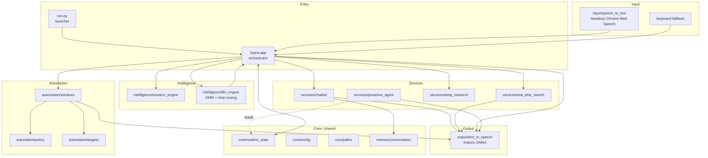
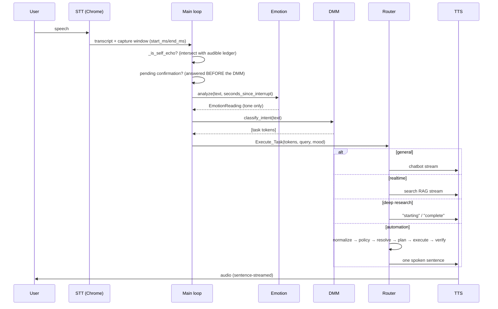
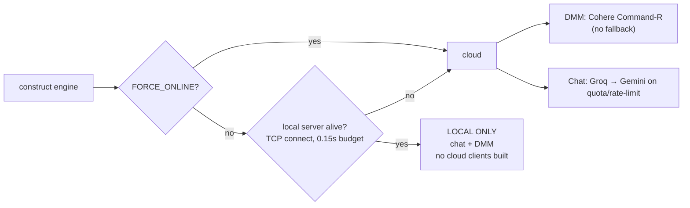
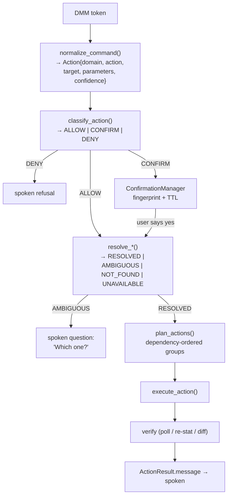
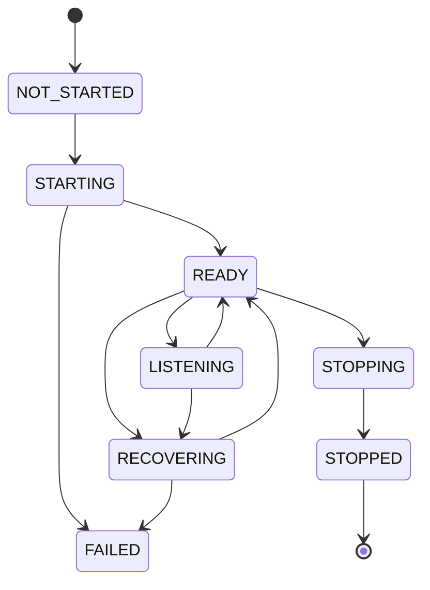
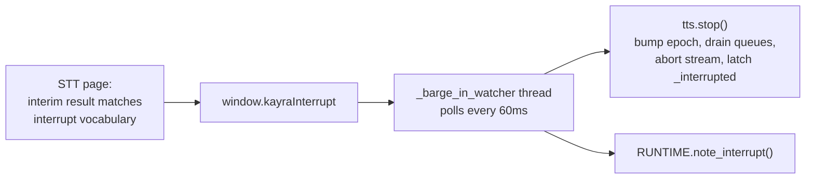
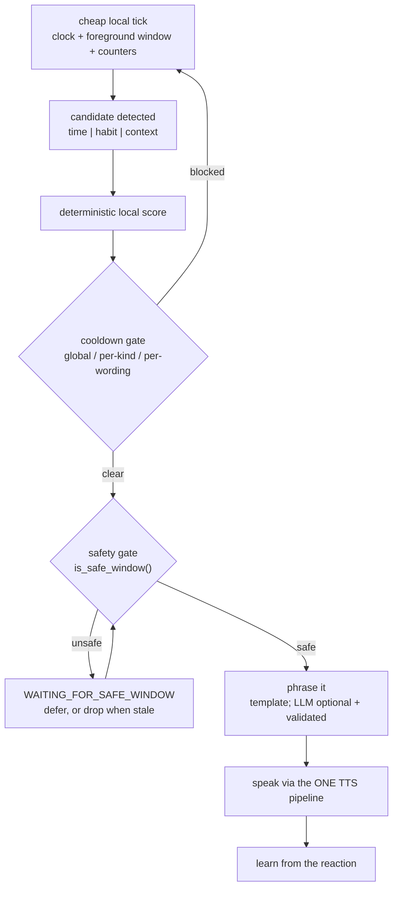
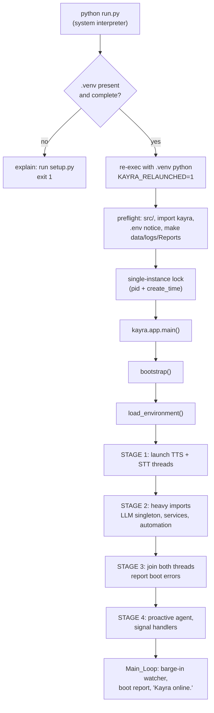
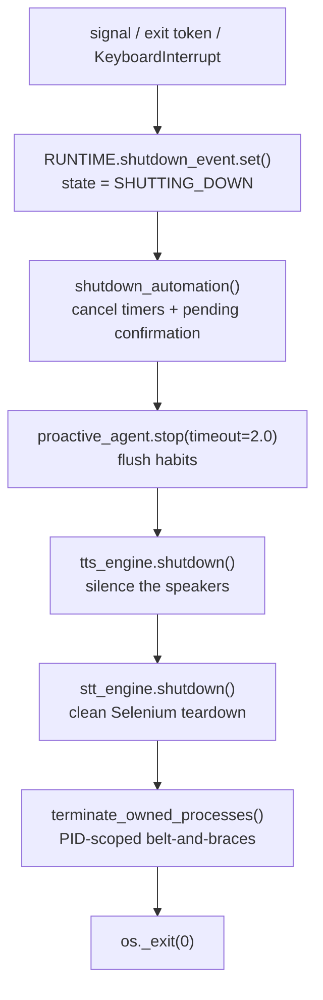

# Kayra System Architecture

> **Scope.** This document describes the Kayra implementation as it exists in this repository,
> not an aspiration and not a historical design. Every claim about behaviour was read out of
> the source; every number labelled *measured* was produced by running the code on the
> development host and is marked with what produced it. Numbers that are targets, estimates or
> inherited from earlier measurement rounds are labelled as such.
>
> **Audience.** Engineers (human or AI) making changes to Kayra. It explains not only *what*
> each subsystem is, but *how* it works, *why* it is built that way, *what else was possible*,
> and *why the alternative lost*.
>
> **Last verified against the tree:** 2026-09-07.

---

## Table of contents

1. [Project overview](#1-project-overview)
2. [Design goals](#2-design-goals)
3. [Architectural principles](#3-architectural-principles)
4. [High-level architecture](#4-high-level-architecture)
5. [Complete data flow](#5-complete-data-flow)
6. [Input architecture](#6-input-architecture)
7. [Emotion engine](#7-emotion-engine)
8. [Decision-Making Model](#8-decision-making-model-dmm)
9. [Context system](#9-context-system)
10. [Chatbot](#10-chatbot)
11. [Real-time search](#11-real-time-search)
12. [Deep research](#12-deep-research)
13. [Automation architecture](#13-automation-architecture)
14. [Automation safety](#14-automation-safety)
15. [Browser / STT Chrome lifecycle](#15-browser--stt-chrome-lifecycle)
16. [TTS architecture](#16-tts-architecture)
17. [Barge-in](#17-barge-in)
18. [Self-echo protection](#18-self-echo-protection)
19. [Proactive agent](#19-proactive-agent)
20. [Memory](#20-memory)
21. [Runtime state](#21-runtime-state)
22. [Logging](#22-logging)
23. [Configuration](#23-configuration)
24. [Startup](#24-startup)
25. [Shutdown](#25-shutdown)
26. [Performance](#26-performance)
27. [Security](#27-security)
28. [Alternatives considered](#28-alternatives-considered)
29. [Why the current choices were selected](#29-why-the-current-choices-were-selected)
30. [Current features](#30-current-features)
31. [Current limitations](#31-current-limitations)
32. [Future extensions](#32-future-extensions)
33. [Final folder structure](#33-final-folder-structure)
34. [Development workflow](#34-development-workflow)
35. [Testing strategy](#35-testing-strategy)

---

## 1. Project overview

Kayra is a voice-driven desktop assistant for Windows. It listens continuously, classifies what
the user asked for, and routes that to one of four capabilities: conversation, live web search,
autonomous deep research, or direct control of the machine. It answers out loud through an
offline neural voice, and it can be interrupted mid-sentence.

The defining constraint is that Kayra **acts on a real computer that belongs to someone**. That
single fact shapes most of the architecture: the safety policy, the PID-scoped process
ownership, the confirmation system, the verification step after every action, and the refusal
to let a language model reach the operating system directly.

The second defining constraint is **latency**. A voice assistant that takes six seconds to
start talking feels broken regardless of how good the answer is. Much of the design — the
overlapped boot, the sentence-streaming TTS, the zero-LLM execution path, the microsecond
normalizer — exists to protect the time between a user finishing a sentence and hearing the
first word back.

| Property | Value |
|---|---|
| Package | `kayra` (under `src/`), version 2.0.0 |
| Platform | Windows 11 (Win32 automation, Windows-only signal handling) |
| Python | 3.10 floor, 3.11 recommended and verified, 3.12 allowed but unverified |
| Entry points | `python run.py` (preferred), `python main.py` (shim), `python -m kayra` |
| Setup | `python setup.py` (once) |
| Offline-capable | Yes, with a local LLM server and the Kokoro voice model |

---

## 2. Design goals

1. **Answer fast.** Time-to-first-spoken-word is the headline metric, not total response time.
2. **Never damage the user's machine or data.** Ambiguity is resolved by asking, not guessing.
3. **Never take resources the user owns.** Kayra's browser is Kayra's; the user's browser is
   untouchable.
4. **Be interruptible.** The user can always take the floor back mid-sentence.
5. **Work offline where it can.** A local LLM and an offline voice mean the core loop does not
   require the network.
6. **Be deterministic where determinism is possible.** A model decides *what was meant*; plain
   Python decides *what may run* and *what happens*.
7. **Stay bounded.** Every queue, cache, history and log has an explicit cap.
8. **Be honest about failure.** Report what broke; never silently degrade in a way that looks
   like success.

---

## 3. Architectural principles

These are load-bearing rules, not style preferences. Each one exists because violating it
caused a real, diagnosed bug.

| # | Principle | The failure it prevents |
|---|---|---|
| 1 | One authoritative state system (`core/runtime_state.py`) | Two copies gave two different answers to "is the assistant speaking?", so the proactive agent read the one nobody wrote |
| 2 | One shared LLM engine (singleton) | The engine was constructed up to 5× per boot, each re-probing the local server and rebuilding API clients |
| 3 | One STT lifecycle manager | A second engine meant a second headless Chrome competing for the microphone |
| 4 | One shared TTS pipeline | A private sentence queue in a service survived `stop()`, so the assistant kept talking after being interrupted |
| 5 | One proactive service | — |
| 6 | One automation policy layer | A missed check in one of thirty handlers is a formatted disk |
| 7 | One target-resolution strategy | Substring sweeps closed every window whose title contained a word |
| 8 | Deterministic execution for known actions | — |
| 9 | LLM for semantic reasoning, never for keystrokes | An LLM round-trip per Ctrl+W is cost with no benefit |
| 10 | Bounded queues, caches, history | Unbounded growth in a process meant to run all day |
| 11 | Explicit resource ownership (by PID, never by name) | A name-based sweep would close the user's entire browsing session |
| 12 | Deterministic shutdown | Orphaned Chrome processes and timers firing after exit |
| 13 | No unrestricted shell execution | — |
| 14 | No process-name-based destructive cleanup | See 11 |
| 15 | No unnecessary startup work | Four spoken boot lines cost ~19s before the assistant was usable |
| 16 | No module import-time side effects | Importing a module started a browser |
| 17 | No hidden global state where a service boundary belongs | See 1 |
| 18 | No silent fallback that hides failure | — |
| 19 | Measured performance wherever practical | — |
| 20 | Extensible without being over-engineered | — |

---

## 4. High-level architecture



**Layer rules.**

- `core` imports nothing from the rest of the package. `core/paths.py` imports only the stdlib.
- `utils` may import `core`, never `services`, `automation`, `input` or `output`.
- `automation` never imports `input` (see [§15](#15-browser--stt-chrome-lifecycle) — importing
  `speech_to_text` would boot a browser as a side effect of asking to close a window).
- `services/proactive_agent` imports neither the TTS engine nor an LLM client; it receives
  callables. This is what makes it structurally unable to touch the cancellation epoch.
- `app.py` is the only module that knows about all of the above.

---

## 5. Complete data flow



The ordering here contains three deliberate, non-obvious decisions.

**Echo rejection happens before anything else.** An utterance captured while the assistant was
audible is its own voice and is dropped, except for interrupt words. See
[§18](#18-self-echo-protection).

**A pending confirmation is answered before the classifier.** A bare "yes" sent to the DMM
comes back as `general yes` and gets answered by the chatbot, so the confirmation would never
resolve. It would also make the answer to "should I restart your computer?" depend on a cloud
round-trip. `resolve_confirmation` returns `handled=False` for anything that is not actually an
answer, so an unrelated command spoken while a confirmation is pending still runs normally.

**Emotion is computed before routing but handed only to the response generators.** It never
reaches the DMM. How the user sounds must not be able to change what they asked for.

---

## 6. Input architecture

### 6.1 Speech (primary)

`input/speech_to_text.py`. The recognizer is the HTML5 Web Speech API running inside a
headless, Selenium-controlled Chromium browser — **not necessarily Chrome**; see
[§6.4](#64-browser-choice-and-the-speech-backend-problem). Python never sees audio — it receives
finalized transcripts over the WebDriver wire, each carrying the wall-clock window it was
captured in.

Two page-side properties exist specifically to make the voice loop work:

1. **Capture timestamps** (`start`/`end` from `Date.now()`) on every utterance. An utterance is
   only finalized ~800ms after the speaker stops, so "was the assistant talking when this was
   *captured*?" is the only answerable form of the echo question.
2. **Interim-result interrupt detection**, published on `window.kayraInterrupt`. This bypasses
   both the VAD silence timer and the translation round-trip, taking "stop" from ~1.2s to
   ~200ms.

The page is served from `http://127.0.0.1:<ephemeral>` by a small loopback server, **not** a
`data:` URL. A `data:` URL has an opaque origin and is not a secure context, so
`navigator.mediaDevices` is `undefined` there and the page's echo-cancellation request was
silently dead code. Verified after the change: `isSecureContext` is true and
`echoCancellation: true` appears in the live track settings.

### 6.2 Keyboard (fallback)

When the STT engine fails to boot, `Listen()` falls back to typed input and the assistant runs
identically otherwise. This is what makes the whole system testable without a microphone.

### 6.4 Browser choice and the speech-backend problem

Kayra does not require Chrome specifically. `input/browsers.py` discovers the installed
browsers, reads the user's Windows default, and picks one that can actually transcribe.

**Why capability must be verified rather than assumed.** `webkitSpeechRecognition` needs a
speech BACKEND, which is a property of the build, not of the API. Chrome carries Google's key;
Edge uses Microsoft's; Brave ships neither, as a deliberate privacy decision. A backendless
browser exposes the whole API surface, `start()` succeeds and `onstart` fires — then recognition
dies with `onerror{error:'network'}` and never produces a transcript. Checking for the API's
existence proves nothing.

Measured on the development host (headless, against the real recognition page):

| Browser | Version | Behaviour | Verdict |
|---|---|---|---|
| Chrome | 152 | session started, no error | USABLE |
| Edge | 152 | session started, no error, produced a result | USABLE (Microsoft backend) |
| Brave | 152 | started, then `network`, session ended | UNUSABLE |

**Edge is the reason "no Chrome installed" is survivable** — it ships on every Windows 11
machine. Measured: a full STT session on Edge starts in **1.3s with 8 owned processes**, versus
Chrome's 1.4s / 9 processes.

**Selection order.** Explicit `STT_BROWSER` → previously verified → the user's default (unless
known backendless) → other browsers with a real backend → unknowns → known-backendless last, so
a machine with only such a browser gets a specific error rather than "no browser found".

**The infinite-loop bug this exposed.** The page's `onerror` treated `network` as transient and
restarted unconditionally. In a backendless browser that is an endless restart loop: the
assistant looks alive, consumes CPU and never hears anything. Restart is now bounded (3
consecutive network errors while nothing has ever been recognised), a successful result clears
the counter, and `onend` refuses to resurrect a backend already declared dead.

**Verification must not cost cold start.** A blanket probe on every session start measured
+2.8s on boot and pushed crash recovery from 2.5s to 6.5s. So browsers with a first-party
backend, and any browser cached as previously working, are TRUSTED at start; unknown and
known-backendless browsers are probed for up to 4s (a backendless build declares itself dead in
1.55–1.78s, measured over three trials). Trusted browsers are verified later at zero cost:
`capture()` already reads the page status on every 50ms poll in the same round-trip it uses to
pop the speech queue, so a dead backend is detected at the first listen and `_switch_browser()`
rebuilds the session on the next candidate. After this change: Chrome 1.4s, Edge 1.3s, recovery
back to 2.5s.

**Cache asymmetry.** Only success is persisted (`data/browser_support.json`). A `network` error
is structural for Brave but temporary for Chrome on an offline machine; persisting the negative
would let a single offline boot permanently demote a good browser. Rejections are session-scoped.

**The user's own browser is never touched.** Kayra reads the registry UserChoice to learn the
preference and runs its own headless session; it does not launch, modify or close the browser
the user actually browses with. When the default cannot be used, it says so — the user chose
that default deliberately, and silently substituting another looks like a bug later.

Firefox is deliberately unsupported: recognition is disabled by default and there is no bundled
backend, so listing it would only be a slower path to the same failure.

### 6.3 Gesture (standalone, not wired in)

`input/gesture.py` is a complete MediaPipe hand-gesture mouse replacement (1-Euro filter,
hysteresis pinch thresholds, FSM, scroll, double-click). It is **not** part of the main loop and
is run directly:

```bash
python -m kayra.input.gesture
```

It is documented here because it exists in the tree, not because the assistant uses it.

---

## 7. Emotion engine

`intelligence/emotion_engine.py`.

### 7.1 What it is for

One sentence of tone guidance appended to the chat system prompt. That is the entire consumer.
Understanding this is essential to judging the design: the value ceiling on this subsystem is
low, so its cost budget is also low.

### 7.2 Why there is no acoustic analysis

The obvious upgrade is prosody — pitch, energy, speaking rate. It is deliberately absent, and
the reason is architectural rather than effort.

**Kayra's STT is the Web Speech API inside headless Chrome. Chrome owns the microphone and
hands Python a transcript. The raw audio never enters this process at all.** Adding acoustic
emotion would require one of:

| Option | Cost | Verdict |
|---|---|---|
| Open a second microphone stream in Python | Two capture paths on one device, contending with Chrome; a second copy of every buffer | Violates the single-capture rule outright |
| Record in-page with `MediaRecorder`, base64 back through Selenium | Hundreds of KB of JSON per utterance on the same WebDriver connection the barge-in watcher polls every 60ms | Endangers the one resource that must stay responsive |
| Add librosa/scipy feature extraction | Tens of MB RSS, hundreds of ms per utterance, on the hot path of every turn | Cost exceeds the value of one tone hint |

The engine therefore uses the signals that are genuinely free and says so, rather than shipping
a placeholder that pretends to hear tone of voice. `_TAB_ENUMERATION_NOTE`-style honesty is the
house pattern here. **If the STT layer is ever replaced by an in-process recognizer that already
holds PCM, this decision should be revisited** — the blocker is the audio boundary, not the idea.

### 7.3 The three signals

| Signal | Weight | What it reads |
|---|---|---|
| Lexical | `W_LEXICAL = 0.62` | Weighted n-gram lexicon with negation, amplifiers and dampeners |
| Structural | `W_STRUCTURAL = 0.20` | Punctuation, capitalisation, elongation, length |
| Contextual | `W_CONTEXT = 0.18` | Recent utterances, local hour, seconds since the user interrupted |

Structural is weighted low on purpose: `"!!!"` is intensity without content, and can only ever
tip a near-tie.

### 7.4 Fusion

Each signal is normalised by **its own evidence mass** before weighting (`scale = weight /
evidence`), so a signal that fired weakly cannot contribute a large raw number merely because
its scale differs. This is the mechanism that satisfies the "one weak signal must not override
a strong one" requirement.

Confidence is then computed from two independent quantities:

```
margin     = (top - runner_up) / top        # how clearly the winner won
mass       = min(1.0, total_evidence / 1.5) # how much evidence existed at all
confidence = (0.45 + 0.55 * margin) * mass
```

Both are needed. Margin alone would make a single 0.3-weight token look as certain as a
paragraph; mass alone would ignore whether the reading was ambiguous.

A **smoothing** bonus of +0.12 applies when at least two of the last three readings agreed with
this one at confidence ≥ 0.4. It only ever *adds* confidence to agreement — it can never invent
an emotion the current utterance had no evidence for.

Below `DEFAULT_THRESHOLD = 0.35`, the reading is reported as `neutral` with its confidence
preserved.

### 7.5 False-positive control

This is the requirement that actually matters, because emotional vocabulary appears constantly
in ordinary questions. Damping is applied to the lexical signal based on **whether the sentence
is even about the speaker**:

| Condition | Damping | Example |
|---|---|---|
| Definitional and no first person | 0.10 | "Why do people get stressed before exams?" |
| Question and no first person | 0.20 | "what does burnout mean" |
| Third person and no first person | 0.30 | "he was furious about the delay" |
| Question with first person | 0.75 | "Why am I so tired today?" |

Negation inside the three tokens before a match cancels it entirely; amplifiers and dampeners
in the two tokens before scale it.

Measured on fresh engines at `hour=14`:

| Utterance | Result |
|---|---|
| "Why do people get stressed before exams?" | `neutral` (0.07) |
| "what does burnout mean" | `neutral` (0.07) |
| "tell me about depression" | `neutral` (0.00) |
| "he was furious about the delay" | `neutral` (0.20) |
| "I am not angry at all" | `neutral` (0.00) |
| "I'm so tired of this" | `tired` (0.87) |
| "THIS IS AMAZING!!!" | `excited` (0.90) |
| "I am really excited about the launch" | `excited` (0.93) |
| "open chrome" | `neutral` (0.00) |

### 7.6 Vocabulary and output

Eight states: `neutral`, `happy`, `excited`, `stressed`, `sad`, `tired`, `frustrated`, `calm`.

`EmotionReading` subclasses `str`, so it is the emotion label wherever a string is expected —
which is what keeps `Chatbot(query, tts, mood)` and `RealTimeSearchEngine(query, mood, tts)`
working unchanged — while also carrying `.confidence`, `.signals`, `.scores`, `.tone` and
`.to_dict()`.

```python
{"emotion": "stressed", "confidence": 0.81, "signals": ["text", "structure"]}
```

### 7.7 Influence, not control

Emotion modifies **tone only**, via `TONE_GUIDANCE`. It is passed to the chatbot and the search
engine and to nothing else. It is never passed to the DMM, so it cannot alter intent: "open
Chrome" spoken angrily is still `open chrome`.

### 7.8 Memory and threading

Bounded and in-RAM: a short deque of recent readings and recent utterance tokens. **Nothing is
persisted** — there is no emotion file, by design. `analyze()` takes a lock only to snapshot
history, and the engine starts no threads and opens no audio stream (both asserted by the test
suite). It runs synchronously on the main loop because at 14.3µs it is far cheaper than the
thread hand-off would be.

Failure is contained: `app.py` wraps the call in `try/except` and continues with `mood=None`.
A malformed or non-string input returns a neutral reading rather than raising.

### 7.9 Measured cost

Measured on the development host with the project `.venv` (Python 3.11.9):

| Metric | Value |
|---|---|
| `analyze()` | **14.3 µs** per call (~69,800 calls/sec) |
| Construction | **2.4 µs** |
| RSS growth over 50,000 analyses | **11.7 KB** |
| Threads started | 0 |
| Audio streams opened | 0 |
| Heavy imports | none (`collections`, `datetime`, `re`, `threading`, `time`) |

At 14.3µs against a DMM round-trip measured in seconds, emotion analysis is not a measurable
part of response latency.

---

## 8. Decision-Making Model (DMM)

`intelligence/llm_engine.py :: CentralizedLLMEngine.classify_intent()`.

### 8.1 How it works

The raw user query plus a large few-shot preamble (`dmm_preamble` + `dmm_chat_history`) goes to
Cohere Command-R (cloud) or the local model. The model must reply with a comma-separated list
of task tokens, each beginning with one of the strings in `self.funcs`. That list is the
acceptance gate.

### 8.2 The contract, and the traps in it

- **`self.funcs` is the acceptance gate, so a token in it that no executor handles is worse
  than useless.** It passes the filter and is then silently dropped, and the user gets nothing.
  `generate image` was exactly that and was removed.
- **Duplicate matching.** Several entries are prefixes of others (`close` / `close window` /
  `close tab`, `save` / `save file`, `minimize` / `minimize all`, `copy` / `copy text`). Each
  raw task must be matched against the header set **once**, not once per matching prefix — a
  naive per-func loop-append double-executes (`minimize all` would fire Win+D twice, undoing
  itself). Keep the single-match + `seen_tasks` dedup.
- **Few-shot ordering is a design decision, not a list.** Recency weight with Cohere is strong
  enough that adding `proactive on`/`proactive off` — which pushed a media example into the
  final position — reproducibly dragged "Undo that." from `undo` to `resume`, taking the matrix
  from 53/53 to 52/53. Moving an undo/redo contrastive pair to the very end restored it. Never
  slice or truncate this list, and re-run the matrix after any append.
- **Placeholders must never reach the output.** The preamble writes `'general ...'`, not
  `'general (query)'`, because the model copied the literal word "query" as the payload. A
  parser guard substitutes the user's real words if a placeholder appears — this matters
  because `deep research` slices its topic out of the token.
- The rate-limit path recurses with `retries + 1` and gives up after 3 attempts. It previously
  recursed with the same counter, making a sustained rate limit an unbounded recursion.

### 8.3 Model routing



`_check_local_server()` does a **TCP connect with a short per-address budget** before any HTTP
call. The old bare `requests.get(..., timeout=1.5)` measured **3.0s** on a host with no local
server: Windows Firewall *drops* rather than refuses connections to closed loopback ports, and
`localhost` resolves to two address families, so the timeout was paid twice.

If the Cohere key is missing while online, `classify_intent` degrades every query to
`general <query>` — the assistant still converses but cannot automate.

### 8.4 Singleton

`CentralizedLLMEngine.__new__` returns one shared instance per process. Five modules construct
it at import time; without the singleton that meant five local-server probes and five sets of
API clients per boot.

`run_boot_sequence()` is **purely cosmetic narration**. `classify_intent()` and
`generate_chat_stream()` work on a freshly constructed engine whether or not it is ever called.
`app.py` calls it without a TTS engine on purpose.

---

## 9. Context system

Two distinct things carry context, and they are deliberately separate.

**`AutomationContext`** (`automation/policy.py`) — six fixed slots (last app, window, site,
file, …) with a 300s referent TTL, so "close it" resolves to something real instead of a
hallucinated referent. Bounded by construction; it is not a growing history.

**`RuntimeState`** (`core/runtime_state.py`) — what the assistant is doing and how recently the
user was involved. See [§21](#21-runtime-state).

Conversational context is the chatbot's own short-term window ([§20](#20-memory)).

---

## 10. Chatbot

`services/chatbot.py`. Memory-augmented conversation.

- Builds the prompt from the identity/system prompt, the short-term session window, relevant
  long-term memory, and the mood tone hint.
- Streams tokens from the shared LLM engine through `utils.SentenceStreamer` into
  `tts_engine.speak`.
- **It must not spawn its own speech worker thread.** A private queue holds a backlog that
  survives `stop()`, which is exactly how the old implementation kept talking after being
  interrupted. The TTS engine owns the only sentence queue.
- Cancellation is epoch-scoped: it captures `tts.turn_token()` once and asks
  `tts.is_cancelled(token)`. It must **not** read a global `interrupted` flag — that flag is
  process-wide and `begin_turn()` clears it, so a proactive suggestion firing in the window
  between a barge-in and the chatbot noticing would un-cancel the interrupted response.

---

## 11. Real-time search

`services/real_time_search.py`. Live retrieval-augmented generation.

DuckDuckGo (`ddgs`, with `duckduckgo_search` as an import fallback) retrieves snippets, which
are injected into the system prompt as live context, and the answer is streamed and spoken
sentence-by-sentence like the chatbot path. It shares the same memory helpers and the same
`SentenceStreamer` discipline.

---

## 12. Deep research

`services/deep_research.py`. A six-stage autonomous research agent that writes a Markdown
report into `Reports/`.

1. **Plan** — the LLM decomposes the topic into angles, sub-topics and search queries.
2. **Broad scrape** — DuckDuckGo for high-level context.
3. **Deep extraction** — full page fetch + BeautifulSoup article extraction for the best hits.
4. **Follow-up generation** — the LLM identifies gaps and writes targeted queries.
5. **Gap-filling scrape** — executes those and deep-scrapes again.
6. **Synthesis** — one long-form cited Markdown document.

Bounded by `MAX_SUB_QUESTIONS`, `MAX_FOLLOWUP_QUERIES`, `MAX_DEEP_PAGES` and
`SEARCH_RESULTS_PER_QUERY`. It is the one path that takes minutes, so the assistant says so
before starting and confirms when the report is saved.

---

## 13. Automation architecture

`automation/windows.py` (the hands), `automation/policy.py` (may it run?),
`automation/targets.py` (what exactly does it mean?).

### 13.1 The pipeline



The sentence is parsed **once**, into a structured `Action`. No later layer re-reads the user's
raw English. That is what makes each stage independently testable: the policy without a
desktop, the resolver without an executor, the executor with a target it did not have to guess.

### 13.2 Prefix collisions are structural, not positional

The old implementation was one ordered `if/elif` chain on `cmd_lower.startswith(...)`, so
`close window` and `close tab` had to be tested before the generic `close ` prefix or they were
routed to `CloseApp("window")`. That ordering constraint is gone: `_EXACT_TOKENS` is a dict
consulted before `_PREFIX_TOKENS`, and the prefix list is sorted longest-first at import. **A
dict cannot be reordered by accident and a longest-first list cannot be shadowed**, so the bug
class is eliminated rather than documented.

When adding a literal token, add it to `_EXACT_TOKENS` and cover it in the normalizer table.
Every token in `llm_engine.funcs` must normalize to something — the suite asserts zero dead
tokens.

### 13.3 Planner

`plan_actions` groups actions for execution. Only `_CONCURRENT_SAFE` domains (`info` — pure
reads) share a group; **everything else is sequential**. This is a correctness fix, not tuning.
The old router built every command as an `asyncio.to_thread` task and fired the lot through one
`asyncio.gather`, so "open chrome and maximize the window" raced the maximize against the
launch, and two keystroke sequences went to whatever had focus at that instant.

### 13.4 Verification

Actions verify rather than assume:

- `_open_app_verified` focuses an already-running app instead of launching a second copy, then
  waits for a window.
- `close` polls until the handle is gone.
- screenshot diffs the folder.
- filesystem operations re-`stat` the result.

Nothing says "Done." because a keystroke was sent.

### 13.5 The stuck-modifier bug (do not reintroduce)

Bringing a window forward needs a synthetic ALT tap to defeat Windows' `ForegroundLockTimeout`.
If ALT is still logically held when the next accelerator arrives, **Ctrl+T is delivered as
Ctrl+Alt+T and Windows opens the task switcher** — the browser never sees it. Observed end to
end: the new tab silently failed, and the following "close this tab" then landed on a
single-tab window and closed the whole window.

Two things prevent it, both load-bearing:

- `focus_window` tries `SetForegroundWindow` **first** and only taps ALT as a fallback, then
  releases ALT/CTRL/SHIFT and settles for `FOCUS_SETTLE_SECONDS` — **including on the fast path
  where the window is already in front**, which is where the bug actually lived.
- `send_keys()` normalises modifier state immediately before **every** injected keystroke.
  Every injection site goes through it, so no future call site can forget.

**Never call `keyboard.press_and_release()` directly in the automation layer.**

### 13.6 Destructive tab actions never hunt for a browser

`close_tab` requires a browser to already be in front. If the user says "close this tab" while
looking at their editor, the honest answer is "no browser is in front". An earlier version fell
back to "find any browser and close a tab in it", and during testing that closed a tab in a
window full of the user's own work. Non-destructive actions (new tab, refresh, back) may still
focus the one unambiguous browser.

### 13.7 Backward compatibility

Every handler that existed before the rewire is still exported with its original name and
signature: `OpenApp`, `CloseApp`, `WindowManage`, `MediaControl`, `HotkeyShortcut`,
`SystemInfo`, `SetTimer`, `TakeScreenshot`, `Clipboard*`, `ExecuteCommand`, `ToggleWifi`,
`WebSearch`, `Content`, `YoutubeSearch`, `PlayYoutube`, `global_desktop_type`,
`translate_and_execute`, `Automation`. The test suite asserts the list.

`Automation()` now **returns the spoken sentence** instead of `True`; a non-empty string is
still truthy, so truthiness checks are unaffected. Before this, automation was silent to a
voice user — a failed or ambiguous action was indistinguishable from a successful one.

---

## 14. Automation safety

`automation/policy.py` is the single boundary. `classify_action` for structured actions,
`classify_shell` for terminal commands; both return ALLOW / CONFIRM / DENY plus a reason that
becomes the spoken refusal.

### 14.1 Shell classification parses, it does not string-match

A blocklist of literal strings is trivially defeated by whitespace, quoting or an equivalent
flag spelling. So:

1. Shell metacharacters (chaining, piping, redirection, substitution) are **refused outright**,
   because every later check reasons about *one* command.
2. The executable **stem** is identified, path- and extension-insensitively, so
   `C:\Windows\System32\format.exe` is `format`.
3. Destructive verbs are judged by **scope** against `_is_protected_path`.
4. Nested interpreters (`powershell`, `cmd`, `wscript`) are **denied as shell targets**, because
   a nested shell defeats every check above it.
5. Unrecognised executables are **CONFIRM, not ALLOW**.

`_is_protected_path` distinguishes `_PROTECTED_TREES` (the Windows directory and everything
under it) from `_PROTECTED_EXACT` (a drive root, the Users folder — protected as a *target*
only). Conflating them is not a safe default in the direction it looks: an earlier version
protected everything on `C:`, which blocked every legitimate file operation the user has. Caught
by the test suite, not by reading it.

**Kayra's own first-party PowerShell calls are not governed by this policy** — they are fixed
argument vectors with no user text in them (`_powershell`, the brightness WMI calls, the timer
toast). The policy governs commands that *originate from something the user said*.

### 14.2 Three dangers that were removed

| Removed | Why it was dangerous |
|---|---|
| `taskkill /f /im <name>.exe` fallback in `CloseApp` | For "close chrome" that is the user's entire browsing session **and** Kayra's own STT Chrome, taking the microphone down with it. There is now **no path** in the stack that terminates a process by name — the test suite walks the AST to prove it. Closing is `WM_CLOSE` to a resolved window: what clicking the X does. |
| The substring sweep | `CloseApp` posted `WM_CLOSE` to *every* visible window whose title contained the string. Matches are now scored (`_score_window`) and ranked; a near-tie returns AMBIGUOUS so the assistant asks. |
| Instant shutdown/restart | `ExecuteCommand` ran `os.system("shutdown /s /t 0")` the moment a substring matched — a misheard word could power the machine off mid-sentence. Both are CONFIRM actions now, and `ExecuteCommand`'s branch is deliberately inert so the gate cannot be routed around. |

`force_close_app()` exists for the genuine force case: PID-scoped, protected-process filtered,
CONFIRM-gated.

### 14.3 Confirmations

`ConfirmationManager` holds **at most one** pending action, bound to `Action.fingerprint()`
(domain, action, target, parameters) and expiring after `AUTOMATION_CONFIRM_TTL_SECONDS`. A
"yes" resolves *that* fingerprint and can never execute something else.

`read_confirmation_reply` matches the **whole cleaned utterance exactly** — "yes and open
chrome" is a new instruction, not an authorisation — and returns `None` for anything that is not
an answer.

### 14.4 Target resolution

`resolve_window`, `resolve_application`, `resolve_site`, `resolve_browser`, `resolve_path`.
Every one returns a `Resolution`, never an action.

- **Kayra-owned PID exclusion is the critical safety property.** `kayra_owned_pids()` reads the
  live STT engine's `owned_pids` out of `sys.modules` — it must **never** import or construct
  `speech_to_text`, because that would boot a headless Chrome as a side effect of the user
  asking to close a window. Every enumerated window is flagged once, in `list_windows`, so no
  caller can forget to check.
- **"Close YouTube" is a site, not a process.** `looks_like_site` + `resolve_site` match the
  site's title fragments against browser window titles.
- **Stated limitation:** Win32 exposes one handle per browser window and its title reflects only
  the *active* tab. A site in a background tab is invisible here. `resolve_site` returns
  NOT_FOUND with that reason rather than closing something else. Real tab enumeration needs UI
  Automation or a debugging port; neither is installed and neither earns its cost yet.
  `_TAB_ENUMERATION_NOTE` marks the extension point.
- `list_windows()` caches for 250ms — a multi-step command asks three or four times, and a
  quarter-second is far shorter than any user-visible window change. Call `invalidate_cache()`
  after anything that changes the window set.

### 14.5 Audit

Every automation decision is written to a bounded 200-entry ring and to `logs/automation.log`.
Spoken output stays one short sentence; paths, status codes and detail go to `detail` and the
audit log.

---

## 15. Browser / STT Chrome lifecycle

`SpeechToTextEngine` owns exactly **one** ChromeDriver and **one** Chrome session for the life
of the process. `get_shared_engine()` is the only sanctioned entry point; constructing a second
engine while one is live logs a warning, because that means a second browser.

### 15.1 Lifecycle



`_start_session`, `recover` and `shutdown` are the only writers, and each holds
`_lifecycle_lock` across the whole transition.

### 15.2 The rules that make it fast and safe

- **Never create a session before the old one is gone.** `recover()` tears down, waits for the
  owned PIDs to actually disappear, and only then builds the replacement.
- **Detect death by PROCESS, not by WebDriver.** `_service_alive()` is a `psutil` check on the
  ChromeDriver PID and costs microseconds. Discovering the same thing through Selenium costs
  ~16s of urllib3 connect retries *while holding the driver lock*, which freezes the barge-in
  watcher too. Measured end-to-end recovery: **45s before, 2.5s after**.
- **Never speak WebDriver to a corpse.** `_teardown_session(session_dead=True)` skips
  `execute_script` and `quit()` (~16s each against a dead driver) and uses `service.stop()`
  (0.00s) plus PID termination (0.04s).
- **Process ownership is PID-based, never name-based.** `owned_pids` records the ChromeDriver
  PID and every Chrome PID beneath it.

### 15.3 Why the browser cannot be killed by process name

This is the single most important ownership rule in the codebase, and it is not stylistic.

`automation/windows.py` opens applications through AppOpener, which uses `subprocess.Popen`.
**A Chrome window Kayra opened *for the user* is therefore a child of the Kayra process.** The
old `children(recursive=True) + name matches "chrome"` sweep in `_force_shutdown` would have
closed the user's browsing session on exit.

This was demonstrated live while verifying this document. A Kayra run left an orphaned STT
browser; walking the PID tree from the ChromeDriver identified **8 owned processes**, while
**6 other `chrome.exe` processes on the same machine belonged to the user**. A name-based
sweep would have killed all 14. The PID-descent cleanup killed the 8 and left the user's 6
running.

Do not reintroduce name matching, and never `taskkill /IM chrome.exe`.

### 15.4 Footprint

Measured on one host: **10 processes / 541 MB before, 9 / 472 MB after** the Chrome flag work.
The flags in `_chrome_options` were chosen by measuring each set, not copied from a list.

---

## 16. TTS architecture

`output/text_to_speech.py`. Kokoro-82M ONNX on CPU, fully offline.

### 16.1 Pipeline

```
speak(text) → text queue → [synth worker] → audio queue → [playback worker] → speakers
                            Kokoro ONNX                     persistent sd.OutputStream
```

Three decoupled stages, one thread each. Every queued item is tagged with the **utterance
epoch** it was produced under.

### 16.2 Epoch cancellation

`stop()` bumps `_epoch`, drains both queues, aborts the output stream, and **latches
`_interrupted`** until the next `begin_turn()`. All of that is one atomic step, so nothing
produced before the interrupt can reach the speakers afterwards.

The latch is the part people remove by accident: without it, a still-running LLM stream
resurrects the cancelled answer one `speak()` call at a time.

### 16.3 Latency decisions

- **`speak()` is non-blocking**: it queues text and returns. Callers that exit the process
  immediately after speaking (the shutdown farewell) must pass `blocking=True`.
- **Speech starts from the first *clause*, not the first sentence.** `SentenceStreamer` lets the
  opening utterance break at a comma. Measured **6.94s → 1.44s** to the first spoken word on a
  typical response, because Kokoro on CPU synthesizes at roughly real time and a 78-character
  opening sentence therefore costs ~4s before any sound.
- **One persistent `sd.OutputStream`**, written in 40 ms slices. The previous
  `sd.play()`/`sd.wait()` per chunk paid a device open/close between every chunk and could not
  be aborted mid-chunk.

### 16.4 Model precision — current status

`TextToSpeechEngine` asks for the quantized `kokoro-v1.0.int8.onnx` + `voices-v1.0.bin` pair
first and **warns** when it falls back.

**On this host it falls back.** `models/` contains only `kokoro.onnx` and `voices.bin`
(full precision), and the warning fires on every boot:

```
[WARNING] Using full-precision kokoro.onnx. Dropping the quantized
'kokoro-v1.0.int8.onnx' + 'voices-v1.0.bin' into models/ cuts speech synthesis
latency substantially.
```

The full-precision model synthesizes at RTF ~1.0–1.4 and is the **largest remaining
speech-latency cost**. This is a real, unresolved gap, not a resolved one.

### 16.5 Speech-safe normalization

`utils/text.py :: speech_safe_text()` is the only place a model response becomes speech. The
console keeps the model's own formatting; only the speech copy is normalized.

- Removes what exists only on screen: markdown, emoji, table pipes, rules, bullet glyphs, bare
  URLs, citation brackets, code fences (replaced by a short spoken placeholder).
- **Pronounces what carries meaning**: `%`, currency, degrees, `&`, `=`, `+`, `/`. The previous
  inline cleaner was `re.sub(r'[^\w\s\.,!\?\-\'"]', '', text)`, which deleted every symbol it
  did not recognise — "50%" was spoken as "50" and "$20" as "20".
- Typographic punctuation is mapped to ASCII **first**. U+2019 is category Pf, so without that
  mapping every contraction broke apart ("Rust's" → "Rust s").
- The final sweep filters by Unicode **category** (keep L/N/M), not by a `\w` allow-list,
  because `\w` excludes combining marks and would strip Devanagari vowel signs out of Hindi
  replies.

The identity prompt also tells the model not to emit markdown in the first place. Both layers
exist deliberately and must stay consistent.

---

## 17. Barge-in

Three independent pieces must hold. Removing any one silently breaks interruption.



1. **Detection off the main loop.** `_barge_in_watcher` polls; `Main_Loop` cannot, because it is
   inside `Execute_Task` for the whole response. Before this watcher existed, barge-in could not
   physically work — the "stop" was only read after the response had finished playing.
2. **Detection on interim results**, skipping both the 800 ms VAD finalize and the `mtranslate`
   network round-trip. Waiting for the finalized transcript costs ~1s.
3. **Epoch cancellation in the TTS engine**, including the latch ([§16.2](#162-epoch-cancellation)).

### Interrupt phrases are matched exactly

After stripping filler words, matching is **exact, never prefix**.
`is_interrupt_phrase("stop the music")` must be `False`, or that automation command gets
swallowed instead of reaching the DMM. Likewise "stop proactive suggestions" (3 words) is a
command, not a barge-in.

The same rule is implemented twice — `is_interrupt_phrase()` in Python and `looksLikeInterrupt()`
in the STT page — and **the two must agree**.

---

## 18. Self-echo protection

The microphone stays open while the assistant is speaking. That is deliberate — barge-in
depends on it — and it means Kayra hears itself.

**The filter is timestamp-based.** Every finalized utterance carries the wall-clock window it
was *captured* in; the TTS engine keeps a ledger of when audio was actually leaving the sound
card (`was_audible_between`). `_is_self_echo` intersects the two. Anything captured while she
was audible is her own voice and is dropped; the only speech accepted during playback is the
interrupt vocabulary.

Two approaches that **cannot** work, both previously shipped:

| Rejected approach | Why it fails |
|---|---|
| Compare the transcript to `tts.last_spoken_text` with difflib | Playback lags generation by several sentences, so the echo reaching the microphone is of a sentence spoken much earlier than the one that string holds. Similarity came out near zero and every echo was promoted to a user command — this is what made her answer herself. |
| Check "is TTS playing right now" | An utterance is only finalized ~800 ms (`silenceLimit`) after the speaker stops, so by the time Python sees it the flag has already flipped. |

`stop()` records `_last_stop_ms`, and an utterance beginning after it bypasses the gate — the
user just took the floor, so their next command must not be eaten by the echo tail margin.
`_begin_burst()` clears it again the moment new audio starts.

Chrome-side AEC/noise-suppression (`primeProcessedMicrophone`) reduces how much echo arrives at
all, but it is best-effort; **the timestamp gate is the guarantee.**

---

## 19. Proactive agent

`services/proactive_agent.py`. One daemon thread sleeping on an `Event`.

### 19.1 The pipeline, and the thing it must never become



**It must never call an LLM to decide whether to speak.** Candidate existence, relevance,
cooldowns and safety are all integer arithmetic over values already in memory. Measured: a full
scored `evaluate()` costs **0.0063 ms** and an idle tick **0.0087 ms**. An LLM per tick would be
a cloud round-trip every 20 seconds forever. The LLM is consulted at most once per *spoken*
suggestion, purely to reword a candidate that has already been approved, and the whole subsystem
works with the network down.

### 19.2 Lifecycle

```
DISABLED → IDLE → OBSERVING → CANDIDATE → WAITING_FOR_SAFE_WINDOW → SPEAKING → COOLDOWN
   → (OBSERVING) … STOPPING → STOPPED
```

The states are not decoration. `COOLDOWN` is what makes most ticks skip candidate generation
entirely — the cheapest path, and the one taken for most of the hour after any suggestion — and
`WAITING_FOR_SAFE_WINDOW` is what turns "never interrupt the user" into a **deferral** rather
than a drop.

### 19.3 Triggers

| Kind | Signal | Requires |
|---|---|---|
| `break` | context + time + habit | ≥75% of `PROACTIVE_FATIGUE_MINUTES` unbroken focus in one app, a plausible hour, and an app the habit model has actually seen used |
| `late_night` | time | inside `PROACTIVE_LATE_NIGHT_*`, and the user demonstrably still at the machine |
| `habit_routine` | habit | an action with ≥ `PROACTIVE_HABIT_MIN_COUNT` observations whose hour histogram fires now, not already done in the last 6h |

### 19.4 Scoring — the weights encode a hard requirement

```
score = 0.30*habit + 0.25*temporal + 0.35*context + 0.10*recency - 0.5*annoyance
```

clamped to [0,1], compared against `PROACTIVE_SCORE_THRESHOLD` (0.60).

**Context alone maxes out at 0.35, which is below the threshold** — so foreground-window
information can never on its own cause the assistant to speak. That is enforced by the
arithmetic rather than by a special case, and the test suite asserts it. If you change
`W_CONTEXT`, keep it under the threshold.

Deliberately no ML. This decides when the assistant talks unprompted, so it has to be
predictable and debuggable before it is clever; every input is readable off `data/habits.json`
and every decision is printed with its component breakdown.

### 19.5 Cooldowns

Three independent timers, **all** of which must have expired:

- global (`PROACTIVE_GLOBAL_COOLDOWN_MINUTES`, 60)
- per-kind (break 90, late_night 240, habit_routine 120 — whichever is longer than global wins)
- **per-exact-wording** (`PROACTIVE_REPEAT_COOLDOWN_MINUTES`, 360)

The last is the backstop: a scheduler bug that re-fires the identical sentence in a loop cannot
get past it even if the other two are misconfigured to zero. Its ledger is pruned on every
speak, so it stays bounded.

### 19.6 The safety gate

`is_safe_window()` is the **only** place proactive speech is authorised. It refuses when the
agent is disabled, the runtime is shutting down, the assistant is in any busy state
(PROCESSING / SPEAKING / INTERRUPTING / AUTOMATING / SHUTTING_DOWN), a turn is open, audio is
still queued or draining, or the user spoke / interrupted / finished a turn within
`PROACTIVE_QUIET_SECONDS`.

`create_default_agent` re-checks `is_playing` once more immediately before queueing, closing the
small window between the gate and the queue push.

A refusal **defers** (state `WAITING_FOR_SAFE_WINDOW`, faster poll) until
`PROACTIVE_MAX_DEFER_SECONDS`, then drops. A `barge_in` event discards it outright.

### 19.7 TTS integration — the race this design exists to avoid

Proactive speech goes out through `begin_background_utterance()` + `speak()`.

**`begin_turn()` must never be called from the proactive path.** It clears the `_interrupted`
latch, and a nudge landing in the window between a barge-in and the chatbot noticing it would
then let the cancelled response carry on speaking. That is the same race
[§16.2](#162-epoch-cancellation) documents from the other side, and it is why the module takes
`speak_fn` as a callable instead of importing the TTS engine — it is **structurally unable** to
reach the cancellation epoch. The test suite greps the source for `.begin_turn(` as a
regression guard.

There is no second audio queue, no second player, no second output stream and no separate
interruption mechanism: "stop" cancels a proactive line through exactly the same `tts.stop()`
path as any other response.

### 19.8 Habit model

`data/habits.json` (v2). **Counters and 24-bucket hour histograms only — never conversation
transcripts.** `note_intents()` records the DMM's action tokens; `general` / `realtime` /
`deep research` / `content` / `write` / `copy text` payloads are dropped by `_habit_key`, and
everything else is reduced to a bounded key (`open:chrome`, `take screenshot`).

Every collection has a retention policy: `actions` capped at `PROACTIVE_MAX_HABIT_ACTIONS` (60),
`apps` at `PROACTIVE_MAX_HABIT_APPS` (40), least-observed evicted first; hour histograms are 24
fixed ints; the candidate "queue" is a single slot, never a list. Measured: **100,000 recorded
habit events grow RSS by 0.01 MB and the file stays at 39 KB.** Writes are atomic (tmp +
replace). A v1 file is migrated on load; a corrupt one falls back to empty.

Reactions are recorded as accepted / ignored / dismissed / interrupted and feed `annoyance()`,
which is deliberately gentle — three ignores roughly halve a candidate's headroom, and it takes
sustained rejection to silence a trigger.

### 19.9 Voice control

`proactive on` / `proactive off` are **DMM tokens**, dispatched by `app.py::Execute_Task`, never
by the automation router. "stop proactive suggestions", "don't interrupt me" and "disable
proactive mode" all classify to `proactive off`, while "stop the music" stays `stop media`.

These are unrelated to the audio interrupt and must stay that way
([§17](#interrupt-phrases-are-matched-exactly)).

### 19.10 Cost

`start()` returns in ~5 ms and the first tick is one interval later, so proactive mode adds
nothing measurable to cold start. `stop()` sets the Event (the thread sleeps *on* it, so it
wakes immediately rather than up to a tick later), joins with a bounded timeout, unsubscribes,
commits the current app's time and flushes — measured **2.7 ms**.

---

## 20. Memory

Two tiers, deliberately different in durability.

| Tier | Where | Lifetime | Written when |
|---|---|---|---|
| Session | in-RAM list in `services/chatbot.py`, capped to the last 6 messages | process | every turn |
| Permanent | `data/conversation.json` via `memory/conversation.py` | forever | only on an explicit trigger phrase |

Trigger phrases: "store this", "remember this", "save this", "memorize this", "note this".

**Corruption resistance.** The backup file is written *first*, then copied over the primary. A
crash mid-write can lose the newest exchange but can never leave the primary half-written, and
`load_conversation_memory` falls back to the backup when the primary is unreadable.

**Paths always resolve through `core/paths.py`.** Bare relative paths like
`"data\\conversation.json"` were a real bug: launching Kayra from outside the project folder
silently fragmented the assistant's memory across several files.

The habit store ([§19.8](#198-habit-model)) is a third, separate durable store, and it
deliberately holds no conversational content.

---

## 21. Runtime state

`core/runtime_state.py`. The assistant's state machine plus a minimal synchronous event bus, a
process-wide singleton via `get_runtime_state()`.

**States:** `IDLE`, `LISTENING`, `PROCESSING`, `SPEAKING`, `INTERRUPTING`, `AUTOMATING`,
`SHUTTING_DOWN`. The last five are `BUSY_STATES` — nothing unprompted may be spoken in any of
them. `AUTOMATING` is set around the `Automation()` dispatch.

**Timestamps:** `note_user_utterance()` / `note_interrupt()` / `end_turn()`. The proactive
safety gate is expressed entirely in terms of these, so they must keep being called. `Main_Loop`
closes the turn in a `finally` — a turn left latched open by a crashed turn would read as "user
is mid-command" forever and mute the proactive agent for the rest of the session.

**`snapshot()`** takes one locked read of everything a policy decision needs, so a decision is
never made against half-updated values.

**Events:** `emit(name, **payload)` fans out synchronously and **swallows subscriber
exceptions** — it is called from the main loop and the barge-in watcher, and a listener bug must
not be able to wedge either. Emitted: `user_utterance`, `intent_classified`, `barge_in`.

**The clock is injectable** (`RuntimeState(clock_ms=...)`), so "is it safe to speak?" can be
tested at exact offsets instead of by sleeping.

**It holds STATE, never RESOURCES.** It does not own the TTS engine, the STT session or the LLM
client and must never import them — which is what makes it safe for anything to import.

---

## 22. Logging

- Console output goes through the Rich-themed helpers in `utils/console.py`: `print_info`,
  `print_success`, `print_warning`, `print_error`, `print_system`, `print_banner`,
  `print_section`, `safe_print`. **Not bare `print()`.**
- `setup_logger(name, log_filename)` writes into `logs/`, resolved through `core/paths.py`.
- `logs/automation.log` holds the automation audit trail; the in-memory ring keeps the last 200
  decisions.
- `StageTimer` (`utils/timing.py`) records boot stages and prints the breakdown every run.
- Secrets are never logged. `setup.py` reports keys only as SET / MISSING.

---

## 23. Configuration

All runtime config lives in `.env`; `.env.example` is the annotated template. `.env` is
gitignored and never overwritten by setup.

`core/config.py` parses it **once** and caches (`functools.lru_cache`), and
`load_environment()` exports the values into `os.environ`. Before this, eight modules each did
their own `dotenv_values` at import time — eight parses of the same file, and eight independent
guesses at the project root. When a file moved to a different directory depth its guess silently
pointed elsewhere and every setting it read fell back to a default. Nothing crashed; the
assistant just quietly stopped honouring the user's configuration.

| Group | Keys |
|---|---|
| Speech | `INPUT_LANGUAGE`, `ASSISTANT_VOICE` |
| Model routing | `FORCE_ONLINE`, `LOCAL_BASE_URL`, `LOCAL_*`, `LOCAL_PROBE_TIMEOUT_SECONDS` |
| Cloud keys | `CohereAPIKey`, `GROQ_API_KEY`, `GEMINI_API_KEY` |
| Identity | `ASSISTANT_NAME`, `ASSISTANT_GENDER`, `USERNAME`, `USER_GENDER`, `LANGUAGE` |
| Proactive | all `PROACTIVE_*` (19 knobs) |
| Automation | `AUTOMATION_CONFIRM_TTL_SECONDS`, `AUTOMATION_SHELL_TIMEOUT_SECONDS`, `AUTOMATION_SCREENSHOT_KEEP`, `AUTOMATION_MAX_TIMERS` |
| Deep research | `MAX_SUB_QUESTIONS`, `MAX_FOLLOWUP_QUERIES`, `MAX_DEEP_PAGES`, `SEARCH_RESULTS_PER_QUERY` |

**The automation knobs are all bounds, not behaviour switches.** There is deliberately no
setting that disables the safety policy or the confirmation prompt.

`ProactiveConfig` reads `os.environ` (not `dotenv_values`), so it depends on `load_environment()`
having run first — which `bootstrap()` does before the module is imported. Every knob has a
defensive default and is range-clamped, so a malformed `.env` cannot crash a background thread.

---

## 24. Startup



**The ordering is load-bearing.** Headless Chrome (~2–4s) and the Kokoro ONNX session (~1–3s)
are both dominated by native work that releases the GIL, so booting them on threads genuinely
overlaps them with each other *and* with the LLM client construction during the heavy imports.
Moving the action-module imports back above the thread launches re-serializes the entire cold
start.

Stage 3 joins **before** the loop, so no command can run against a half-initialized subsystem.

Boot narration is one short spoken line. `run_boot_sequence()` prints routing diagnostics and
only speaks them if handed a TTS engine — `app.py` deliberately calls it without one. Speaking
all four old startup lines cost ~19s of speech.

### Measured cold start

Captured on this host from a real `python run.py`, full-precision voice model, cloud routing:

```
[TIMING] TTS ready (Kokoro-ONNX vocal matrix)      +1.85s
[TIMING] STT ready (headless Chrome Web Speech)    +2.40s
[TIMING] LLM engine ready (routing + DMM)          +4.48s
[TIMING] Assistant ready                           +4.48s
```

TTS and STT complete inside the LLM stage, which is exactly what the overlap is for.

---

## 25. Shutdown

`app.py::_force_shutdown` is registered for SIGINT, SIGTERM and **SIGBREAK**. SIGBREAK is
Windows-only and is the only signal a parent process can actually deliver to a child console
app there, so registering it is what makes an externally-triggered shutdown run this handler
instead of a hard kill that would orphan the STT Chrome processes.

Order matters:



- The shutdown flag is set **first** so background workers stop producing rather than racing the
  teardown of the engine they would have spoken through.
- The proactive agent stops **before** audio and browser teardown, so it can never hand text to
  an engine being disposed.
- Timers are the only long-lived resource the automation layer owns; an uncancelled one used to
  keep a sleeping thread alive and fire a message box after the assistant had exited.
- Signal handlers are installed from `bootstrap()` (main thread only) and guarded, so importing
  the module from a worker cannot raise.

**`os._exit(0)` skips every `finally` in the process.** This is deliberate — it guarantees the
process dies — and it is why `run.py`'s lock staleness detection has to be exact rather than
relying on cleanup ([§33](#runpy)).

---

## 26. Performance

### Measured this session (development host, Python 3.11.9, project `.venv`)

| Metric | Value | How |
|---|---|---|
| Cold start to "Assistant ready" | **4.48 s** | `BOOT.report()` from a real `python run.py` |
| TTS engine ready | **1.85 s** | same |
| STT (headless Chrome) ready | **2.40 s** | same |
| `emotion.analyze()` | **14.3 µs** | 20,000-iteration loop |
| Emotion engine construction | **2.4 µs** | 2,000-iteration loop |
| Emotion RSS over 50k analyses | **11.7 KB** | `tracemalloc` |
| `normalize_command` | **1.7 µs** / token | `tests/test_automation.py` §15 |
| `classify_action` / `classify_shell` | **5.3 µs** / call | same |

### Measured in earlier rounds (carried forward, not re-run this session)

| Metric | Value |
|---|---|
| Time to first spoken word | 6.94 s → **1.44 s** |
| STT crash recovery | 45 s → **2.5 s** |
| `list_windows` | 4.9 ms cold, **0.0004 ms** cached |
| `SystemInfo` (psutil vs PowerShell) | 300–900 ms → **~0.1 ms** |
| Proactive `evaluate()` | **0.0063 ms**; idle tick 0.0087 ms |
| Proactive `start()` / `stop()` | ~5 ms / **2.7 ms** |
| Habit store, 100k events | **+0.01 MB** RSS, 39 KB file |
| Process/RAM footprint | 10 proc / 541 MB → **9 / 472 MB** |

### Structural cost properties

- **Zero LLM calls on the automation execution path.** The DMM classifies; everything after it
  is arithmetic. `Content()` is the one text-*generation* feature and is not an execution
  decision.
- **No `shell=True` and no `os.system` anywhere in the stack** (AST-asserted by the tests).
- **Threads:** main loop, TTS synth worker, TTS playback worker, barge-in watcher, proactive
  agent, plus two short-lived boot threads that are joined. Timers use `threading.Timer` via the
  bounded `TimerService`.
- **Processes:** the Python process, one ChromeDriver, and its Chrome children (measured 9 total
  on this host).
- **Bounded collections:** audit ring 200; automation context 6 slots / 300 s TTL;
  `TimerService.MAX_ACTIVE` 16; screenshots pruned to `AUTOMATION_SCREENSHOT_KEEP` (30); window
  cache is one list; pid→exe cache clears at 256; `SearchFiles` is depth- and result-capped and
  never walks the whole disk; session memory 6 messages; emotion history a short deque.

### Known open cost

The **full-precision Kokoro model** ([§16.4](#164-model-precision--current-status)) is the
largest remaining speech-latency item on this host. The quantized pair is not installed.

---

## 27. Security

Kayra runs with the user's full privileges and acts on their machine, so "security" here means
*containing the assistant*, not defending a network service.

| Control | Implementation |
|---|---|
| Dangerous command DENY | `classify_shell` parses; metacharacters, nested interpreters and protected-scope destructive verbs are refused |
| Confirmation-required actions | shutdown, restart, logout, sleep, force-close, unrecognised executables |
| Allowlisted actions | explicit, and unrecognised executables are CONFIRM rather than ALLOW |
| Shell restrictions | no `shell=True`, no `os.system`, no string-concatenated commands — all AST-asserted |
| No LLM → OS path | the model produces intent; deterministic Python decides what may execute |
| Process ownership | PID-scoped; no name-based termination anywhere (AST-asserted) |
| Chrome ownership | Kayra-owned PIDs excluded from every window enumeration |
| Confirmation expiry | fingerprint-bound, single-slot, TTL-limited |
| Audit logging | every decision, bounded ring + `logs/automation.log` |
| Secret handling | `.env` gitignored; setup prints SET/MISSING only, never values |
| Emotion cannot alter intent | mood never reaches the DMM |
| Habit store contains no transcripts | counters and hour histograms only |

**Known exposure, stated plainly:** an attacker who can put text into the user's microphone can
issue commands, subject to the policy above. Kayra has no speaker verification. The policy layer
is what bounds the blast radius — destructive actions require confirmation, and shell execution
is heavily restricted — but it is a containment boundary, not authentication.

---

## 28. Alternatives considered

| Subsystem | Current choice | Alternatives | Advantages of the alternative | Disadvantages | Why Kayra chose current |
|---|---|---|---|---|---|
| **STT** | Web Speech API in a headless Chromium browser (Chrome/Edge/…, selected by verified capability) | Local Whisper; cloud STT (Google/Azure/Deepgram); Vosk | Whisper: in-process PCM (would enable acoustic emotion), no browser, no Selenium. Cloud: high accuracy. Vosk: light, offline | Whisper: heavy CPU/GPU per utterance, poor streaming latency on CPU, no free VAD. Cloud: per-minute cost, privacy, network dependence. Vosk: weaker accuracy | Free, streaming, good accuracy, VAD and echo-cancellation come from the browser at zero implementation cost; interim results make sub-second barge-in possible. The cost is a managed browser process and no access to raw audio |
| **TTS** | Kokoro-82M ONNX, offline, CPU | Piper; pyttsx3 / SAPI; cloud TTS (ElevenLabs, Azure) | Piper: faster on CPU. SAPI: zero install, near-instant. Cloud: best quality | Piper: lower quality. SAPI: robotic. Cloud: latency, cost, privacy, requires network | Best quality-per-CPU offline, and the streaming/epoch design hides most of the synthesis latency. Quantized weights would close the remaining gap |
| **DMM** | Cloud Cohere Command-R with few-shot preamble (or local model) | Rule-based router; classical classifier (SVM/fastText); local LLM only; hybrid rules-then-LLM | Rules: microseconds, deterministic, offline. Classifier: fast, trainable. Local-only: private, free | Rules: brittle on natural phrasing, endless maintenance. Classifier: needs a labelled corpus that does not exist. Local-only: quality varies with the user's hardware | Natural-language intent with 15+ boundaries is exactly what an LLM is good at, and one classification per turn is affordable. Local-first routing keeps the offline path open |
| **Automation** | Win32 (pywin32) + AppOpener + keyboard/pyautogui, behind a normalize→policy→resolve→plan→execute→verify pipeline | Shell-only; pyautogui-only; UI Automation (pywinauto); browser debugging port; accessibility APIs | UIA: real tab enumeration, semantic controls. Debug port: full browser control. Shell: trivial to implement | UIA: heavy dependency, slow, fragile across app versions. Debug port: requires launching the user's browser with a flag. Shell: unbounded danger | Win32 gives reliable window identity cheaply (`list_windows` 4.9 ms); the pipeline supplies the safety the raw APIs lack. UIA is the marked extension point when tab enumeration earns its cost |
| **Browser control** | Win32 window handles + keystrokes | CDP/debugging port; Selenium against the user's browser; extension | Real per-tab visibility, no focus dependence | Requires relaunching the user's browser with a debug flag, or installing an extension — both intrusive | Kayra refuses to disturb the user's browser session. The honest limitation (background tabs invisible) is reported rather than worked around by guessing |
| **Memory** | Two tiers: capped RAM window + explicit-trigger JSON | Vector DB (Chroma/FAISS); full transcript log; SQLite | Semantic recall over everything ever said | Embedding model + index in RAM, a growing store, and privacy exposure for an assistant that mostly needs the last few turns | The value of recall beyond a few turns is low here; the cost of an always-on index is not. Atomic JSON is auditable and deletable |
| **Emotion** | Lexical + structural + contextual fusion, text only | Acoustic prosody (librosa); neural text classifier (DistilBERT/GoEmotions); LLM-as-classifier | Acoustic: catches "Fine." said angrily. Neural: better accuracy. LLM: no lexicon to maintain | Acoustic: the raw audio is not in this process ([§7.2](#72-why-there-is-no-acoustic-analysis)). Neural: tens/hundreds of MB and ms per turn. LLM: a round-trip per turn for a tone hint | The consumer is one sentence of tone guidance. 14.3 µs and zero dependencies is the right size for that. Revisit if STT ever moves in-process |
| **Proactive** | Deterministic scored candidates on one Event-driven thread | LLM decides each tick; `schedule` library polling; OS notification hooks | LLM: flexible. schedule: trivial | LLM: a cloud round-trip every 20 s forever, and unpredictable behaviour in the one subsystem that talks unprompted. schedule: a fixed poll with no state awareness (the previous implementation) | Predictable and debuggable beats clever, for the subsystem that interrupts you. 0.0063 ms per evaluation |
| **State** | One `RuntimeState` singleton + synchronous event bus | Module globals in `main.py`; asyncio queues; a message broker | Broker/queues: decoupling, backpressure | Overkill for one subscriber; a dispatch thread costs more than it saves | Globals in `main.py` could not be read without importing `main.py` and re-running its boot — which is exactly what forced this module to exist |
| **Launcher** | `run.py` re-execs into `.venv` | Require manual activation; console_scripts entry point; batch file | entry point: idiomatic pip install. Batch: trivial | Activation: the user must remember. Entry point: requires an install step and does not solve "which Python?" for a source checkout | Native extensions (onnxruntime, sounddevice, mediapipe) are ABI-bound to the installing interpreter; running the right one is the only reliable answer |

---

## 29. Why the current choices were selected

A short version of the reasoning above, organised by the constraint that drove it.

**Because Kayra acts on a machine that belongs to someone:** the policy layer, PID-scoped
ownership, confirmations bound to fingerprints, verification after every action, resolution as a
separate stage that can say "I found three of those", and the refusal to let a model reach the
OS.

**Because a slow voice assistant is a broken one:** overlapped boot threads, clause-level speech
streaming, a persistent audio stream, a TCP pre-check before the local-LLM HTTP ping, psutil
instead of PowerShell for system info, a 250 ms window cache, and zero LLM calls after
classification.

**Because the user must always be able to take the floor back:** a watcher thread that does not
depend on the main loop, interim-result detection in the page, and epoch cancellation with a
latch.

**Because the microphone is always open:** timestamp-based echo rejection, which is the only
formulation that can actually answer the question.

**Because it should work without the network:** local-first model routing, an offline voice, and
a proactive agent that makes every decision with integer arithmetic.

**Because it runs all day:** every queue, cache, ring and history has an explicit cap.

---

## 30. Current features

Verified present in the source.

**Input** — continuous voice (Web Speech in headless Chrome), keyboard fallback, VAD
segmentation, interim-result interrupt detection, capture timestamps, standalone hand-gesture
mouse (`input/gesture.py`, not wired into the loop).

**Voice loop** — self-echo protection, barge-in ("stop"/"wait"), epoch-cancellable TTS,
sentence/clause streaming, speech-safe text normalization, persistent audio output stream.

**Intelligence** — DMM intent classification, local-vs-cloud routing with local-first probing,
Groq→Gemini chat fallback, emotion estimation (8 states, 3 signals), tone-only influence.

**Conversation** — memory-augmented chat, two-tier memory with explicit-trigger persistence,
atomic corruption-resistant writes.

**Research** — live DuckDuckGo RAG search, 6-stage autonomous deep research with Markdown
reports into `Reports/`.

**Automation** — application open/close, window management (minimize/maximize/restore/focus/
minimize-all), browser control, tab control (new/close/refresh/back), media keys, keyboard
hotkeys, typing, clipboard copy/paste/copy-text, screenshots (with pruning), filesystem
operations (search, delete-to-recycle-bin where `send2trash` is present), timers, system
information (psutil), Wi-Fi toggle, restricted terminal execution, web/YouTube search and
playback, text authoring (`Content`).

**Automation infrastructure** — action normalization, ALLOW/CONFIRM/DENY policy, shell parsing,
target resolution with ambiguity detection, dependency-ordered planning, post-action
verification, bounded automation context, confirmation manager with TTL, audit log.

**Services** — proactive suggestion agent (3 triggers, deterministic scoring, 3 cooldown tiers,
safety gate, habit learning, optional validated LLM phrasing).

**Infrastructure** — runtime state machine + event bus, single-parse cached configuration,
centralized path resolution, Rich-themed console logging, boot stage timing, managed STT browser
lifecycle with in-place recovery, PID-scoped shutdown, single-instance launcher lock.

---

## 31. Current limitations

Stated honestly; several are deliberate trade-offs rather than defects.

**Platform.** Windows-only in practice: Win32 automation, SIGBREAK, `pygetwindow`,
`AppOpener`. `core/paths.py` and `run.py` handle POSIX layouts, but the automation layer does
not.

**Browser tabs.** Win32 exposes one handle per window and its title reflects only the active
tab. A site in a background tab is invisible; `resolve_site` reports NOT_FOUND with that reason
rather than acting on something else.

**Speech model.** The quantized Kokoro pair is not installed on this host, so synthesis runs at
full precision (RTF ~1.0–1.4) and warns on every boot.

**Emotion.** Text-only. It cannot hear "Fine." said angrily. Reaction classification in the
proactive agent is keyword-based, so an unusual answer is recorded as "ignored".

**Proactive agent.** The context signal needs `pygetwindow`; without it the agent runs on time
and habit signals only and says so at boot. `habit_routine` predicts *that* a routine is due,
not *what to do about it* — it offers, it does not act. App identity comes from the window
title's tail segment, so two apps sharing a suffix collapse into one habit entry. The late-night
window is wall-clock, not calendar-aware.

**DMM.** Cloud DMM is Cohere-only with no fallback; if the key is missing while online, every
query degrades to `general`. Few-shot ordering is sensitive enough that appends require re-running
the matrix.

**Speaker identity.** No verification. Anyone audible can issue commands, bounded only by the
policy layer.

**Tests.** `tests/` are standalone diagnostic scripts, not a pytest suite. Four assert and exit
non-zero; the rest are manual. Some make real API calls.

**Not verified in this round:** interactive Ctrl+C shutdown from a real console (see
[§35](#35-testing-strategy)), live microphone barge-in, deep research end-to-end, and the
gesture engine.

---

## 32. Future extensions

Marked by status. **None of these are implemented.**

| Extension | Status | Natural entry point |
|---|---|---|
| Real browser tab enumeration | PLANNED | `_TAB_ENUMERATION_NOTE` in `automation/targets.py`; UI Automation or a debugging port |
| Quantized Kokoro weights | PLANNED | drop the int8 pair into `models/`; the loader already prefers it |
| Acoustic emotion | OPTIONAL — blocked | requires an in-process recognizer that holds PCM ([§7.2](#72-why-there-is-no-acoustic-analysis)) |
| Vision / screen understanding | OPTIONAL | new `input/` module |
| Multilingual output | OPTIONAL | `speech_safe_text` already preserves Devanagari; needs voice + prompt work |
| Wiring habit acceptance back into `Automation` | OPTIONAL — deliberately not done | `services/proactive_agent.py` |
| Gesture engine integrated into the main loop | OPTIONAL | `input/gesture.py` is standalone today |
| Smarter memory (semantic recall) | OPTIONAL | `memory/`; weigh against [§28](#28-alternatives-considered) |
| Developer / code-assistant mode | OPTIONAL | new `services/` module |
| Focus mode, journal, clipboard intelligence | OPTIONAL | `services/` |

---

## 33. Final folder structure

```
project-kayra/
├── run.py                      ← launcher: locate .venv, re-exec, preflight, lock, start
├── setup.py                    ← environment preparation (run once)
├── main.py                     ← backward-compatibility shim → kayra.app.main()
├── requirements.txt
├── .env / .env.example         ← .env is gitignored
├── README.md · blueprint.md · CLAUDE.md · AGENTS.md
│
├── src/
│   └── kayra/
│       ├── __init__.py         ← version only; no import-time side effects
│       ├── __main__.py         ← `python -m kayra`
│       ├── app.py              ← orchestrator: bootstrap, loop, router, shutdown
│       │
│       ├── core/               ← imports nothing from the rest of the package
│       │   ├── paths.py        ← THE single source of truth for filesystem locations
│       │   ├── config.py       ← one cached parse of .env
│       │   └── runtime_state.py← state machine + event bus (singleton)
│       │
│       ├── intelligence/
│       │   ├── llm_engine.py   ← routing, DMM, chat streaming (singleton)
│       │   └── emotion_engine.py
│       │
│       ├── input/
│       │   ├── speech_to_text.py
│       │   └── gesture.py      ← standalone; not in the main loop
│       │
│       ├── output/
│       │   └── text_to_speech.py
│       │
│       ├── automation/
│       │   ├── windows.py      ← the hands + normalizer + planner + executor
│       │   ├── policy.py       ← Action/ActionResult, ALLOW/CONFIRM/DENY, confirmations, audit
│       │   └── targets.py      ← Win32 target resolution + ownership exclusion
│       │
│       ├── services/
│       │   ├── chatbot.py
│       │   ├── real_time_search.py
│       │   ├── deep_research.py
│       │   └── proactive_agent.py
│       │
│       ├── memory/
│       │   └── conversation.py ← the only durable conversational state
│       │
│       └── utils/
│           ├── __init__.py     ← flat façade re-exporting the three below
│           ├── console.py      ← Rich theme, logger, print_* helpers
│           ├── timing.py       ← StageTimer, now_ms
│           └── text.py         ← speech_safe_text, SentenceStreamer, answer_modifier
│
├── tests/                      ← standalone diagnostic scripts (see §35)
├── docs/
│   └── KAYRA_SYSTEM_ARCHITECTURE.md
├── models/                     ← kokoro.onnx, voices.bin
├── data/                       ← conversation.json (+backup), habits.json, Files/, kayra.lock
├── logs/                       ← kayra.log, automation.log
└── Reports/                    ← deep-research output
```

### Why this shape

- **`src/` layout.** The package cannot be imported by accident from the working directory,
  which is what forces the launcher and the tests to be explicit about how they find it.
- **`core` is a leaf.** Anything may import it; it imports nothing back. That is what makes
  `runtime_state` safe for the proactive thread and `paths` safe for everything.
- **The `utils` façade.** Submodules by responsibility (the old single `utils.py` did five
  unrelated jobs in 600 lines), with a flat re-export so call sites stay readable. **Modules
  inside `kayra.utils`, `kayra.core` and `kayra.memory` must import from the submodules
  directly** — importing the package from one of its own members is how import cycles start.
- **No empty folders.** Every directory here holds code that runs.

### Path handling

`core/paths.py` computes the repository root **once**, from its own file location, and derives
everything else. Nothing in the codebase is allowed to guess.

The layout is anchored on the repository root (the directory containing `run.py`), not on the
package, because `models/`, `data/`, `logs/` and `Reports/` are user data that live beside the
code rather than inside it. `get_project_root()` remains as an alias for the historical name.

### `run.py`

Two phases in one file, told apart by `sys.prefix` (not an environment variable a stale shell
could have left behind):

| Phase | Interpreter | Does |
|---|---|---|
| 1 | system Python | locate and validate `.venv`, re-exec, propagate the child's exit code |
| 2 | `.venv` Python | preflight, take the single-instance lock, call `kayra.app.main()` |

Phase 1 imports only the stdlib, because at that point the project's dependencies are by
definition not importable.

Design points worth keeping:

- **Re-exec rather than path manipulation.** Native extensions are ABI-bound to the interpreter
  that installed them; pointing `sys.path` at another environment's `site-packages` fails deep
  inside a native import with a message unrelated to the cause.
- **A child process, not `os.execv`.** On Windows `execv` does not replace the process — it
  spawns a new one and lets the original exit, so the console returns to the prompt while Kayra
  is still running and Ctrl+C no longer reaches it.
- **The wrapper ignores SIGINT/SIGBREAK while waiting.** Console signals go to the whole process
  group, so both processes receive them. The assistant runs a real shutdown; the wrapper must
  survive to report the assistant's exit code. Before this, Ctrl+C reported `0xC000013A`
  regardless of how cleanly the child exited.
- **A relaunch loop guard** (`KAYRA_RELAUNCHED`). One relaunch is legitimate; a second means
  detection disagrees with reality, and forking forever is the worst form of the duplicate this
  file exists to prevent.
- **The single-instance lock is `(pid, create_time)`, not a bare PID.** Kayra's shutdown ends in
  `os._exit(0)`, which skips every `finally`, so the lock file is **always** left behind. A
  pure-PID check would then depend on the recorded number not being recycled. `--force`
  overrides; an unwritable lock never blocks startup.

### `setup.py`

Runs on the **system** interpreter, before `.venv` exists, so it imports nothing outside the
standard library and nothing from `kayra`. A setup script that needs the project's dependencies
in order to install the project's dependencies is not a setup script.

1. **Python version** — 3.10 floor, 3.11 recommended, >3.12 warned rather than blocked. Refusing
   to run on a version nobody has tried is not the same as knowing it fails.
2. **Venv** — creates `.venv`, reuses a compatible one, and never deletes an incompatible one
   without an explicit "y" that defaults to no.
3. **Dependencies** — `.venv\Scripts\python.exe -m pip`, never assuming an activated shell.
4. **Import validation** — grouped, with optional packages reported separately.
5. **Local LLM detection** — probes the configured endpoint; if it is alive, **cloud keys are
   not requested**, because that path does not need them.
6. **API keys** — asks only for what the enabled configuration actually requires, never
   re-asks for a key already present, and never prints a secret. Status is SET / MISSING.
7. **`.env`** — created from `.env.example` if absent; an existing one is never overwritten.
8. **Models** — reports quantized / full-precision / missing honestly; downloads nothing large
   without asking.
9. **Platform** — Windows version, audio output, Chrome presence, automation dependencies.

Both scripts degrade to ASCII on a legacy console. They print box-drawing and check-mark glyphs,
which raise `UnicodeEncodeError` on cp1252 — and did, in the single most important path
`run.py` has: a user with no virtual environment received a traceback instead of the "run
setup.py" instructions. Each now reconfigures the stream to UTF-8 where possible **and** probes
what the stream can actually encode, falling back to ASCII substitutes. A setup script must run
on the console the user has.

---

## 34. Development workflow

```bash
python setup.py          # once: venv, dependencies, .env, model check
python run.py            # every time after that
```

No manual `.venv` activation is needed at any point.

Other entry points, all landing in `kayra.app.main()`:

```bash
python main.py           # backward-compatibility shim
python -m kayra          # from within the venv, with src/ importable
python -m kayra.input.gesture   # the standalone gesture engine
```

Before assuming a change is correct:

```bash
.venv/Scripts/python.exe -m py_compile main.py setup.py run.py $(find src tests -name "*.py")
.venv/Scripts/python.exe -m pyflakes src/kayra tests run.py setup.py main.py
```

The pyflakes sweep is worth running specifically after moving files: the reorganization left
`utils/timing.py` importing `console, print_info` while using `safe_print` and `Rule`, which
made the assistant crash on boot with `NameError` and was invisible to `py_compile`.

After any code change, run `graphify update .` (see `AGENTS.md`) to keep the knowledge graph
current.

---

## 35. Testing strategy

`tests/*.py` are **standalone diagnostic scripts, not a pytest suite** — run each directly.
They fall into three tiers.

### Tier 1 — hardware-free, assert, exit non-zero

Run these first; they need no audio, no browser and no network.

| Suite | Covers | Result this session |
|---|---|---|
| `test_automation.py` | normalizer table, DMM token coverage, DENY/CONFIRM/ALLOW policy, confirmation binding, target resolution and ambiguity, context referents, planner ordering, filesystem, timers, audit log, AST assertions (no `shell=True`, no name-based kill, no LLM on the exec path), performance | **261 passed, 0 failed** |
| `test_proactive_agent.py` | state model, safety gate, deferral, scoring, cooldowns, habits, reaction learning, LLM-failure fallback, TTS routing, shutdown, barge-in phrase regressions | **140 passed, 0 failed** |
| `test_emotion_engine.py` | eight states, false positives, third person, negation, ambiguity, malformed input, thread-safety, repeated calls, memory growth, performance, integration contract | **119 passed, 0 failed** |
| `test_browser_selection.py` | capability priors, candidate ordering, cache asymmetry, page-side dead-backend detection, probe budget, browser-switch path, engine integration | **64 passed, 0 failed** |

`test_automation.py` runs in DRY mode by default and touches nothing on the desktop; pass
`--live` for the read-only Win32 checks.

### Tier 2 — needs network or hardware

| Suite | Needs | Result this session |
|---|---|---|
| `test_dmm_matrix.py` | Cohere; 53 intent-boundary cases, paced under the rate limit | **53/53 (100%)**, 0 duplicate-token cases, 0 unexecutable-token cases, mean classification 0.95 s. All 15 boundaries at 100%: app, exit, input, knowledge, long, media, multi, negative, realtime, research, sysinfo, system, tab, utility, window |
| `test_audio_pipeline.py` | the TTS model; time-to-first-word, barge-in cancellation, echo gate, interrupt phrases, normalization | see below |
| `test_stt_lifecycle.py` | a working browser; session reuse, no accumulation across cycles, crash recovery, PID-scoped shutdown — run it **with your own Chrome open**, that is the interesting case | not run this session |
| `test_DMM.py`, `test_engine.py`, `test_voice.py` | live API calls | not run this session |

### Tier 3 — requires a human

`test_barge_in_live.py` needs someone to speak, and checks the microphone is actually live
first, because a muted input device looks exactly like broken barge-in.

### What "verified" means in this document

Claims here are backed by one of: reading the source, running a tier-1 suite, or a measured run
recorded in [§26](#26-performance). **Acoustic emotion accuracy is not claimed at all**, because
there is no acoustic path and no acoustic test data. Unit-tested logic and real-microphone
validation are kept separate on purpose.
