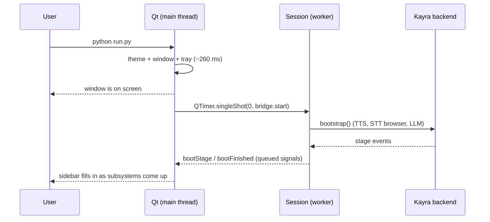

# Kayra Desktop UI — Architecture & Design Specification

> The presentation layer for the Kayra assistant. This document covers the UI/core boundary,
> the design system, the screen architecture, the system-compatibility model, and the
> performance rules the implementation is held to.
>
> The backend architecture is documented separately in
> [`KAYRA_SYSTEM_ARCHITECTURE.md`](KAYRA_SYSTEM_ARCHITECTURE.md). This layer sits **on top** of
> it and changes almost nothing in it — see [§10](#10-backend-changes).
>
> **Last verified against the tree:** 2026-09-07.

---

## 1. Technology decision

**PySide6 (Qt 6.11), Essentials distribution only.**

| Option | Verdict |
|---|---|
| **PySide6 / Qt** ✅ | Native widgets, no browser runtime, LGPL, mature. QSS gives a real stylesheet layer, QPainter gives the custom assistant visual, and the `offscreen` platform makes the whole UI testable headless in CI. |
| Electron / webview | Rejected outright. It would ship a second browser engine into a process that already owns one for speech recognition, and add 100MB+ RSS to render buttons. |
| Tkinter | Cannot produce this design. No stylesheet layer, no antialiased custom painting worth the name, and a distinctly non-native feel on Windows 11. |
| Dear PyGui / imgui | Immediate-mode: redraws continuously at the refresh rate, which is the opposite of an assistant that should cost nothing while idle. |
| Flet / NiceGUI | Both are browser runtimes wearing a desktop coat. Same objection as Electron. |

**Essentials, not the full distribution**, and that is a deliberate line: the full package pulls
QtWebEngine — an entire Chromium — which would violate the "no browser runtime to render the
UI" constraint even if nothing imported it. Essentials is ~200MB on disk against ~1GB.

**Measured cost** on the development host:

| Metric | Value |
|---|---|
| `import PySide6.QtWidgets` | 128 ms, +15.9 MB |
| `QApplication` + first window | 133 ms, +3.8 MB |
| **Total UI overhead** | **262 ms, +19.7 MB RSS** |

Against a 4.4s backend boot and a ~470MB footprint, that is roughly +6% startup and +4% memory
— and, because of the startup model below, the *perceived* startup gets dramatically better.

---

## 2. Startup model: paint first, boot second

The single most important structural decision in the UI.



Booting first and painting afterwards would give a four-second black screen. Instead the window
appears in about a quarter of a second and reports which subsystem is still starting.

Measured on a real `python run.py`: window painted immediately; backend `Assistant ready` at
**5.70s** (against 4.36s for the console front end — Qt startup competes for CPU during boot,
which is a real cost, paid where the user cannot see it).

---

## 3. The UI ↔ backend boundary

Two layers, split so that the hard part is testable without a display.

```
┌──────────────────────────── views/ ────────────────────────────┐
│ home  chat  automation  memory  activity  system  settings     │
│ ── may ONLY talk to the bridge. No engine imports, no runtime  │
│    bus subscriptions, no threads.                              │
└───────────────────────────────┬────────────────────────────────┘
                                │ Qt signals (queued across threads)
┌───────────────────────────────▼────────────────────────────────┐
│ bridge.py — KayraBridge(QObject)                               │
│ Thin Qt adapter. Turns session callbacks into signals.         │
└───────────────────────────────┬────────────────────────────────┘
                                │ plain Python callbacks
┌───────────────────────────────▼────────────────────────────────┐
│ session.py — KayraSession   (NO Qt anywhere in this file)      │
│ Thread ownership, boot sequencing, the turn pipeline, shutdown │
└───────────────────────────────┬────────────────────────────────┘
                                │
┌───────────────────────────────▼────────────────────────────────┐
│ kayra.app  ·  runtime_state  ·  automation  ·  memory  ·  …    │
└────────────────────────────────────────────────────────────────┘
```

### Why the split

`session.py` holds everything awkward — threads, boot order, the turn pipeline — and expresses
its output as plain callbacks. That makes it testable with no `QApplication`, no display and no
widgets, and leaves the Qt adapter small enough to be obviously correct.

### The thread-safety rule this exists to enforce

Kayra's runtime bus calls subscribers **synchronously on whichever thread emitted** — the turn
runner, the barge-in watcher, the proactive agent. Qt widgets may only be touched from the GUI
thread. Calling `label.setText(...)` from the barge-in watcher is undefined behaviour that
usually appears to work and occasionally corrupts the widget tree.

`KayraBridge` lives in the GUI thread, so every signal emitted from a worker is delivered
through Qt's queued-connection mechanism: payload copied, posted to the GUI event queue,
delivered on the next loop turn. Hence the two rules the test suite enforces by AST:

- **No view or component subscribes to the runtime bus.**
- **No view imports or calls a backend engine.**

### Threads the UI adds

| Thread | Why it must exist |
|---|---|
| `kayra-ui-runner` | Consumes a bounded queue of turns and executes them. |
| `kayra-ui-listener` | Blocks in `Listen()` and pushes utterances onto that queue. |
| `kayra-ui-profile` | One-shot, daemon: the ~3s WMI device probe. Ends by itself. |

The listener is the only genuinely new cost, and it is unavoidable: `Listen()` blocks until an
utterance is finalized and has no timeout, so a single thread could not also service the text
box while the microphone is open. Everything else — TTS synthesis and playback, the barge-in
watcher, the proactive agent — is a thread the backend already owned.

### Reusing the turn pipeline rather than reimplementing it

`KayraSession._run_turn` performs exactly the sequence `app.Main_Loop` performs, in the same
order, calling the same functions:

```
confirmation gate → runtime bookkeeping → emotion → DMM → Execute_Task
```

The confirmation gate runs **before** the classifier for the reason documented in the backend
architecture: a bare "yes" sent to the DMM comes back as `general yes` and is answered by the
chatbot, so a pending "should I restart your computer?" would never resolve. Because the UI
calls the same functions rather than copying them, a change to the backend pipeline is
inherited automatically.

### Capturing what Kayra says

The conversational services stream their answer into `tts_engine.speak()` and return nothing;
there is no existing return path a transcript could come from. `_install_output_tap()` wraps
that one public method.

Wrapping beats the alternative — changing the signature of `Chatbot`,
`RealTimeSearchEngine` and the automation dispatcher so each also returns text — because it is
a presentation concern living in the presentation layer, it touches no stable backend code, and
it captures **every** utterance by construction, including any future service.

A pleasant side effect: sentences arrive as they are synthesized, so the chat view streams the
reply in as it is spoken.

**Stated limitation:** with speech output unavailable there is no stream to tap, and the Chat
screen says so rather than appearing silently broken.

---

## 4. Visual design

### Direction

Technical, premium, minimal, futuristic, calm. Explicitly **not** the default AI aesthetic — no
blue-dominant surfaces, no cyan neon, no purple-blue gradients, no glowing borders.

The ground is a near-black with a faint **warm** bias (a trace of red/yellow rather than the
blue-grey most dark UIs default to). It reads as graphite rather than as "dark mode", and it is
what lets a single amber accent look intentional instead of decorative.

### Palette

All tokens live in `ui/theme/tokens.py`; nothing else in the UI may contain a hex colour, and
the test suite fails the build if one appears.

| Role | Token | Value |
|---|---|---|
| Ground | `base` | `#0E0E10` |
| Panels | `surface` | `#141416` |
| Cards | `elevated` | `#191A1D` |
| Menus / hover | `overlay` | `#202024` |
| Wells (inputs, transcript) | `inset` | `#0A0A0C` |
| Separator | `border` | `#26262B` |
| Text | `text` | `#EDE9E3` (warm white, not `#FFF` — pure white glares on near-black) |
| Secondary text | `text_secondary` | `#A3A09A` |
| **Accent** | `accent` | `#E8A33D` — amber |
| Accent partner | `copper` | `#C2703C` — automation only |
| Success / warning / danger | | `#6FBF73` / `#D9A441` / `#D96A5A` |

Elevation is expressed by **lightness alone** — there are no drop shadows between panels, only
one step of lightness and a hairline border, which stays crisp at any DPI. Shadows are reserved
for genuinely floating things: menus and the ambient window.

Status colours are muted on purpose. A saturated green "OK" pip is as loud as an error and
trains people to ignore both.

**Measured contrast** against the base surface (asserted in `tests/test_ui.py`):

| | Ratio | Standard |
|---|---|---|
| `text` | 15.9 : 1 | WCAG AAA |
| `text_secondary` | 7.4 : 1 | AAA body text |
| `accent` | 8.9 : 1 | AAA |

### Typography

Two families, both already on every Windows machine, so the UI never waits on a font and never
falls back to something unintended.

- **`Segoe UI Variable Text` / `Segoe UI`** — the system face. Matching it is what makes the
  application feel native rather than transplanted.
- **`Cascadia Mono` / `Consolas`** — anything numeric or technical. Tabular figures stop metrics
  jittering as digits change, which is the entire reason a monospace face belongs in a
  dashboard.

Seven sizes (10/11/12/13/15/19/26) and three weights. Small uppercase labels carry 1.2px
tracking — uppercase at 10–11px is unreadable without it, and those labels are what give the
interface its technical register.

### Geometry and motion

Radii 4/6/10/14 — subtle, never pill-shaped; large radii on dark panels read as toy-like.
Spacing is a strict 4px grid. Transitions are 90–320ms: motion exists to explain a change of
state, and above ~250ms a UI stops feeling responsive.

---

## 5. The assistant visual

`ui/components/orb.py`. Three concentric elements, each carrying information:

- an outer **ring of 48 segments** — the technical register of the interface, and the element
  that rotates and brightens with activity;
- an inner **core** that breathes, whose brightness follows the activity envelope;
- a soft radial **halo** in the state colour, which is what makes it feel lit rather than drawn.

Deliberately not a glowing sphere and not a reactor: a segmented ring reads as instrumentation.

**Every state is distinguishable by motion as well as colour**, so it survives a monochrome
screen and does not depend on hue discrimination:

| State | Motion | Colour |
|---|---|---|
| `IDLE` | slow even breath, segments still | dim grey |
| `LISTENING` | travelling wave around the ring | amber |
| `PROCESSING` | steady rotation with a decaying tail | copper |
| `SPEAKING` | two overlaid harmonics — an amplitude envelope | bright gold |
| `AUTOMATING` | two opposed sweeping arcs | deep amber |
| `ERROR` | single slow pulse, no rotation | warm red |

### Cost, bounded explicitly

This is the only continuously animated element in the application:

- repaint capped at **30fps while busy, 12fps when idle**;
- the timer **stops completely when the widget is hidden** (`hideEvent`), so a minimised window,
  a switched tab or a dismissed ambient panel costs exactly zero — asserted in the test suite;
- geometry is recomputed on resize only, never per frame;
- one QPainter pass over ~50 primitives, no pixmap cache, no compositing layer.

---

## 6. Screen architecture

```
Home        the assistant itself: state, prompt, voice controls, recent activity, health
Chat        one transcript for typed and spoken turns, with automation traces
Automation  the six-stage pipeline for the current task, plus verified history
Memory      what Kayra kept, why, and how to delete it
Activity    a session timeline with category filters
System      device, three-axis capability analysis, live resources, system guide
Settings    configuration, written to .env with comments preserved
```

`Ctrl+1..7` navigate, `Ctrl+K` jumps to Chat, `Ctrl+.` interrupts.

### The view contract

Every screen implements `on_show()` / `on_hide()`. **A screen that polls anything starts its
timer in `on_show` and stops it in `on_hide`**, so exactly one screen is ever doing work.
Without that rule, seven views would each keep a timer running forever and the idle cost of the
application would be seven times what the user can see. The test suite asserts it.

### Two surfaces, one session

The ambient assistant (a small frameless always-on-top panel) and the control centre are views
onto the **same** bridge. There is one backend session per process. Closing the main window
hides it to tray and does **not** stop the assistant — a voice assistant that stops listening
because its window was closed is not an assistant. Quitting is explicit, from the tray, and the
tray says so the first time.

---

## 7. System compatibility architecture

`core/system_profile.py` — structured data only; it never formats or prints.

### Relationship to `SystemInfo`

Kayra already reads the machine in `automation/windows.py :: SystemInfo(query)`. That is **not**
duplicated here, because the two have different output contracts: `SystemInfo` answers a spoken
question and returns one sentence; a dashboard needs numbers it can lay out and threshold.
Refactoring `SystemInfo` onto this module was considered and rejected — it is a stable path
with 263 tests behind it, the overlap is a handful of psutil calls rather than real logic, and a
UI feature is not a good reason to disturb the voice path.

### Three scores, never one

| Question | What it means |
|---|---|
| **Compatibility** | Can Kayra operate correctly on this device at all? |
| **Performance** | How comfortably can this device run it? |
| **Readiness** | Is *this installation* configured and ready right now? |

Collapsing these destroys the only actionable information. A powerful workstation with no API
key is perfectly capable and completely unready; a modest laptop that is configured is
completely ready and merely slow. One blended percentage describes neither, and gives no clue
which to fix.

Each score is the **mean of named checks**, expressed out of 100, with the checks listed beneath
it. Nothing must be taken on faith.

### Honesty rules

- **GPU utilisation is not shown.** It cannot be read reliably without vendor libraries, and
  Kayra runs no work on the GPU. The screen says so instead of inventing a number.
- **VRAM is reported as "not reported by Windows" when the WMI field is clamped.** `AdapterRAM`
  is 32-bit and drivers clamp it — the observed value on this host's 8GB RTX 4060 is 4095 MiB.
  Two earlier bounds let that through and the screen confidently displayed "4.0 GB". Anything
  ≥4000MB is now treated as clamped. This gives up on genuine 4GB cards, which is the far
  smaller error.

### Cost

- Static facts: collected **once per process**, on a worker thread, behind a **double-checked
  lock**. Not `lru_cache` — that decorator does not hold a lock across the wrapped call, so two
  threads that miss simultaneously both run the ~3s WMI probe and hand callers different
  objects. The UI reaches this from two directions at once and the test suite caught it.
  Verified: 8 concurrent callers → one 3.27s collection, all receiving the same object.
- One **batched** PowerShell call for CPU name, OS edition, GPU and VRAM. Three separate calls
  measured 4.0s; batching them is 3.2s, paid once.
- Live metrics: **psutil only, no subprocess anywhere on the refresh path**, 2s interval, only
  while the screen is visible. The process-tree walk is cached for 4s on top of that.

---

## 8. Asset and background strategy

**There are no binary assets.** Every graphic — the orb, the navigation glyphs, the window and
tray icons — is drawn with QPainter from the theme tokens.

That is a deliberate choice with three concrete payoffs: nothing to ship or version, sharp
rendering at every DPI scale factor without per-density copies, and icons that can carry the
assistant's state colour (the tray icon changes hue with what Kayra is doing).

A background image is supported by the design but **deliberately not used**, and the question
was re-opened during the refinement pass rather than inherited:

* the layered graphite surfaces already carry the depth an image would provide;
* any image behind text on a near-black ground costs contrast, and the type here is already
  sitting at the low end of what a dark UI can afford;
* Home has exactly one focal point, and it is the assistant. A texture in the space around the
  orb competes with the only element on the page that is supposed to hold the eye;
* the interface's whole thesis is instrumentation rather than decoration. An atmospheric image
  would be the single decorative element in it, and would read as borrowed.

`ui/assets/` remains the drop-in location should one ever be wanted; nothing depends on an
external URL, and no code path assumes the directory has contents.

---

## 8b. The visual refinement pass (2026-09-08)

The first implementation was architecturally correct and visually unfinished. Everything below
was found by **rendering every screen at real desktop sizes and looking at it** — not one of
these faults failed a test, and several passed a suite of 131 checks while being obviously
wrong on screen.

### What was actually wrong

| Fault | Evidence | Fix |
|---|---|---|
| **Bare window ground below the content** on five of seven screens — 262px on Home, 428px on Automation, 479px on Activity, of an 880px page | measured on the rendered PNGs | stretches placed *around* the content (Home) and a stretch factor on the list card (Automation, Activity, Memory) so lists occupy the page they are the subject of |
| **Overlapping widgets in Activity** — "Nothing yet" drawn straight through the timeline text | visible in the render | `takeAt` removes from the *layout*, and `deleteLater` runs only at the next event-loop turn, so the empty state stayed a visible child at stale geometry. It is now a permanent child that is shown or hidden |
| **Clipped text** — the automation pipeline's first stage rendered as "derstand" | visible in the render | the label rect started at a negative x; it is now clamped into the widget and aligned to the edge it is against |
| **Internal names on screen** — `app.open chrome`, `system.shutdown`, `User: remember…` | visible in the render | `humanise_action` / `humanise_command` map the policy layer's vocabulary to what happened to the machine; the memory row carries the speaker as its own element |
| **A log where a timeline was wanted** — three consecutive rows for one action, one per pipeline stage | visible in the render | `collapse_audit` keeps one row per action, holding the furthest-progressed event |
| **Ragged control widths in Settings** — 260px text fields beside 190px combo boxes, rows ~110px tall | visible in the render | one `Size.control_field` for every control type, ruled rows, `padding` cut to one grid step (Qt adds padding to `min-height`) |
| **The toggle drew as a clipped blob** | visible in the render | the generic `QPushButton` rule's `min-height: 32px` **overrides `setFixedSize`**; the switch needed its own objectName and a rule neutralising the geometry |
| **Status chips were rectangles** | visible in the render | Qt does not clamp an oversized `border-radius` the way CSS does — `999px` fell back to a small radius. An explicit 11px half-height radius |
| **A disabled accent button looked enabled** | visible in the render | `:disabled` loses to the more specific `[variant="accent"]`; it needed its own rule |
| **The orb read as a smudge** | visible in the render | resting alpha resolved to ~0.13 on a `#0E0E10` ground. Segments now keep a 0.22 floor, and a static neutral gauge ring gives the visual an edge |
| **The Settings icon read as an asterisk** | rendered as an icon sheet at 8x | a gear at 16px is a circle with six stubs; replaced with sliders |
| **Timestamps floated beside every bubble** | visible in the render | the time and the "spoken" marker moved inside the bubble, where they align to its edge |
| Grammar: "1 items", "4 actions" over two rows | visible in the render | pluralised; the count is taken from the collapsed rows it describes |

### What was added to the component vocabulary

`SegmentedControl` (exclusive options as one control), `Disclosure` (a collapsible section, used
for the System guide), `IconButton` (a square drawn-glyph control — microphone, stop),
`ListRow` (one hover-able row, now shared by Activity, Automation, Memory and Home),
`CardAction` (a header control that matches `StatusPill`'s height), `Metric` / `GroupLabel` /
`RowRule`. The point is that a row in a timeline and a row in a memory list are now literally
the same component instead of three hand-built layouts that drift apart.

### Tokens

`Color` gained the named interaction states the brief asks for — `surface_hover`,
`surface_active`, `base_elevated`, `accent_subtle`, `disabled`, and `automation` as the semantic
name for copper. Naming them is what stops each component inventing its own idea of "slightly
lighter". `Size` gained `content_max`, `control_field` and `settings_label_max`; `Font` gained
`metric` and `metric_lg`.

### What is NOT claimed

The suite grew from 131 to 202 checks, and every one of them pins a specific defect. **None of
them proves the interface looks good.** The dead-space numbers, the overlap and the clipping
were all found by eye on a rendered page and only then written down as tests; the tests exist so
those particular faults cannot return silently, not as evidence of visual quality.

One test in this section was written twice, because the first version passed with the bug
deliberately reintroduced: `QIcon.paint(painter, rect)` and `QIcon.pixmap(w, h)` both *rescale*
the artwork to fill the target, so a quarter-drawn glyph fills it too. The check that works
inspects the stored pixmap and asserts the glyph keeps its margin — a clipped one runs flush to
the edge. Verified in both directions before being kept.

---

## 8c. Interaction pass (2026-09-08)

### The listening axis

Kayra gained a control that closes the microphone without touching anything else it runs. The
smallest interface that could express it:

| Layer | Addition |
|---|---|
| `input/speech_to_text.py` | `pause_listening()` / `resume_listening()` / `listening_paused`, and a `capture()` that returns immediately while paused |
| `core/runtime_state.py` | `listening` property, `set_listening()`, a `listening_changed` event, and `listening` in `snapshot()` |
| `app.py` | `set_listening(enabled)`, `listening_enabled()`, a `stop listening` branch in `Execute_Task`, and a `Listen()` that returns promptly while paused |
| `intelligence/llm_engine.py` | the `stop listening` token plus one preamble paragraph |
| `ui/session.py` | `set_listening` / `listening_enabled`, a `listening_changed` callback, and a listener thread that parks on an Event |
| `ui/bridge.py` | `listeningChanged` signal, `set_listening`, `listening_enabled` |

Nothing was rewritten. STT, TTS, the DMM, the LLM router, automation, the proactive agent, the
emotion engine, memory and the shutdown path are untouched.

**Pausing keeps the session.** `pause_listening()` stops the page's SpeechRecognition — which
is what releases the microphone — and leaves the driver, the browser, the loopback server and
the owned-PID ledger alone. Verified at the browser level: page status `listening` → `stopped`
→ `listening`, 9 owned PIDs before and after, `is_session_alive()` true throughout.

**The asymmetry is the design.** "Stop listening" can be spoken; "start listening" cannot,
because a closed microphone cannot hear it. There is no `start listening` token, and resuming
is a manual action: the button, Ctrl+M, or the tray.

**Three separate concepts, three separate mechanisms** — barge-in cancels speech, listening
pause closes the microphone, shutdown ends the process. Ctrl+. is barge-in; Ctrl+M is the
microphone. Live-verified that interrupting does not change the listening state and that
pausing calls neither interrupt nor shutdown.

### Chat auto-scroll

The old `QTimer.singleShot(0, lambda: bar.setValue(bar.maximum()))` read a `maximum` that had
not been recalculated for the widget just added. Measured overflow of the newest message under
the old code: **249px** for a long reply, **280px** for an automation block, **1347px** for a
burst — and 0px for a short message, which is why it presented as intermittent.

The fix activates the layout and recomputes the size hint BEFORE reading `maximum`, then
repeats once on the next event-loop turn for content that grows afterwards. `_following` is
driven by the scrollbar's own signal: scrolling up parks the view, returning to the bottom
re-arms it, and sending always re-pins.

### Ambient lifecycle

Dashboard and panel are now mutually exclusive, hooked to `showEvent` / `hideEvent` /
`WindowStateChange`. Closing the dashboard collapses into the panel and never quits. Drag is
told apart from click by a 4px threshold; placement follows the cursor's screen; a panel left
on a disconnected monitor is recovered.

**This is a net performance improvement**: the panel used to animate its orb permanently,
including while the dashboard was open. It now runs zero timers whenever the dashboard is
visible.

### Typography and status

`text_tertiary` moved from `#6E6B66` (3.3:1) to `#857F78` (4.7:1) — it was two points off
`text_disabled`, so every settings description read as a disabled control. Card titles and
section labels went up one weight; settings titles now outrank their descriptions in weight and
colour; page subtitles moved to body size.

Status washes were near-black (`#121A13` is three points off the card behind it), so success
and failure were the same dark rectangle. The new `ActionStatus` component uses a tinted field
one surface step up, a **drawn** mark (check / cross / dot) so the state survives a monochrome
screen or a red-green deficiency, and identical metrics across variants. The System page's
verdicts use the same component — as `StatusPill`s they read as a column of outlined buttons,
and "Ready" looked clickable.

---

## 9. Performance strategy

| Rule | How it is enforced |
|---|---|
| No polling for state | `RuntimeState.set_state()` emits `state_changed`; the UI subscribes |
| One active screen | `on_show`/`on_hide` start and stop timers; asserted by tests |
| No animation when hidden | The orb stops its timer in `hideEvent`; asserted by tests |
| No repeated hardware probes | Locked one-shot cache; batched WMI |
| No subprocess on refresh | `live_metrics()` is psutil-only; asserted by tests |
| No widget churn | Automation history rebuilds only when the audit ring grew |
| Bounded histories | Activity capped at 200 entries; Home's glance list at 4 |
| Text elided, not wrapped, in fixed-height panels | a wrapping line would resize Home's bottom strip on every reply and make the anchor jump |
| No extra processes | The UI adds none; the launcher wrapper chain is 25 MB total |

### Measured after the refinement pass (stub backend, so the numbers are the UI's own)

| | Value |
|---|---|
| Import (PySide6 + every view) | 261 ms |
| Stylesheet build + apply | 139 ms |
| Construct + first paint | 304 ms |
| **Window visible** | **704 ms** |
| **Interactive** | **709 ms** |
| UI RSS (widgets + theme) | 53.9 MB |
| Threads added by the UI | 0 (the shell itself); 3 when a session is running |
| Child processes added | 0 |
| Idle CPU, Home visible, orb animating at 12fps | **2.6 %** |
| Idle CPU, orb hidden | **1.6 %** |
| Orb paint, 208px, SPEAKING | **1.28 ms/frame** — 3.85 % of one core at 30fps |
| Orb paint, 208px, IDLE | 0.79 ms/frame — 0.95 % of one core at 12fps |
| Cost of the added static gauge ring | **+0.15 ms/frame** |
| Navigation to any screen, with a real paint | 10–25 ms |
| Active Qt timers — Chat / Memory / Activity / Settings | **0** |
| Active Qt timers — Home | 2 (orb at 12fps, panel refresh at 4s) |
| Active Qt timers — ambient panel while the dashboard is open | **0** (it is hidden) |
| Threads and processes added by the interaction pass | **0** |

Idle CPU is deliberately not quoted for this pass: sampled on a machine with other load, the
figure for Settings — where the orb is hidden and nothing is running — came back between 2.1%
and 4.7%, which is measurement noise rather than the application. The deterministic counts
above are the honest statement of what the UI costs at rest.

The orb grew a static gauge ring and a higher resting brightness; neither changes the shape of
its cost, and the paint-first startup is untouched — the window is still painted before the
backend is asked to boot.

Note on measuring the orb: `QWidget.grab()` reports ~3.35 ms/frame for the same paint, because
it allocates a pixmap per call. `render()` into a reused surface is the honest figure.

### Measured, with the real backend running

| | Console | With UI |
|---|---|---|
| Backend `Assistant ready` | 4.36 s | 5.70 s |
| Time to a painted window | n/a | **~0.26 s** |
| Kayra application process | ~370 MB | **393 MB** (+20 MB) |
| Threads in that process | ~34 | **37** (+3) |
| Processes in the tree | 9 | 11 (+2 launcher wrappers) |

---

## 10. Backend changes

Three, all additive. No existing behaviour was altered, and the full backend suite still passes.

**1. `RuntimeState.set_state()` now emits `state_changed`.**
Without it the UI would have to poll for the assistant's state on a timer — the one thing the
performance brief rules out, to discover something the writer already knows. The emit happens
**after** the lock is released: `_lock` is re-entrant so emitting inside it would not deadlock
this thread, but `emit()` calls subscribers synchronously and a subscriber touching the runtime
from another thread would then block on a lock held across arbitrary third-party code.
*Regression tests:* no duplicate emit for an unchanged state; a subscriber may read the runtime
without deadlock; subscriber exceptions are still swallowed.

**2. `core/config.write_env_values()` added.**
The Settings screen needs to write `.env`. `setup.py` has its own writer, but it runs on the
system interpreter before the venv exists and deliberately imports nothing from `kayra`, so it
cannot be the shared implementation. The writer rewrites keys **in place**, preserving comments
and ordering — rewriting from a parsed dict would silently delete every comment in a file that
is heavily annotated on purpose. Writes go through a temp file and `os.replace`.

**3. `core/system_profile.py` added.** New module, no existing code touched.

Nothing was rewritten: STT, TTS, automation, the proactive agent, the DMM, the emotion engine
and the runtime are untouched. Shutdown remains authoritative in `app._force_shutdown` — the UI
delegates to it and does not reorder or duplicate it, which the test suite asserts by source
inspection.

---

## 11. Final structure

```
src/kayra/ui/
├── __init__.py            side-effect-free; `main()` imports Qt lazily
├── __main__.py            python -m kayra.ui
├── application.py         window shell, routing, tray, ambient assistant
├── bridge.py              THE boundary: Qt signals over a session
├── session.py             backend driver — no Qt, testable headless
├── theme/
│   ├── tokens.py          every colour, size, radius, duration
│   ├── stylesheet.py      one generated QSS sheet, applied once
│   └── __init__.py        apply() + repolish()
├── components/
│   ├── orb.py             assistant visual + status badge
│   ├── navigation.py      sidebar, drawn glyphs
│   ├── primitives.py      Card, StatusPill, Toggle, Meter, StatRow, EmptyState, buttons
│   └── chat_items.py      bubbles, automation traces, thinking indicator
├── views/
│   ├── base.py            the on_show/on_hide contract
│   └── home · chat · automation · memory · activity · system · settings
└── assets/                empty; the drop-in point if a backdrop is ever added
```

Entry points:

```bash
python run.py              # desktop UI (default)
python run.py --console    # voice + terminal only
python -m kayra.ui         # UI directly, from inside the venv
```

If PySide6 is not installed, `run.py` explains and falls back to the console loop rather than
refusing to start over a presentation dependency.

---

## 12. Testing

`tests/test_ui.py` — **131 checks**, hardware-free, on Qt's `offscreen` platform. No display, no
microphone, no browser, no LLM, no network. The backend is replaced by `StubBridge`, which
mirrors the real signal signatures exactly.

Covered: stylesheet generation; palette direction (the accent's hue is asserted to be amber, not
blue); WCAG contrast ratios; no hardcoded colours outside the theme; every component painting in
every state; the orb stopping when hidden; all seven views constructing, painting and surviving
show/hide **with no backend at all**; timers stopping on hide; state reflection end to end;
streaming into one bubble; typed input reaching the backend; secrets never rendered; navigation;
minimum window size; the ambient assistant; shutdown delegation; and the boundary rules (AST
assertions that no view touches the runtime bus or an engine, and that `session.py` contains no
Qt).

What it cannot cover is how the interface *looks*; visual design is not assertable and is not
claimed to be tested.

**Full suite: 752 checks passing** (automation 263, proactive 140, emotion 119, browser 64, UI
131, audio 35), plus the DMM matrix at 53/53.
